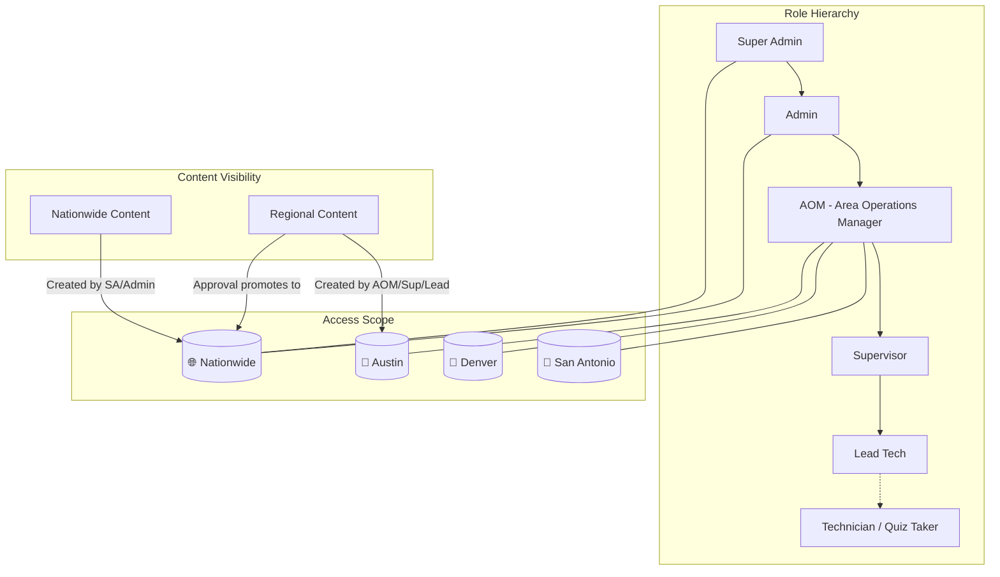
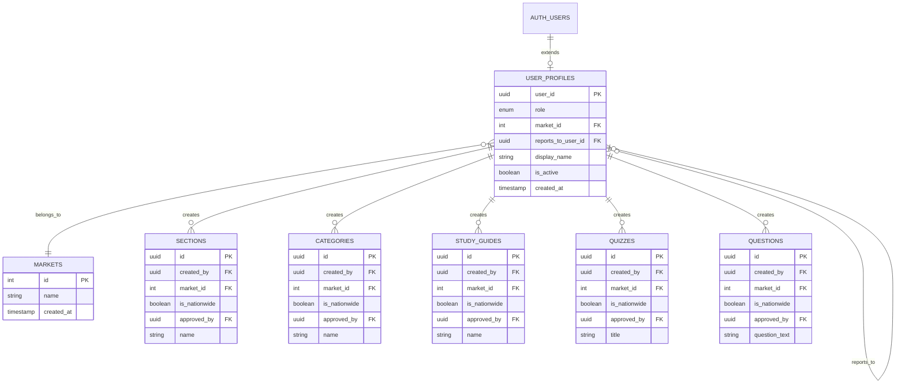

# Training Hub RBAC Implementation Plan

## Executive Summary

This plan transforms the Training Hub from a single-admin system to a multi-user Role-Based Access Control (RBAC) system with regional content isolation and a hierarchical permission structure.

**Current State:**
- Single Supabase admin user (itcservicegroup99@gmail.com)
- No role differentiation
- All content is globally accessible
- 4 markets, 4 supervisors, 20 study guides, 22 quizzes, 305 questions

**Target State:**
- Multiple user accounts with hierarchical roles
- Content scoped by region (market)
- Role-based permissions for CRUD operations
- Content approval workflow for promoting regional → nationwide

---

## Architecture Diagrams

### Role Hierarchy & Data Flow



### Database Schema - New & Modified Tables



---

## 1. Role Definitions

| Role | Scope | Can Create Content | Can Edit | Can View | Can Manage Users | Special Permissions |
|------|-------|-------------------|----------|----------|------------------|---------------------|
| **Super Admin** | Nationwide | ✅ Nationwide | All content | All content | All users | Approve regional→nationwide |
| **Admin** | Nationwide | ✅ Nationwide | All content | All content | Non-Super users | Approve regional→nationwide |
| **AOM** | Single Market | ✅ Regional only | Own region | Nationwide + own region | Supervisors & Leads in region | - |
| **Supervisor** | Single Market | ✅ Regional only | Own region | Nationwide + own region | Lead Techs under them | - |
| **Lead Tech** | Single Market | ✅ Regional only | Own content only | Nationwide + own region | None | - |
| **Technician** | Single Market | ❌ | ❌ | Nationwide + own region | None | Future: Take quizzes |

### Role Hierarchy Details

- **Super Admin**: The master account (itcservicegroup99@gmail.com). Full system access.
- **Admin**: Company-wide administrators. Can do everything except manage Super Admin.
- **AOM (Area Operations Manager)**: Regional leaders. Manage a specific market.
- **Supervisor**: Team leaders within a market. Report to AOM.
- **Lead Tech**: Senior technicians. Report to Supervisor. Can create content.
- **Technician**: Future role for quiz-takers with accounts.

---

## 2. Database Schema Changes

### 2.1 New Table: `user_profiles`

This table extends Supabase's `auth.users` with application-specific role and market data.

```sql
-- Create the role enum type
CREATE TYPE user_role AS ENUM (
  'super_admin',
  'admin',
  'aom',
  'supervisor',
  'lead_tech',
  'technician'
);

-- Create user_profiles table
CREATE TABLE user_profiles (
  user_id UUID PRIMARY KEY REFERENCES auth.users(id) ON DELETE CASCADE,
  role user_role NOT NULL DEFAULT 'technician',
  market_id INTEGER REFERENCES markets(id) ON DELETE SET NULL,
  reports_to_user_id UUID REFERENCES user_profiles(user_id) ON DELETE SET NULL,
  display_name TEXT NOT NULL,
  email TEXT, -- Cached from auth.users for easier querying
  is_active BOOLEAN DEFAULT TRUE,
  created_at TIMESTAMPTZ DEFAULT NOW(),
  updated_at TIMESTAMPTZ DEFAULT NOW(),

  -- Super Admin and Admin must NOT have a market (they're nationwide)
  -- All other roles MUST have a market
  CONSTRAINT valid_market_for_role CHECK (
    (role IN ('super_admin', 'admin') AND market_id IS NULL) OR
    (role NOT IN ('super_admin', 'admin') AND market_id IS NOT NULL)
  ),

  -- Super Admin, Admin, and AOM don't report to anyone
  -- Supervisor reports to AOM, Lead Tech reports to Supervisor, Technician reports to Supervisor/Lead
  CONSTRAINT valid_reports_to CHECK (
    (role IN ('super_admin', 'admin', 'aom') AND reports_to_user_id IS NULL) OR
    (role NOT IN ('super_admin', 'admin', 'aom'))
  )
);

-- Create indexes for common queries
CREATE INDEX idx_user_profiles_role ON user_profiles(role);
CREATE INDEX idx_user_profiles_market ON user_profiles(market_id);
CREATE INDEX idx_user_profiles_reports_to ON user_profiles(reports_to_user_id);
CREATE INDEX idx_user_profiles_active ON user_profiles(is_active) WHERE is_active = TRUE;

-- Add comments
COMMENT ON TABLE user_profiles IS 'Extended user profile with role and market assignment';
COMMENT ON COLUMN user_profiles.role IS 'User role determining permissions';
COMMENT ON COLUMN user_profiles.market_id IS 'Market/region the user belongs to (NULL for nationwide roles)';
COMMENT ON COLUMN user_profiles.reports_to_user_id IS 'Hierarchical reporting relationship';
```

### 2.2 Ownership & Visibility Columns for Content Tables

Add these columns to: `sections`, `categories`, `study_guides`, `quizzes`, `questions`, `media_library`

```sql
-- Template for adding RBAC columns to content tables
-- Replace {TABLE_NAME} with actual table name

ALTER TABLE {TABLE_NAME} ADD COLUMN IF NOT EXISTS created_by UUID REFERENCES auth.users(id);
ALTER TABLE {TABLE_NAME} ADD COLUMN IF NOT EXISTS market_id INTEGER REFERENCES markets(id);
ALTER TABLE {TABLE_NAME} ADD COLUMN IF NOT EXISTS is_nationwide BOOLEAN DEFAULT FALSE;
ALTER TABLE {TABLE_NAME} ADD COLUMN IF NOT EXISTS approved_by UUID REFERENCES auth.users(id);
ALTER TABLE {TABLE_NAME} ADD COLUMN IF NOT EXISTS approved_at TIMESTAMPTZ;

-- Add index for visibility queries
CREATE INDEX IF NOT EXISTS idx_{TABLE_NAME}_visibility
  ON {TABLE_NAME}(is_nationwide, market_id);
CREATE INDEX IF NOT EXISTS idx_{TABLE_NAME}_created_by
  ON {TABLE_NAME}(created_by);

COMMENT ON COLUMN {TABLE_NAME}.created_by IS 'User who created this content';
COMMENT ON COLUMN {TABLE_NAME}.market_id IS 'Market this content belongs to (NULL if nationwide)';
COMMENT ON COLUMN {TABLE_NAME}.is_nationwide IS 'TRUE if content is visible to all markets';
COMMENT ON COLUMN {TABLE_NAME}.approved_by IS 'Admin who approved regional content for nationwide visibility';
COMMENT ON COLUMN {TABLE_NAME}.approved_at IS 'When the content was approved for nationwide visibility';
```

### 2.3 Modify `supervisors` Table

Link existing supervisors to user accounts while preserving legacy data.

```sql
-- Add user account link to supervisors table
ALTER TABLE supervisors ADD COLUMN IF NOT EXISTS user_id UUID REFERENCES auth.users(id);
ALTER TABLE supervisors ADD COLUMN IF NOT EXISTS is_legacy BOOLEAN DEFAULT TRUE;

CREATE INDEX IF NOT EXISTS idx_supervisors_user_id ON supervisors(user_id);

COMMENT ON COLUMN supervisors.user_id IS 'Link to user account (if supervisor has an account)';
COMMENT ON COLUMN supervisors.is_legacy IS 'TRUE for supervisors created before RBAC (dropdown-only entries)';
```

### 2.4 New Table: `content_approval_requests`

Track requests to promote regional content to nationwide visibility.

```sql
CREATE TABLE content_approval_requests (
  id UUID PRIMARY KEY DEFAULT uuid_generate_v4(),
  content_type TEXT NOT NULL CHECK (content_type IN (
    'section', 'category', 'study_guide', 'quiz', 'question', 'media'
  )),
  content_id UUID NOT NULL,
  requested_by UUID REFERENCES auth.users(id) NOT NULL,
  requested_at TIMESTAMPTZ DEFAULT NOW(),
  status TEXT DEFAULT 'pending' CHECK (status IN ('pending', 'approved', 'rejected')),
  reviewed_by UUID REFERENCES auth.users(id),
  reviewed_at TIMESTAMPTZ,
  review_notes TEXT,

  -- Ensure one pending request per content item
  UNIQUE(content_type, content_id, status) WHERE status = 'pending'
);

CREATE INDEX idx_approval_requests_status ON content_approval_requests(status);
CREATE INDEX idx_approval_requests_requested_by ON content_approval_requests(requested_by);
CREATE INDEX idx_approval_requests_content ON content_approval_requests(content_type, content_id);

COMMENT ON TABLE content_approval_requests IS 'Workflow for promoting regional content to nationwide';
```

---

## 3. RLS Policy Strategy

### 3.1 Helper Functions

These functions simplify RLS policy definitions and centralize permission logic.

```sql
-- Get current user's profile
CREATE OR REPLACE FUNCTION get_user_profile()
RETURNS user_profiles AS $$
  SELECT * FROM user_profiles WHERE user_id = auth.uid();
$$ LANGUAGE sql SECURITY DEFINER STABLE;

-- Get current user's role
CREATE OR REPLACE FUNCTION get_user_role()
RETURNS user_role AS $$
  SELECT role FROM user_profiles WHERE user_id = auth.uid();
$$ LANGUAGE sql SECURITY DEFINER STABLE;

-- Get current user's market_id
CREATE OR REPLACE FUNCTION get_user_market_id()
RETURNS INTEGER AS $$
  SELECT market_id FROM user_profiles WHERE user_id = auth.uid();
$$ LANGUAGE sql SECURITY DEFINER STABLE;

-- Check if current user is an admin (Super Admin or Admin)
CREATE OR REPLACE FUNCTION is_admin()
RETURNS BOOLEAN AS $$
  SELECT EXISTS (
    SELECT 1 FROM user_profiles
    WHERE user_id = auth.uid()
    AND role IN ('super_admin', 'admin')
  );
$$ LANGUAGE sql SECURITY DEFINER STABLE;

-- Check if current user is Super Admin
CREATE OR REPLACE FUNCTION is_super_admin()
RETURNS BOOLEAN AS $$
  SELECT EXISTS (
    SELECT 1 FROM user_profiles
    WHERE user_id = auth.uid()
    AND role = 'super_admin'
  );
$$ LANGUAGE sql SECURITY DEFINER STABLE;

-- Check if user can VIEW content based on visibility rules
CREATE OR REPLACE FUNCTION can_view_content(
  content_market_id INTEGER,
  content_is_nationwide BOOLEAN
)
RETURNS BOOLEAN AS $$
DECLARE
  v_role user_role;
  v_market INTEGER;
BEGIN
  -- Get user's role and market
  SELECT role, market_id INTO v_role, v_market
  FROM user_profiles WHERE user_id = auth.uid();

  -- No profile = no access (except for public content handling elsewhere)
  IF v_role IS NULL THEN
    RETURN FALSE;
  END IF;

  -- Super Admin and Admin can view everything
  IF v_role IN ('super_admin', 'admin') THEN
    RETURN TRUE;
  END IF;

  -- Everyone can view nationwide content
  IF content_is_nationwide = TRUE THEN
    RETURN TRUE;
  END IF;

  -- Regional users can view content from their market
  IF content_market_id = v_market THEN
    RETURN TRUE;
  END IF;

  RETURN FALSE;
END;
$$ LANGUAGE plpgsql SECURITY DEFINER STABLE;

-- Check if user can EDIT content
CREATE OR REPLACE FUNCTION can_edit_content(
  content_created_by UUID,
  content_market_id INTEGER
)
RETURNS BOOLEAN AS $$
DECLARE
  v_role user_role;
  v_market INTEGER;
BEGIN
  SELECT role, market_id INTO v_role, v_market
  FROM user_profiles WHERE user_id = auth.uid();

  IF v_role IS NULL THEN
    RETURN FALSE;
  END IF;

  -- Super Admin and Admin can edit everything
  IF v_role IN ('super_admin', 'admin') THEN
    RETURN TRUE;
  END IF;

  -- AOM and Supervisor can edit content in their market
  IF v_role IN ('aom', 'supervisor') AND content_market_id = v_market THEN
    RETURN TRUE;
  END IF;

  -- Lead Tech can only edit their own content
  IF v_role = 'lead_tech' AND content_created_by = auth.uid() THEN
    RETURN TRUE;
  END IF;

  RETURN FALSE;
END;
$$ LANGUAGE plpgsql SECURITY DEFINER STABLE;

-- Check if user can CREATE content (and determine visibility)
CREATE OR REPLACE FUNCTION can_create_content()
RETURNS BOOLEAN AS $$
  SELECT EXISTS (
    SELECT 1 FROM user_profiles
    WHERE user_id = auth.uid()
    AND role IN ('super_admin', 'admin', 'aom', 'supervisor', 'lead_tech')
    AND is_active = TRUE
  );
$$ LANGUAGE sql SECURITY DEFINER STABLE;

-- Check if user can manage another user
CREATE OR REPLACE FUNCTION can_manage_user(target_user_id UUID)
RETURNS BOOLEAN AS $$
DECLARE
  v_my_role user_role;
  v_my_market INTEGER;
  v_target_role user_role;
  v_target_market INTEGER;
BEGIN
  -- Get my profile
  SELECT role, market_id INTO v_my_role, v_my_market
  FROM user_profiles WHERE user_id = auth.uid();

  -- Get target profile
  SELECT role, market_id INTO v_target_role, v_target_market
  FROM user_profiles WHERE user_id = target_user_id;

  -- Super Admin can manage everyone except themselves
  IF v_my_role = 'super_admin' AND target_user_id != auth.uid() THEN
    RETURN TRUE;
  END IF;

  -- Admin can manage non-super users
  IF v_my_role = 'admin' AND v_target_role NOT IN ('super_admin', 'admin') THEN
    RETURN TRUE;
  END IF;

  -- AOM can manage Supervisors and Lead Techs in their market
  IF v_my_role = 'aom'
     AND v_target_role IN ('supervisor', 'lead_tech', 'technician')
     AND v_target_market = v_my_market THEN
    RETURN TRUE;
  END IF;

  -- Supervisor can manage Lead Techs and Technicians in their market
  IF v_my_role = 'supervisor'
     AND v_target_role IN ('lead_tech', 'technician')
     AND v_target_market = v_my_market THEN
    RETURN TRUE;
  END IF;

  RETURN FALSE;
END;
$$ LANGUAGE plpgsql SECURITY DEFINER STABLE;
```

### 3.2 RLS Policies for `user_profiles`

```sql
ALTER TABLE user_profiles ENABLE ROW LEVEL SECURITY;

-- Users can view their own profile
CREATE POLICY "Users can view own profile" ON user_profiles
  FOR SELECT USING (user_id = auth.uid());

-- Admins can view all profiles
CREATE POLICY "Admins can view all profiles" ON user_profiles
  FOR SELECT USING (is_admin());

-- Regional managers can view profiles in their market
CREATE POLICY "Managers can view regional profiles" ON user_profiles
  FOR SELECT USING (
    get_user_role() IN ('aom', 'supervisor')
    AND market_id = get_user_market_id()
  );

-- Only admins can insert new profiles (user creation)
CREATE POLICY "Admins can create profiles" ON user_profiles
  FOR INSERT WITH CHECK (is_admin());

-- Users with management permission can update profiles
CREATE POLICY "Managers can update profiles" ON user_profiles
  FOR UPDATE USING (can_manage_user(user_id));

-- Only super admin can delete profiles
CREATE POLICY "Super admin can delete profiles" ON user_profiles
  FOR DELETE USING (is_super_admin());
```

### 3.3 RLS Policies for Content Tables (Template)

Apply this pattern to: `sections`, `categories`, `study_guides`, `quizzes`, `questions`, `media_library`

```sql
-- Template: Replace {TABLE} with actual table name

ALTER TABLE {TABLE} ENABLE ROW LEVEL SECURITY;

-- SELECT: View accessible content
CREATE POLICY "{TABLE}_select_policy" ON {TABLE}
  FOR SELECT USING (
    -- Public read for nationwide content (for quiz takers)
    is_nationwide = TRUE
    OR
    -- Authenticated users follow visibility rules
    can_view_content(market_id, is_nationwide)
  );

-- INSERT: Create content with proper ownership
CREATE POLICY "{TABLE}_insert_policy" ON {TABLE}
  FOR INSERT WITH CHECK (
    can_create_content()
    AND created_by = auth.uid()
    AND (
      -- Admins create nationwide content
      (is_admin() AND is_nationwide = TRUE AND market_id IS NULL)
      OR
      -- Regional users create regional content
      (NOT is_admin() AND is_nationwide = FALSE AND market_id = get_user_market_id())
    )
  );

-- UPDATE: Edit permitted content
CREATE POLICY "{TABLE}_update_policy" ON {TABLE}
  FOR UPDATE USING (
    can_edit_content(created_by, market_id)
  );

-- DELETE: Delete permitted content
CREATE POLICY "{TABLE}_delete_policy" ON {TABLE}
  FOR DELETE USING (
    can_edit_content(created_by, market_id)
  );
```

---

## 4. Data Migration Strategy

### 4.1 Phase 1: Create Super Admin Profile

```sql
-- Create profile for existing Super Admin user
INSERT INTO user_profiles (user_id, role, display_name, email, is_active)
VALUES (
  '19782d02-d744-488e-849f-154696da81a7', -- Existing user ID
  'super_admin',
  'Nathan Sullivan',
  'itcservicegroup99@gmail.com',
  TRUE
);
```

### 4.2 Phase 2: Migrate Existing Content Ownership

All existing content becomes nationwide content owned by Super Admin.

```sql
-- Set Super Admin as creator and mark as nationwide
-- Run for each content table

UPDATE sections SET
  created_by = '19782d02-d744-488e-849f-154696da81a7',
  is_nationwide = TRUE,
  market_id = NULL
WHERE created_by IS NULL;

UPDATE categories SET
  created_by = '19782d02-d744-488e-849f-154696da81a7',
  is_nationwide = TRUE,
  market_id = NULL
WHERE created_by IS NULL;

UPDATE study_guides SET
  created_by = '19782d02-d744-488e-849f-154696da81a7',
  is_nationwide = TRUE,
  market_id = NULL
WHERE created_by IS NULL;

UPDATE quizzes SET
  created_by = '19782d02-d744-488e-849f-154696da81a7',
  is_nationwide = TRUE,
  market_id = NULL
WHERE created_by IS NULL;

UPDATE questions SET
  created_by = '19782d02-d744-488e-849f-154696da81a7',
  is_nationwide = TRUE,
  market_id = NULL
WHERE created_by IS NULL;

UPDATE media_library SET
  created_by = '19782d02-d744-488e-849f-154696da81a7',
  is_nationwide = TRUE,
  market_id = NULL
WHERE created_by IS NULL;
```

### 4.3 Phase 3: Mark Legacy Supervisors

```sql
-- Mark all existing supervisors as legacy entries
UPDATE supervisors SET is_legacy = TRUE WHERE user_id IS NULL;
```

---

## 5. Frontend Implementation

### 5.1 New Context: `RBACContext`

```javascript
// src/contexts/RBACContext.jsx
import { createContext, useContext, useState, useEffect } from 'react';
import { useAuth } from './AuthContext';
import { supabase } from '../config/supabase';

const RBACContext = createContext(null);

export const ROLES = {
  SUPER_ADMIN: 'super_admin',
  ADMIN: 'admin',
  AOM: 'aom',
  SUPERVISOR: 'supervisor',
  LEAD_TECH: 'lead_tech',
  TECHNICIAN: 'technician'
};

export const RBACProvider = ({ children }) => {
  const { user } = useAuth();
  const [profile, setProfile] = useState(null);
  const [loading, setLoading] = useState(true);

  useEffect(() => {
    if (user) {
      fetchProfile();
    } else {
      setProfile(null);
      setLoading(false);
    }
  }, [user]);

  const fetchProfile = async () => {
    const { data, error } = await supabase
      .from('user_profiles')
      .select('*, markets(id, name)')
      .eq('user_id', user.id)
      .single();

    if (!error) setProfile(data);
    setLoading(false);
  };

  const hasRole = (roles) => {
    if (!profile) return false;
    const roleArray = Array.isArray(roles) ? roles : [roles];
    return roleArray.includes(profile.role);
  };

  const isAdmin = () => hasRole([ROLES.SUPER_ADMIN, ROLES.ADMIN]);
  const isSuperAdmin = () => hasRole([ROLES.SUPER_ADMIN]);
  const canCreateContent = () => hasRole([
    ROLES.SUPER_ADMIN, ROLES.ADMIN, ROLES.AOM, ROLES.SUPERVISOR, ROLES.LEAD_TECH
  ]);
  const canManageUsers = () => hasRole([
    ROLES.SUPER_ADMIN, ROLES.ADMIN, ROLES.AOM, ROLES.SUPERVISOR
  ]);

  const value = {
    profile,
    loading,
    hasRole,
    isAdmin,
    isSuperAdmin,
    canCreateContent,
    canManageUsers,
    marketId: profile?.market_id,
    marketName: profile?.markets?.name
  };

  return <RBACContext.Provider value={value}>{children}</RBACContext.Provider>;
};

export const useRBAC = () => useContext(RBACContext);
```

### 5.2 Updated `ProtectedRoute` Component

```javascript
// src/components/auth/ProtectedRoute.jsx
import { Navigate, Outlet } from 'react-router-dom';
import { useAuth } from '../../contexts/AuthContext';
import { useRBAC } from '../../contexts/RBACContext';

const ProtectedRoute = ({ allowedRoles = null }) => {
  const { isAuthenticated, loading: authLoading } = useAuth();
  const { profile, loading: rbacLoading, hasRole } = useRBAC();

  if (authLoading || rbacLoading) {
    return <div className="loading-screen"><div className="spinner"></div></div>;
  }

  if (!isAuthenticated) {
    return <Navigate to="/login" replace />;
  }

  if (!profile) {
    return <Navigate to="/unauthorized" replace />;
  }

  if (allowedRoles && !hasRole(allowedRoles)) {
    return <Navigate to="/unauthorized" replace />;
  }

  return <Outlet />;
};

export default ProtectedRoute;
```

### 5.3 New Hook: `useContentVisibility`

```javascript
// src/hooks/useContentVisibility.js
import { useRBAC, ROLES } from '../contexts/RBACContext';

export const useContentVisibility = () => {
  const { profile, isAdmin } = useRBAC();

  const canViewContent = (content) => {
    if (!profile) return false;
    if (isAdmin()) return true;
    if (content.is_nationwide) return true;
    return content.market_id === profile.market_id;
  };

  const canEditContent = (content) => {
    if (!profile) return false;
    if (isAdmin()) return true;

    if (profile.role === 'aom' || profile.role === 'supervisor') {
      return content.market_id === profile.market_id;
    }

    if (profile.role === 'lead_tech') {
      return content.created_by === profile.user_id;
    }

    return false;
  };

  const getNewContentDefaults = () => {
    if (isAdmin()) {
      return { is_nationwide: true, market_id: null };
    }
    return { is_nationwide: false, market_id: profile?.market_id };
  };

  return { canViewContent, canEditContent, getNewContentDefaults };
};
```

### 5.4 New Pages Required

| Page | Path | Access | Description |
|------|------|--------|-------------|
| User Management | `/admin/users` | Super Admin, Admin | List, create, edit users |
| User Profile | `/admin/users/:id` | Managers | View/edit specific user |
| Approval Queue | `/admin/approvals` | Super Admin, Admin | Review content approval requests |
| My Profile | `/admin/profile` | All authenticated | View own profile |

---

## 6. Implementation Phases

### Phase 1: Database Foundation ✅ (Week 1)
- [ ] Create `user_role` enum type
- [ ] Create `user_profiles` table
- [ ] Create `content_approval_requests` table
- [ ] Add RBAC columns to content tables (sections, categories, study_guides, quizzes, questions, media_library)
- [ ] Modify supervisors table
- [ ] Create all helper functions
- [ ] Create Super Admin profile for existing user
- [ ] Migrate existing content ownership

### Phase 2: RLS Policies (Week 2)
- [ ] Drop existing RLS policies on content tables
- [ ] Create new RLS policies for user_profiles
- [ ] Create new RLS policies for all content tables
- [ ] Create RLS policies for content_approval_requests
- [ ] Test policies with Super Admin account
- [ ] Create test accounts for each role level

### Phase 3: Frontend - Auth & Context (Week 3)
- [ ] Create RBACContext
- [ ] Update AuthContext to work with RBACContext
- [ ] Update ProtectedRoute component
- [ ] Create useContentVisibility hook
- [ ] Add role-based navigation in AdminLayout
- [ ] Create Unauthorized page

### Phase 4: Frontend - User Management (Week 4)
- [ ] Create User List page
- [ ] Create User Create/Edit form
- [ ] Implement role assignment dropdown
- [ ] Implement market assignment dropdown
- [ ] Implement reports_to assignment (hierarchical)
- [ ] Add user activation/deactivation

### Phase 5: Frontend - Content Visibility (Week 5)
- [ ] Update all content list queries to filter by visibility
- [ ] Add visibility indicators to content items
- [ ] Update content forms with ownership fields
- [ ] Create "Request Nationwide" button
- [ ] Create Approval Queue page
- [ ] Implement approval/rejection workflow

### Phase 6: Testing & Polish (Week 6)
- [ ] Create test accounts for each role
- [ ] End-to-end testing of all permission scenarios
- [ ] Test content visibility across roles
- [ ] Test user management hierarchy
- [ ] Performance testing with RLS policies
- [ ] Documentation and training materials

---

## 7. File Changes Required

### New Files
| File | Purpose |
|------|---------|
| `src/contexts/RBACContext.jsx` | Role-based access control context |
| `src/hooks/useContentVisibility.js` | Content permission checks |
| `src/hooks/useUserManagement.js` | User CRUD operations |
| `src/pages/admin/UserManagement.jsx` | User list and management |
| `src/pages/admin/UserForm.jsx` | Create/edit user form |
| `src/pages/admin/ApprovalQueue.jsx` | Content approval workflow |
| `src/pages/admin/MyProfile.jsx` | Current user's profile |
| `src/pages/UnauthorizedPage.jsx` | Access denied page |
| `src/services/api/users.js` | User API service |
| `src/services/api/approvals.js` | Approval API service |
| `database/migrations/20_create_rbac_system.sql` | RBAC schema migration |
| `database/migrations/21_create_rbac_policies.sql` | RLS policies migration |
| `database/migrations/22_migrate_content_ownership.sql` | Data migration |

### Modified Files
| File | Changes |
|------|---------|
| `src/App.jsx` | Add new routes, wrap with RBACProvider |
| `src/contexts/AuthContext.jsx` | Integrate with RBACContext |
| `src/components/auth/ProtectedRoute.jsx` | Add role-based checks |
| `src/components/layout/AdminLayout.jsx` | Role-based navigation |
| `src/services/api/sections.js` | Add ownership fields |
| `src/services/api/categories.js` | Add ownership fields |
| `src/services/api/studyGuides.js` | Add ownership fields |
| `src/services/api/quizzes.js` | Add ownership fields |
| `src/services/api/questions.js` | Add ownership fields |
| `src/pages/admin/AdminStudyGuides.jsx` | Content visibility filtering |
| `src/pages/admin/AdminQuizzes.jsx` | Content visibility filtering |

---

## 8. Testing Checklist

### Role Permission Tests
- [ ] Super Admin can access everything
- [ ] Admin can access everything except manage Super Admin
- [ ] AOM can only see/edit their market's content + nationwide
- [ ] Supervisor can only see/edit their market's content + nationwide
- [ ] Lead Tech can see market content, only edit own
- [ ] Technician can only view content (future)

### Content Visibility Tests
- [ ] Nationwide content visible to all roles
- [ ] Regional content only visible to same-market users
- [ ] Regional content visible to admins
- [ ] Content approval promotes to nationwide

### User Management Tests
- [ ] Super Admin can create any role
- [ ] Admin can create non-admin roles
- [ ] AOM can create Supervisor/Lead/Technician in their market
- [ ] Supervisor can create Lead/Technician in their market
- [ ] Lead Tech cannot create users

### Edge Cases
- [ ] User with no profile cannot access admin
- [ ] Deactivated user cannot login
- [ ] Deleted user's content ownership handled
- [ ] Market deletion with assigned users

---

## 9. Questions to Resolve Before Implementation

1. **Supervisors Table Transition**: When creating Supervisor user accounts, should they automatically link to existing supervisor dropdown entries by name matching?

2. **New User Creation Flow**:
   - Manual creation via Supabase dashboard + profile creation in app?
   - Or full invite flow with email?

3. **Quiz Results Visibility**:
   - AOM sees all quiz results for their market?
   - Supervisor sees only results where they are listed as supervisor?

4. **The "New Hire" Market**: Is this a real market or a placeholder for new employees?

---

## 10. Rollback Plan

If issues arise, the rollback strategy is:

1. **Database**: All schema changes are additive (new columns, new tables). Existing functionality is preserved.

2. **RLS Policies**: Can revert to previous policies stored in `database/migrations/11_create_policies.sql`

3. **Frontend**: Feature flag `REACT_APP_RBAC_ENABLED` can disable new functionality

```javascript
// Example feature flag usage
const showUserManagement = process.env.REACT_APP_RBAC_ENABLED === 'true' && isAdmin();
```

---

## Appendix A: Complete Migration Script

See `database/migrations/20_create_rbac_system.sql` (to be created during Phase 1)

## Appendix B: Role Permission Matrix (Detailed)

| Permission | Super Admin | Admin | AOM | Supervisor | Lead Tech | Technician |
|------------|-------------|-------|-----|------------|-----------|------------|
| View nationwide content | ✅ | ✅ | ✅ | ✅ | ✅ | ✅ |
| View regional content (own) | ✅ | ✅ | ✅ | ✅ | ✅ | ✅ |
| View regional content (other) | ✅ | ✅ | ❌ | ❌ | ❌ | ❌ |
| Create nationwide content | ✅ | ✅ | ❌ | ❌ | ❌ | ❌ |
| Create regional content | ✅ | ✅ | ✅ | ✅ | ✅ | ❌ |
| Edit any content | ✅ | ✅ | ❌ | ❌ | ❌ | ❌ |
| Edit regional content (own market) | ✅ | ✅ | ✅ | ✅ | ❌ | ❌ |
| Edit own content only | ✅ | ✅ | ✅ | ✅ | ✅ | ❌ |
| Delete any content | ✅ | ✅ | ❌ | ❌ | ❌ | ❌ |
| Delete regional content (own market) | ✅ | ✅ | ✅ | ✅ | ❌ | ❌ |
| Request nationwide approval | ❌ | ❌ | ✅ | ✅ | ✅ | ❌ |
| Approve nationwide requests | ✅ | ✅ | ❌ | ❌ | ❌ | ❌ |
| View all quiz results | ✅ | ✅ | ❌ | ❌ | ❌ | ❌ |
| View regional quiz results | ✅ | ✅ | ✅ | ✅ | ❌ | ❌ |
| Manage all users | ✅ | ❌ | ❌ | ❌ | ❌ | ❌ |
| Manage non-admin users | ✅ | ✅ | ❌ | ❌ | ❌ | ❌ |
| Manage regional users | ✅ | ✅ | ✅ | ✅ | ❌ | ❌ |
| Manage markets | ✅ | ✅ | ❌ | ❌ | ❌ | ❌ |
| Access admin dashboard | ✅ | ✅ | ✅ | ✅ | ✅ | ❌ |
| Take quizzes | ✅ | ✅ | ✅ | ✅ | ✅ | ✅ |

