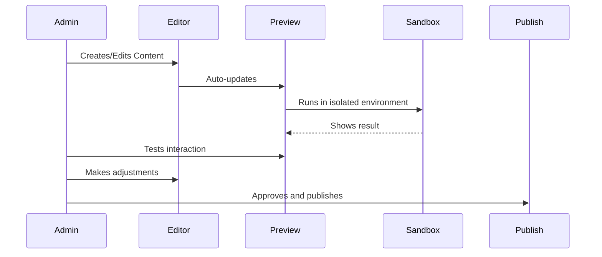
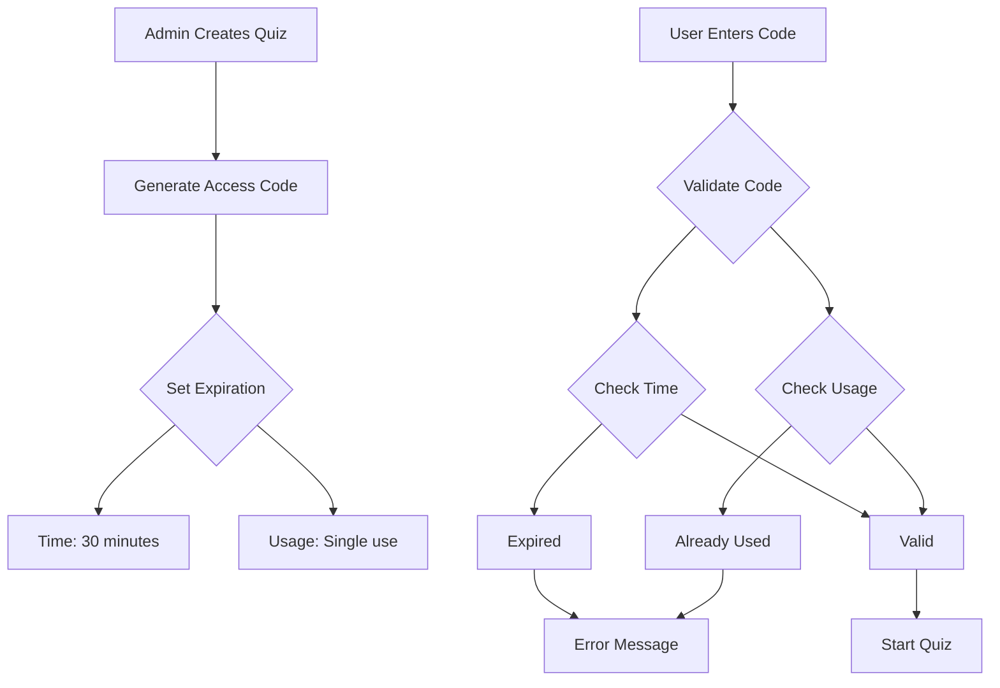

# Implementation Notes

## Study Guide Interactive Elements

### Preview Environment


Key Features:
- Split-screen view with editor and preview
- Real-time preview updates
- Isolated testing environment
- Mobile/desktop view toggle
- Console output for debugging

## Access Code System

### Code Generation and Validation


Code Properties:
- 6 characters (3 letters + 3 numbers)
- Case insensitive
- Expires after 30 minutes OR first use
- No admin tracking required

## Database Updates

### Access Codes Table
```sql
create table access_codes (
  id uuid default uuid_generate_v4() primary key,
  code varchar not null unique,
  quiz_id uuid references quizzes(id) on delete cascade,
  expires_at timestamp with time zone not null, -- Set to 30 minutes from creation
  used boolean default false,
  used_at timestamp with time zone,
  created_at timestamp with time zone default timezone('utc'::text, now())
);

-- Indexes for quick lookup
create index access_codes_code_idx on access_codes(code);
create index access_codes_expires_at_idx on access_codes(expires_at);
```

### Study Guide Preview Table
```sql
create table study_guide_previews (
  id uuid default uuid_generate_v4() primary key,
  guide_id uuid references study_guides(id) on delete cascade,
  content text not null,
  interactive_elements jsonb,
  preview_url varchar,
  created_at timestamp with time zone default timezone('utc'::text, now()),
  updated_at timestamp with time zone default timezone('utc'::text, now())
);
```

## Security Considerations

1. Admin Access:
   - Single password protection
   - Session management
   - Rate limiting on login attempts

2. Access Codes:
   - Rate limiting on code validation attempts
   - Automatic cleanup of expired codes
   - Case-insensitive comparison

3. Study Guide JavaScript:
   - No restrictions on admin JavaScript
   - Preview environment for testing
   - Clear preview/production separation

## Implementation Order

1. Core Infrastructure:
   - Database setup
   - Basic admin authentication
   - File structure setup

2. Admin Features:
   - Question management
   - Study guide editor with preview
   - Access code generation

3. Public Features:
   - Study guide viewer
   - Quiz system
   - Results handling

4. Testing & Deployment:
   - Preview testing
   - Access code validation
   - GitHub Pages setup

## Migration Strategy

1. Data Migration:
   - Export existing questions
   - Create new categories
   - Import questions with categories
   - Verify data integrity

2. Application Migration:
   - Deploy new system
   - Verify functionality
   - Switch DNS/hosting
   - Monitor for issues

3. Backup Plan:
   - Keep old system running
   - Maintain data backups
   - Document rollback procedure
