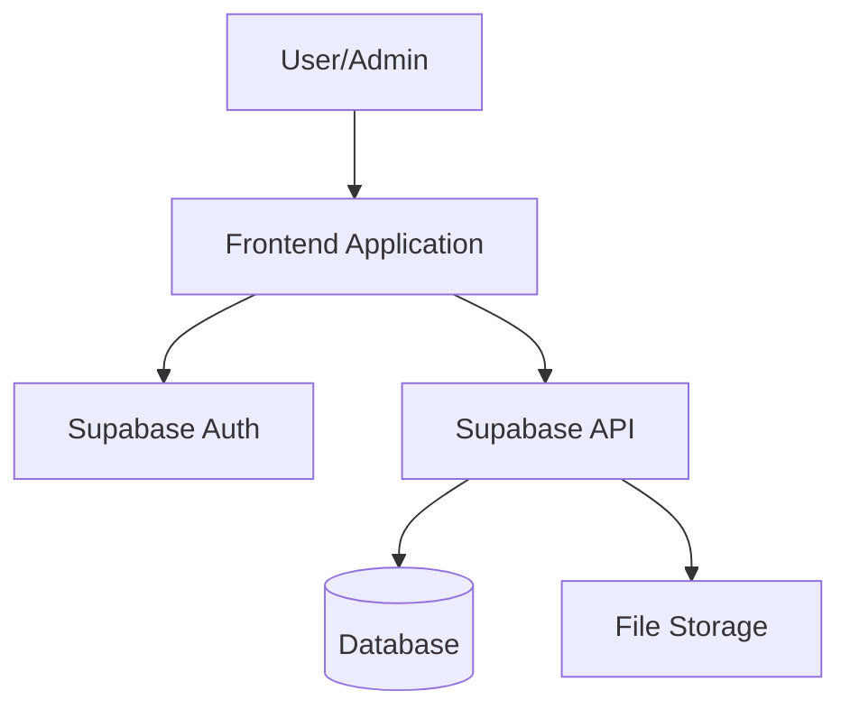

# Training Hub - Project Overview

## Project Purpose
The Training Hub is a web-based platform for delivering training content, study guides, and assessments. The platform consists of a public-facing study area and a protected admin interface for content management.

## Key Features
- **Public Study Guides**: Accessible to all users without authentication
- **Quiz System**: Assessment functionality with detailed results
- **Admin Portal**: Protected interface for content management and analytics
- **Supabase Integration**: Authentication and database backend

## Architecture Overview

## Technology Stack
- **Frontend**: To be determined (React recommended)
- **Backend**: Supabase (Authentication, Database, Storage)
- **Hosting**: To be determined (GitHub Pages or Vercel recommended)
