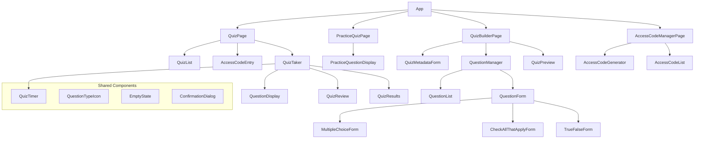

# Quiz UI Components (Part 2)

This document is a continuation of [quiz-components.md](./quiz-components.md) and contains the remaining component specifications for the quiz implementation.

## Table of Contents

1. [QuizResults Component](#quizresults-component)
2. [Practice Quiz Components](#practice-quiz-components)
3. [Access Code Components](#access-code-components)
4. [Shared Components](#shared-components)
5. [Component Hierarchy](#component-hierarchy)

## QuizResults Component

Component for displaying quiz results.

**Props:**
- `quiz`: Quiz object
- `selectedAnswers`: Object mapping question IDs to selected answers
- `score`: Score object with correct, total, and percentage
- `onRetry`: Function to retry the quiz
- `onExit`: Function to exit the quiz
- `isPractice`: Boolean indicating if this was a practice quiz

**Example:**

```jsx
// QuizResults.jsx
import React from 'react';

const QuizResults = ({ quiz, selectedAnswers, score, onRetry, onExit, isPractice }) => {
  // Get result message based on score
  const getResultMessage = (score) => {
    const passingScore = quiz.passing_score || 70;
    
    if (score >= passingScore) {
      if (score >= 90) return 'Excellent work!';
      if (score >= 80) return 'Great job!';
      return 'Good job!';
    }
    
    return 'Keep practicing!';
  };
  
  // Determine if the user passed
  const isPassed = score.percentage >= (quiz.passing_score || 70);
  
  return (
    <div className="text-center p-8">
      <h3 className="mb-8">Quiz Results</h3>
      
      <div className="text-5xl font-bold text-teal-700 mb-4">{score.percentage}%</div>
      
      <p className={`text-2xl font-bold mb-8 ${isPassed ? 'text-green-500' : 'text-amber-500'}`}>
        {getResultMessage(score.percentage)}
      </p>
      
      <p>You answered {score.correct} out of {score.total} questions correctly.</p>
      
      <div className="flex justify-center gap-4 mt-8">
        <button
          className="bg-slate-500 hover:bg-slate-600 text-white border-none rounded py-3 px-4 text-sm font-bold cursor-pointer transition-colors"
          onClick={onExit}
        >
          Back to Quizzes
        </button>
        
        {isPractice && (
          <button
            className="bg-teal-700 hover:bg-teal-800 text-white border-none rounded py-3 px-4 text-sm font-bold cursor-pointer transition-colors"
            onClick={onRetry}
          >
            Retry Quiz
          </button>
        )}
      </div>
      
      <div className="mt-12 text-left">
        <h4 className="mb-6">Question Review</h4>
        
        {quiz.questions.map((question, index) => {
          const selectedAnswer = selectedAnswers[question.id];
          let isCorrect = false;
          
          // Determine if the answer was correct
          switch (question.question_type) {
            case 'multiple_choice':
              isCorrect = selectedAnswer === question.correct_answer;
              break;
            case 'check_all_that_apply':
              if (Array.isArray(selectedAnswer) && Array.isArray(question.correct_answer)) {
                isCorrect = 
                  selectedAnswer.length === question.correct_answer.length &&
                  selectedAnswer.every(a => question.correct_answer.includes(a));
              }
              break;
            case 'true_false':
              isCorrect = selectedAnswer === question.correct_answer;
              break;
          }
          
          return (
            <div key={question.id} className="mb-8 p-6 bg-slate-50 rounded-lg">
              <p className="font-bold mb-4">
                {index + 1}. {question.question_text}
              </p>
              
              {/* Multiple choice display */}
              {question.question_type === 'multiple_choice' && question.options.map((option, optionIndex) => {
                const isSelected = optionIndex === selectedAnswer;
                const isCorrectAnswer = optionIndex === question.correct_answer;
                let className = "p-3 mb-2 rounded ";
                
                if (isSelected) {
                  className += isCorrectAnswer 
                    ? "bg-green-100 text-green-800 border border-green-500 " 
                    : "bg-red-100 text-red-800 border border-red-500 ";
                } else {
                  className += isCorrectAnswer 
                    ? "bg-teal-50 border border-slate-200 " 
                    : "bg-white border border-slate-200 text-slate-900 ";
                }
                
                return (
                  <div key={optionIndex} className={className}>
                    {option}
                    {isCorrectAnswer && <span className="ml-2 text-green-500">✓</span>}
                    {isSelected && !isCorrectAnswer && <span className="ml-2 text-red-500">✗</span>}
                  </div>
                );
              })}
              
              {/* Check all that apply display */}
              {question.question_type === 'check_all_that_apply' && question.options.map((option, optionIndex) => {
                const isSelected = Array.isArray(selectedAnswer) && selectedAnswer.includes(optionIndex);
                const isCorrectAnswer = Array.isArray(question.correct_answer) && question.correct_answer.includes(optionIndex);
                let className = "p-3 mb-2 rounded ";
                
                if (isSelected) {
                  className += isCorrectAnswer 
                    ? "bg-green-100 text-green-800 border border-green-500 " 
                    : "bg-red-100 text-red-800 border border-red-500 ";
                } else {
                  className += isCorrectAnswer 
                    ? "bg-teal-50 border border-slate-200 " 
                    : "bg-white border border-slate-200 text-slate-900 ";
                }
                
                return (
                  <div key={optionIndex} className={className}>
                    {option}
                    {isCorrectAnswer && <span className="ml-2 text-green-500">✓</span>}
                    {isSelected && !isCorrectAnswer && <span className="ml-2 text-red-500">✗</span>}
                  </div>
                );
              })}
              
              {/* True/False display */}
              {question.question_type === 'true_false' && (
                <div className="flex space-x-4">
                  <div className={`flex-1 p-3 rounded ${
                    selectedAnswer === true
                      ? (question.correct_answer === true ? 'bg-green-100 text-green-800 border border-green-500' : 'bg-red-100 text-red-800 border border-red-500')
                      : (question.correct_answer === true ? 'bg-teal-50 border border-slate-200' : 'bg-white border border-slate-200 text-slate-900')
                  }`}>
                    True
                    {question.correct_answer === true && <span className="ml-2 text-green-500">✓</span>}
                    {selectedAnswer === true && question.correct_answer !== true && <span className="ml-2 text-red-500">✗</span>}
                  </div>
                  <div className={`flex-1 p-3 rounded ${
                    selectedAnswer === false
                      ? (question.correct_answer === false ? 'bg-green-100 text-green-800 border border-green-500' : 'bg-red-100 text-red-800 border border-red-500')
                      : (question.correct_answer === false ? 'bg-teal-50 border border-slate-200' : 'bg-white border border-slate-200 text-slate-900')
                  }`}>
                    False
                    {question.correct_answer === false && <span className="ml-2 text-green-500">✓</span>}
                    {selectedAnswer === false && question.correct_answer !== false && <span className="ml-2 text-red-500">✗</span>}
                  </div>
                </div>
              )}
              
              {/* Explanation for incorrect answers */}
              {!isCorrect && question.explanation && (
                <div className="mt-4 p-3 bg-slate-100 rounded">
                  <p className="font-medium">Explanation:</p>
                  <p>{question.explanation}</p>
                </div>
              )}
            </div>
          );
        })}
      </div>
    </div>
  );
};

export default QuizResults;
```

## Practice Quiz Components

### PracticeQuizPage

Page component for practice quizzes.

**Props:**
- None (uses React Router params)

**State:**
- `category`: Category object
- `questions`: Array of questions
- `currentQuestionIndex`: Index of the current question
- `isLoading`: Boolean loading state
- `error`: Error state

**Example:**

```jsx
// PracticeQuizPage.jsx
import React, { useState, useEffect } from 'react';
import { useParams, useNavigate } from 'react-router-dom';
import { categoriesService } from '../services/api/categories';
import { questionsService } from '../services/api/questions';
import PracticeQuestionDisplay from '../components/practice-quiz/PracticeQuestionDisplay';

const PracticeQuizPage = () => {
  const { categoryId } = useParams();
  const navigate = useNavigate();
  const [category, setCategory] = useState(null);
  const [questions, setQuestions] = useState([]);
  const [currentQuestionIndex, setCurrentQuestionIndex] = useState(0);
  const [isLoading, setIsLoading] = useState(true);
  const [error, setError] = useState(null);
  
  // Fetch category and questions
  useEffect(() => {
    const fetchData = async () => {
      setIsLoading(true);
      setError(null);
      
      try {
        // Fetch category
        const categoryData = await categoriesService.getById(categoryId);
        setCategory(categoryData);
        
        // Fetch questions for category
        const questionsData = await questionsService.getByCategory(categoryId);
        setQuestions(questionsData);
      } catch (error) {
        setError('Failed to load practice quiz');
      } finally {
        setIsLoading(false);
      }
    };
    
    fetchData();
  }, [categoryId]);
  
  // Handle moving to next question
  const handleNextQuestion = () => {
    if (currentQuestionIndex < questions.length - 1) {
      setCurrentQuestionIndex(currentQuestionIndex + 1);
    } else {
      // End of questions, show completion message
      setCurrentQuestionIndex(-1);
    }
  };
  
  // Handle restarting the quiz
  const handleRestart = () => {
    setCurrentQuestionIndex(0);
  };
  
  if (isLoading) {
    return <div className="text-center p-8">Loading practice quiz...</div>;
  }
  
  if (error) {
    return (
      <div className="bg-red-50 text-red-600 p-4 rounded-lg mb-6">
        {error}
        <div className="mt-4">
          <button
            className="bg-slate-500 hover:bg-slate-600 text-white border-none rounded py-2 px-3 text-sm font-bold cursor-pointer transition-colors"
            onClick={() => navigate('/study-guide')}
          >
            Back to Study Guide
          </button>
        </div>
      </div>
    );
  }
  
  if (!category || questions.length === 0) {
    return (
      <div className="bg-amber-50 text-amber-600 p-4 rounded-lg mb-6">
        No practice questions available for this category.
        <div className="mt-4">
          <button
            className="bg-slate-500 hover:bg-slate-600 text-white border-none rounded py-2 px-3 text-sm font-bold cursor-pointer transition-colors"
            onClick={() => navigate('/study-guide')}
          >
            Back to Study Guide
          </button>
        </div>
      </div>
    );
  }
  
  return (
    <div className="py-4 max-w-full">
      <div className="mb-8 flex justify-between items-center">
        <div>
          <h2 className="text-4xl text-teal-700 m-0">Practice Quiz</h2>
          <p className="text-slate-500 mt-2">{category.name}</p>
        </div>
        <button
          className="bg-slate-500 hover:bg-slate-600 text-white border-none rounded py-2 px-3 text-sm font-bold cursor-pointer transition-colors"
          onClick={() => navigate('/study-guide')}
        >
          Back to Study Guide
        </button>
      </div>
      
      <div className="bg-white rounded-lg p-8 shadow">
        {currentQuestionIndex === -1 ? (
          // Quiz completion screen
          <div className="text-center">
            <h3 className="text-xl font-bold mb-6">Practice Complete!</h3>
            <p className="mb-6">You've completed all practice questions for this category.</p>
            <div className="flex justify-center gap-4">
              <button
                className="bg-teal-700 hover:bg-teal-800 text-white border-none rounded py-3 px-4 text-sm font-bold cursor-pointer transition-colors"
                onClick={handleRestart}
              >
                Restart Practice
              </button>
              <button
                className="bg-slate-500 hover:bg-slate-600 text-white border-none rounded py-3 px-4 text-sm font-bold cursor-pointer transition-colors"
                onClick={() => navigate(`/study-guide/category/${categoryId}`)}
              >
                Back to Category
              </button>
            </div>
          </div>
        ) : (
          // Question display
          <>
            <div className="flex justify-between mb-6">
              <span>Question {currentQuestionIndex + 1} of {questions.length}</span>
            </div>
            
            <PracticeQuestionDisplay
              question={questions[currentQuestionIndex]}
              onNext={handleNextQuestion}
            />
          </>
        )}
      </div>
    </div>
  );
};

export default PracticeQuizPage;
```

### PracticeQuestionDisplay

Component for displaying a practice question with immediate feedback.

**Props:**
- `question`: Question object to display
- `onNext`: Function to move to the next question

**State:**
- `selectedAnswer`: Currently selected answer
- `showFeedback`: Boolean indicating if feedback should be shown
- `isCorrect`: Boolean indicating if the selected answer is correct

**Example:**

```jsx
// PracticeQuestionDisplay.jsx
import React, { useState } from 'react';

const PracticeQuestionDisplay = ({ question, onNext }) => {
  const [selectedAnswer, setSelectedAnswer] = useState(null);
  const [showFeedback, setShowFeedback] = useState(false);
  const [isCorrect, setIsCorrect] = useState(false);
  
  // Handle selecting an answer
  const handleSelectAnswer = (answer) => {
    if (showFeedback) return; // Prevent changing answer after feedback is shown
    
    setSelectedAnswer(answer);
    
    // Check if answer is correct
    let correct = false;
    switch (question.question_type) {
      case 'multiple_choice':
        correct = answer === question.correct_answer;
        break;
      case 'check_all_that_apply':
        if (Array.isArray(answer) && Array.isArray(question.correct_answer)) {
          correct = 
            answer.length === question.correct_answer.length &&
            answer.every(a => question.correct_answer.includes(a));
        }
        break;
      case 'true_false':
        correct = answer === question.correct_answer;
        break;
    }
    
    setIsCorrect(correct);
    setShowFeedback(true);
  };
  
  // Render different question types
  const renderQuestionContent = () => {
    switch (question.question_type) {
      case 'multiple_choice':
        return (
          <ul className="list-none p-0 m-0">
            {question.options.map((option, index) => {
              const isSelected = selectedAnswer === index;
              return (
                <li
                  key={index}
                  className={`p-4 mb-3 border rounded cursor-pointer transition-all ${isSelected ? 'border-teal-700 bg-teal-50' : 'border-slate-200 bg-white hover:border-teal-700 hover:bg-teal-50'}`}
                  onClick={() => handleSelectAnswer(index)}
                >
                  {option}
                </li>
              );
            })}
          </ul>
        );
        
      case 'check_all_that_apply':
        return (
          <div className="space-y-3">
            {question.options.map((option, index) => {
              const isSelected = Array.isArray(selectedAnswer) && selectedAnswer.includes(index);
              return (
                <label
                  key={index}
                  className={`flex items-center p-4 border rounded cursor-pointer transition-all ${isSelected ? 'border-teal-700 bg-teal-50' : 'border-slate-200 bg-white hover:border-teal-700 hover:bg-teal-50'}`}
                >
                  <input
                    type="checkbox"
                    className="h-4 w-4 text-teal-600 border-slate-300 rounded"
                    checked={isSelected}
                    onChange={() => {
                      if (showFeedback) return; // Prevent changing answer after feedback is shown
                      
                      const newSelection = Array.isArray(selectedAnswer) ? [...selectedAnswer] : [];
                      if (isSelected) {
                        const idx = newSelection.indexOf(index);
                        if (idx !== -1) newSelection.splice(idx, 1);
                      } else {
                        newSelection.push(index);
                      }
                      setSelectedAnswer(newSelection);
                    }}
                    disabled={showFeedback}
                  />
                  <span className="ml-2">{option}</span>
                </label>
              );
            })}
            
            <button
              className="bg-teal-700 hover:bg-teal-800 text-white border-none rounded py-2 px-3 text-sm font-bold cursor-pointer transition-colors"
              onClick={() => handleSelectAnswer(selectedAnswer || [])}
              disabled={showFeedback}
            >
              Check Answer
            </button>
          </div>
        );
        
      case 'true_false':
        return (
          <div className="flex space-x-4">
            <button
              className={`flex-1 p-4 border rounded cursor-pointer transition-all ${selectedAnswer === true ? 'border-teal-700 bg-teal-50' : 'border-slate-200 bg-white hover:border-teal-700 hover:bg-teal-50'}`}
              onClick={() => handleSelectAnswer(true)}
              disabled={showFeedback}
            >
              True
            </button>
            <button
              className={`flex-1 p-4 border rounded cursor-pointer transition-all ${selectedAnswer === false ? 'border-teal-700 bg-teal-50' : 'border-slate-200 bg-white hover:border-teal-700 hover:bg-teal-50'}`}
              onClick={() => handleSelectAnswer(false)}
              disabled={showFeedback}
            >
              False
            </button>
          </div>
        );
        
      default:
        return <p>Unsupported question type</p>;
    }
  };
  
  // Render feedback
  const renderFeedback = () => {
    if (!showFeedback) return null;
    
    return (
      <div className={`mt-6 p-4 rounded-lg ${isCorrect ? 'bg-green-50 border border-green-200' : 'bg-red-50 border border-red-200'}`}>
        <h4 className={`font-bold ${isCorrect ? 'text-green-700' : 'text-red-700'}`}>
          {isCorrect ? 'Correct!' : 'Incorrect'}
        </h4>
        
        {!isCorrect && (
          <div className="mt-2">
            <p className="font-medium">Correct answer:</p>
            {question.question_type === 'multiple_choice' && (
              <p>{question.options[question.correct_answer]}</p>
            )}
            
            {question.question_type === 'check_all_that_apply' && (
              <ul className="list-disc pl-5 mt-1">
                {question.correct_answer.map(index => (
                  <li key={index}>{question.options[index]}</li>
                ))}
              </ul>
            )}
            
            {question.question_type === 'true_false' && (
              <p>{question.correct_answer ? 'True' : 'False'}</p>
            )}
            
            {question.explanation && (
              <div className="mt-3 pt-3 border-t border-red-200">
                <p className="font-medium">Explanation:</p>
                <p>{question.explanation}</p>
              </div>
            )}
          </div>
        )}
        
        <div className="mt-4">
          <button
            className="bg-teal-700 hover:bg-teal-800 text-white border-none rounded py-2 px-3 text-sm font-bold cursor-pointer transition-colors"
            onClick={onNext}
          >
            Next Question
          </button>
        </div>
      </div>
    );
  };
  
  if (!question) {
    return <div>No question available</div>;
  }
  
  return (
    <div className="mb-8">
      <p className="text-xl font-bold mb-6 text-slate-900">
        {question.question_text}
      </p>
      
      {renderQuestionContent()}
      {renderFeedback()}
    </div>
  );
};

export default PracticeQuestionDisplay;
```

## Access Code Components

### AccessCodeManagerPage

Admin page for managing access codes.

**Props:**
- None (uses React Router params)

**State:**
- `quizzes`: Array of quizzes
- `selectedQuizId`: ID of the selected quiz
- `accessCodes`: Array of access codes for the selected quiz
- `isGeneratingCode`: Boolean indicating if a code is being generated
- `isLoading`: Boolean loading state
- `error`: Error state

**Example:**

```jsx
// AccessCodeManagerPage.jsx
import React, { useState, useEffect } from 'react';
import { quizzesService } from '../services/api/quizzes';
import { accessCodesService } from '../services/api/accessCodes';
import AccessCodeGenerator from '../components/access-code/AccessCodeGenerator';
import AccessCodeList from '../components/access-code/AccessCodeList';

const AccessCodeManagerPage = () => {
  const [quizzes, setQuizzes] = useState([]);
  const [selectedQuizId, setSelectedQuizId] = useState('');
  const [accessCodes, setAccessCodes] = useState([]);
  const [isGeneratingCode, setIsGeneratingCode] = useState(false);
  const [isLoading, setIsLoading] = useState(true);
  const [error, setError] = useState(null);
  
  // Fetch quizzes
  useEffect(() => {
    const fetchQuizzes = async () => {
      setIsLoading(true);
      try {
        const data = await quizzesService.getAll();
        setQuizzes(data.filter(quiz => !quiz.is_practice));
      } catch (error) {
        setError('Failed to load quizzes');
      } finally {
        setIsLoading(false);
      }
    };
    
    fetchQuizzes();
  }, []);
  
  // Fetch access codes when a quiz is selected
  useEffect(() => {
    if (!selectedQuizId) {
      setAccessCodes([]);
      return;
    }
    
    const fetchAccessCodes = async () => {
      setIsLoading(true);
      try {
        const data = await accessCodesService.getByQuizId(selectedQuizId);
        setAccessCodes(data);
      } catch (error) {
        setError('Failed to load access codes');
      } finally {
        setIsLoading(false);
      }
    };
    
    fetchAccessCodes();
  }, [selectedQuizId]);
  
  // Handle quiz selection
  const handleQuizChange = (e) => {
    setSelectedQuizId(e.target.value);
  };
  
  // Handle code generation
  const handleCodeGenerated = (code) => {
    setAccessCodes([code, ...accessCodes]);
    setIsGeneratingCode(false);
  };
  
  // Handle code deletion
  const handleDeleteCode = async (codeId) => {
    try {
      await accessCodesService.delete(codeId);
      setAccessCodes(accessCodes.filter(code => code.id !== codeId));
    } catch (error) {
      setError('Failed to delete access code');
    }
  };
  
  return (
    <div className="py-4 max-w-full">
      <div className="mb-8 flex justify-between items-center">
        <h2 className="text-4xl text-teal-700 m-0">Access Codes</h2>
      </div>
      
      {error && (
        <div className="bg-red-50 text-red-600 p-4 rounded-lg mb-6">{error}</div>
      )}
      
      <div className="bg-white rounded-lg shadow p-6 mb-6">
        <div className="mb-6">
          <label className="block text-sm font-medium text-slate-700 mb-1">
            Select Quiz
          </label>
          <select
            className="w-full py-2 px-3 border border-slate-300 rounded-md"
            value={selectedQuizId}
            onChange={handleQuizChange}
            disabled={isLoading}
          >
            <option value="">Select a quiz</option>
            {quizzes.map(quiz => (
              <option key={quiz.id} value={quiz.id}>
                {quiz.title}
              </option>
            ))}
          </select>
        </div>
        
        {selectedQuizId && !isGeneratingCode && (
          <button
            className="bg-teal-700 hover:bg-teal-800 text-white border-none rounded py-3 px-4 text-sm font-bold cursor-pointer transition-colors"
            onClick={() => setIsGeneratingCode(true)}
          >
            Generate New Access Code
          </button>
        )}
        
        {selectedQuizId && isGeneratingCode && (
          <AccessCodeGenerator
            quizId={selectedQuizId}
            onGenerated={handleCodeGenerated}
            onCancel={() => setIsGeneratingCode(false)}
          />
        )}
      </div>
      
      {selectedQuizId && (
        <div className="bg-white rounded-lg shadow overflow-hidden">
          <AccessCodeList
            accessCodes={accessCodes}
            isLoading={isLoading}
            onDelete={handleDeleteCode}
          />
        </div>
      )}
    </div>
  );
};

export default AccessCodeManagerPage;
```

### AccessCodeGenerator

Component for generating access codes.

**Props:**
- `quizId`: ID of the quiz to generate a code for
- `onGenerated`: Function called when a code is generated
- `onCancel`: Function to cancel code generation

**State:**
- `testTakerInfo`: Object containing test taker information
- `isGenerating`: Boolean indicating if a code is being generated
- `error`: Error state

**Example:**

```jsx
// AccessCodeGenerator.jsx
import React, { useState } from 'react';
import { accessCodesService } from '../../services/api/accessCodes';

const AccessCodeGenerator = ({ quizId, onGenerated, onCancel }) => {
  const [testTakerInfo, setTestTakerInfo] = useState({
    ldap: '',
    email: '',
    supervisor: '',
    market: ''
  });
  const [isGenerating, setIsGenerating] = useState(false);
  const [error, setError] = useState(null);
  
  // Handle form field changes
  const handleChange = (field, value) => {
    setTestTakerInfo({
      ...testTakerInfo,
      [field]: value
    });
  };
  
  // Handle form submission
  const handleSubmit = async (e) => {
    e.preventDefault();
    setIsGenerating(true);
    setError(null);
    
    try {
      const code = await accessCodesService.generateCode(quizId, testTakerInfo);
      onGenerated(code);
    } catch (error) {
      setError('Failed to generate access code');
      setIsGenerating(false);
    }
  };
  
  return (
    <div className="space-y-6">
      <h3 className="text-xl font-bold">Generate Access Code</h3>
      
      {error && (
        <div className="bg-red-50 text-red-600 p-4 rounded-lg">{error}</div>
      )}
      
      <form className="space-y-4" onSubmit={handleSubmit}>
        <div>
          <label className="block text-sm font-medium text-slate-700 mb-1">
            LDAP Username
          </label>
          <input
            type="text"
            className="w-full py-2 px-3 border border-slate-300 rounded-md"
            value={testTakerInfo.ldap}
            onChange={(e) => handleChange('ldap', e.target.value)}
            required
            disabled={isGenerating}
          />
        </div>
        
        <div>
          <label className="block text-sm font-medium text-slate-700 mb-1">
            Email
          </label>
          <input
            type="email"
            className="w-full py-2 px-3 border border-slate-300 rounded-md"
            value={testTakerInfo.email}
            onChange={(e) => handleChange('email', e.target.value)}
            required
            disabled={isGenerating}
          />
        </div>
        
        <div>
          <label className="block text-sm font-medium text-slate-700 mb-1">
            Supervisor
          </label>
          <input
            type="text"
            className="w-full py-2 px-3 border border-slate-300 rounded-md"
            value={testTakerInfo.supervisor}
            onChange={(e) => handleChange('supervisor', e.target.value)}
            required
            disabled={isGenerating}
          />
        </div>
        
        <div>
          <label className="block text-sm font-medium text-slate-700 mb-1">
            Market
          </label>
          <input
            type="text"
            className="w-full py-2 px-3 border border-slate-300 rounded-md"
            value={testTakerInfo.market}
            onChange={(e) => handleChange('market', e.target.value)}
            required
            disabled={isGenerating}
          />
        </div>
        
        <div className="flex justify-end space-x-4 pt-4">
          <button
            type="button"
            className="py-2 px-4 border border-slate-300 rounded-md text-slate-700 hover:bg-slate-50"
            onClick={onCancel}
            disabled={isGenerating}
          >
            Cancel
          </button>
          <button
            type="submit"
            className="py-2 px-4 bg-teal-700 text-white rounded-md hover:bg-teal-800"
            disabled={isGenerating}
          >
            {isGenerating ? 'Generating...' : 'Generate Code'}
          </button>
        </div>
      </form>
    </div>
  );
};

export default AccessCodeGenerator;
```

### AccessCodeList

Component for displaying a list of access codes.

**Props:**
- `accessCodes`: Array of access code objects
- `isLoading`: Boolean loading state
- `onDelete`: Function to handle code deletion

**Example:**

```jsx
// AccessCodeList.jsx
import React from 'react';

const AccessCodeList = ({ accessCodes, isLoading, onDelete }) => {
  if (isLoading) {
    return <div className="text-center p-8">Loading access codes...</div>;
  }
  
  if (accessCodes.length === 0) {
    return <div className="text-center p-8 text-slate-500">No access codes found</div>;
  }
  
  return (
    <table className="w-full">
      <thead className="bg-slate-50">
        <tr>
          <th className="py-3 px-4 text-left text-sm font-medium text-slate-700">Code</th>
          <th className="py-3 px-4 text-left text-sm font-medium text-slate-700">LDAP</th>
          <th className="py-3 px-4 text-left text-sm font-medium text-slate-700">Email</th>
          <th className="py-3 px-4 text-left text-sm font-medium text-slate-700">Supervisor</th>
          <th className="py-3 px-4 text-left text-sm font-medium text-slate-700">Market</th>
          <th className="py-3 px-4 text-left text-sm font-medium text-slate-700">Status</th>
          <th className="py-3 px-4 text-left text-sm font-medium text-slate-700">Created</th>
          <th className="py-3 px-4 text-left text-sm font-medium text-slate-700">Actions</th>
        </tr>
      </thead>
      <tbody className="divide-y divide-slate-200">
        {accessCodes.map(code => (
          <tr key={code.id} className="hover:bg-slate-50">
            <td className="py-3 px-4 font-mono">{code.code}</td>
            <td className="py-3 px-4">{code.ldap}</td>
            <td className="py-3 px-4">{code.email}</td>
            <td className="py-3 px-4">{code.supervisor}</td>
            <td className="py-3 px-4">{code.market}</td>
            <td className="py-3 px-4">
              <span className={`px-2 py-1 rounded text-xs font-medium ${
                code.is_used ? 'bg-slate-100 text-slate-800' : 'bg-green-100 text-green-800'
              }`}>
                {code.is_used ? 'Used' : 'Available'}
              </span>
            </td>
            <td className="py-3 px-4">{new Date(code.created_at).toLocaleDateString()}</td>
            <td className="py-3 px-4">
              {!code.is_used && (
                <button
                  className="text-red-600 hover:text-red-800"
                  onClick={() => onDelete(code.id)}
                >
                  Delete
                </button>
              )}
            </td>
          </tr>
        ))}
      </tbody>
    </table>
  );
};

export default AccessCodeList;
```

## Shared Components

### QuizTimer

Component for displaying a countdown timer.

**Props:**
- `timeLeft`: Number of seconds remaining
- `formatTime`: Function to format time as MM:SS
- `isWarning`: Boolean indicating if time is running low

**Example:**

```jsx
// QuizTimer.jsx
import React from 'react';

const QuizTimer = ({ timeLeft, formatTime, isWarning }) => {
  return (
    <div className={`flex items-center gap-2 ${isWarning ? 'text-red-500 font-bold' : 'text-slate-500'}`}>
      <span>⏱️</span> {formatTime(timeLeft)}
    </div>
  );
};

export default QuizTimer;
```

### QuestionTypeIcon

Component for displaying an icon representing a question type.

**Props:**
- `type`: Question type string
- `size`: Icon size (small, medium, large)

**Example:**

```jsx
// QuestionTypeIcon.jsx
import React from 'react';

const QuestionTypeIcon = ({ type, size = 'medium' }) => {
  const getIcon = () => {
    switch (type) {
      case 'multiple_choice':
        return '🔘';
      case 'check_all_that_apply':
        return '☑️';
      case 'true_false':
        return '✓✗';
      default:
        return '❓';
    }
  };
  
  const getSize = () => {
    switch (size) {
      case 'small':
        return 'text-sm';
      case 'large':
        return 'text-xl';
      case 'medium':
      default:
        return 'text-base';
    }
  };
  
  return (
    <span className={`${getSize()} flex items-center justify-center`}>
      {getIcon()}
    </span>
  );
};

export default QuestionTypeIcon;
```

### EmptyState

Component for displaying an empty state message.

**Props:**
- `message`: Message to display
- `icon`: Optional icon to display
- `action`: Optional action button
- `onAction`: Function to handle action button click

**Example:**

```jsx
// EmptyState.jsx
import React from 'react';

const EmptyState = ({ message, icon, action, onAction }) => {
  return (
    <div className="text-center p-8">
      {icon && <div className="text-4xl mb-4">{icon}</div>}
      <p className="text-slate-500 mb-4">{message}</p>
      {action && (
        <button
          className="bg-teal-700 hover:bg-teal-800 text-white border-none rounded py-2 px-3 text-sm font-bold cursor-pointer transition-colors"
          onClick={onAction}
        >
          {action}
        </button>
      )}
    </div>
  );
};

export default EmptyState;
```

### ConfirmationDialog

Component for displaying a confirmation dialog.

**Props:**
- `title`: Dialog title
- `message`: Dialog message
- `confirmText`: Text for confirm button
- `cancelText`: Text for cancel button
- `onConfirm`: Function to handle confirmation
- `onCancel`: Function to handle cancellation
- `isOpen`: Boolean indicating if the dialog is open
- `isDestructive`: Boolean indicating if the action is destructive

**Example:**

```jsx
// ConfirmationDialog.jsx
import React from 'react';

const ConfirmationDialog = ({
  title,
  message,
  confirmText = 'Confirm',
  cancelText = 'Cancel',
  onConfirm,
  onCancel,
  isOpen,
  isDestructive = false
}) => {
  if (!isOpen) return null;
  
  return (
    <div className="fixed inset-0 bg-black bg-opacity-50 flex items-center justify-center z-50">
      <div className="bg-white rounded-lg p-6 max-w-md w-full">
        <h3 className="text-xl font-bold mb-4">{title}</h3>
        <p className="mb-6">{message}</p>
        <div className="flex justify-end space-x-4">
          <button
            className="py-2 px-4 border border-slate-300 rounded-md text-slate-700 hover:bg-slate-50"
            onClick={onCancel}
          >
            {cancelText}
          </button>
          <button
            className={`py-2 px-4 text-white rounded-md ${
              isDestructive ? 'bg-red-600 hover:bg-red-700' : 'bg-teal-700 hover:bg-teal-800'
            }`}
            onClick={onConfirm}
          >
            {confirmText}
          </button>
        </div>
      </div>
    </div>
  );
};

export default ConfirmationDialog;
```

## Component Hierarchy

The following diagram illustrates the component hierarchy for the quiz implementation:



This component hierarchy shows the relationships between the various components in the quiz implementation. The main pages (QuizPage, PracticeQuizPage, QuizBuilderPage, and AccessCodeManagerPage) are at the top level, with their respective child components below them. The shared components are used throughout the application.

The component hierarchy is designed to be modular and reusable, with each component having a specific responsibility. This approach makes the code easier to maintain and extend in the future.
