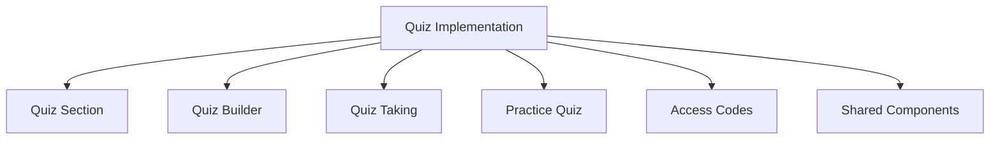

# Quiz UI Components (Part 1)

This document details the UI components needed for the quiz implementation. It includes component specifications, props, state management, and component relationships.

**Note:** Due to the extensive nature of the component documentation, this file has been split into two parts. Please see [quiz-components-part2.md](./quiz-components-part2.md) for the continuation, which includes the QuizResults component, Practice Quiz Components, Access Code Components, Shared Components, and Component Hierarchy.

## Table of Contents

### Part 1 (This File)
1. [Component Overview](#component-overview)
2. [Quiz Section Components](#quiz-section-components)
3. [Quiz Builder Components](#quiz-builder-components)
4. [Quiz Taking Components](#quiz-taking-components)

### Part 2 ([quiz-components-part2.md](./quiz-components-part2.md))
5. [QuizResults Component](./quiz-components-part2.md#quizresults-component)
6. [Practice Quiz Components](./quiz-components-part2.md#practice-quiz-components)
7. [Access Code Components](./quiz-components-part2.md#access-code-components)
8. [Shared Components](./quiz-components-part2.md#shared-components)
9. [Component Hierarchy](./quiz-components-part2.md#component-hierarchy)

## Component Overview

The quiz implementation will require several new React components organized into logical groups. These components will be built using the same patterns and styling (Tailwind CSS) as the existing application.



## Quiz Section Components

### QuizPage

The main page component for the quiz section, similar to the existing StudyGuidePage.

**Props:**
- None (uses React Router params)

**State:**
- `quizzes`: Array of quizzes
- `accessCode`: String for access code input
- `searchQuery`: String for filtering quizzes
- `isLoadingQuizzes`: Boolean loading state
- `quizzesError`: Error state for quiz loading

**Functionality:**
- Display list of available quizzes
- Allow searching/filtering of quizzes
- Provide access code entry
- Navigate to specific quiz when selected

**Example:**

```jsx
// QuizPage.jsx
import React, { useState, useEffect } from 'react';
import { useParams, useNavigate } from 'react-router-dom';
import { quizzesService } from '../services/api/quizzes';
import QuizList from '../components/quiz/QuizList';
import QuizTaker from '../components/quiz/QuizTaker';
import AccessCodeEntry from '../components/quiz/AccessCodeEntry';

const QuizPage = () => {
  const { quizId } = useParams();
  const navigate = useNavigate();
  const [quizzes, setQuizzes] = useState([]);
  const [accessCode, setAccessCode] = useState('');
  const [searchQuery, setSearchQuery] = useState('');
  const [isLoadingQuizzes, setIsLoadingQuizzes] = useState(false);
  const [quizzesError, setQuizzesError] = useState(null);
  
  // Fetch quizzes on component mount
  useEffect(() => {
    const fetchQuizzes = async () => {
      setIsLoadingQuizzes(true);
      try {
        const data = await quizzesService.getAllWithQuestionCount();
        setQuizzes(data);
      } catch (error) {
        setQuizzesError('Failed to load quizzes');
      } finally {
        setIsLoadingQuizzes(false);
      }
    };
    
    fetchQuizzes();
  }, []);
  
  // Handle access code submission
  const handleAccessCodeSubmit = () => {
    navigate(`/quiz/access/${accessCode}`);
  };
  
  // Filter quizzes based on search query
  const filteredQuizzes = quizzes.filter(quiz => 
    quiz.title.toLowerCase().includes(searchQuery.toLowerCase()) ||
    quiz.description.toLowerCase().includes(searchQuery.toLowerCase())
  );
  
  return (
    <div className="py-4 max-w-full">
      <div className="mb-8 flex justify-between items-center flex-wrap gap-4">
        <h2 className="text-4xl text-teal-700 m-0">Quizzes</h2>
        {!quizId && (
          <div className="flex items-center max-w-md w-full">
            <input
              type="text"
              placeholder="Search quizzes..."
              className="py-3 px-3 border border-slate-200 rounded text-base w-full"
              value={searchQuery}
              onChange={(e) => setSearchQuery(e.target.value)}
            />
          </div>
        )}
      </div>
      
      {quizId ? (
        <QuizTaker quizId={quizId} />
      ) : (
        <>
          <QuizList 
            quizzes={filteredQuizzes} 
            isLoading={isLoadingQuizzes}
            error={quizzesError}
            onSelect={(id) => navigate(`/quiz/${id}`)}
          />
          
          <AccessCodeEntry
            value={accessCode}
            onChange={setAccessCode}
            onSubmit={handleAccessCodeSubmit}
          />
        </>
      )}
    </div>
  );
};

export default QuizPage;
```

### QuizList

Component to display a grid of available quizzes.

**Props:**
- `quizzes`: Array of quiz objects
- `isLoading`: Boolean loading state
- `error`: Error state
- `onSelect`: Function to handle quiz selection

**Example:**

```jsx
// QuizList.jsx
import React from 'react';

const QuizList = ({ quizzes, isLoading, error, onSelect }) => {
  if (isLoading) {
    return <div className="text-center p-8">Loading quizzes...</div>;
  }
  
  if (error) {
    return <div className="bg-red-50 text-red-600 p-4 rounded-lg mb-6">{error}</div>;
  }
  
  if (quizzes.length === 0) {
    return <div className="text-center p-8 text-slate-500">No quizzes found</div>;
  }
  
  return (
    <div className="grid grid-cols-1 sm:grid-cols-2 lg:grid-cols-3 xl:grid-cols-4 gap-6 mt-6">
      {quizzes.map(quiz => (
        <div
          key={quiz.id}
          className="bg-white rounded-lg shadow p-6 cursor-pointer flex flex-col h-full transition-all hover:translate-y-[-5px] hover:shadow-md"
          onClick={() => onSelect(quiz.id)}
        >
          <div className="w-[50px] h-[50px] rounded-full flex items-center justify-center text-2xl mb-4 bg-teal-600 text-white">
            <span>📝</span>
          </div>
          <h3 className="text-xl font-bold mb-2 text-slate-900">{quiz.title}</h3>
          <p className="text-slate-500 mb-4 flex-1">{quiz.description}</p>
          <div className="flex justify-between text-slate-400 text-sm mt-auto mb-4">
            <span>{quiz.questionCount} Questions</span>
            <span>{quiz.time_limit ? `${Math.floor(quiz.time_limit / 60)} min` : 'No time limit'}</span>
          </div>
          <button className="bg-teal-700 hover:bg-teal-800 text-white border-none rounded py-3 px-4 text-sm font-bold cursor-pointer transition-colors w-full">
            Start Quiz
          </button>
        </div>
      ))}
    </div>
  );
};

export default QuizList;
```

### AccessCodeEntry

Component for entering an access code.

**Props:**
- `value`: String for the access code input
- `onChange`: Function to handle input changes
- `onSubmit`: Function to handle form submission

**Example:**

```jsx
// AccessCodeEntry.jsx
import React from 'react';

const AccessCodeEntry = ({ value, onChange, onSubmit }) => {
  const handleSubmit = (e) => {
    e.preventDefault();
    onSubmit();
  };
  
  return (
    <div className="mt-12 p-8 bg-slate-50 rounded-lg">
      <h3 className="mt-0">Have an Access Code?</h3>
      <p>If you have an access code for a specific quiz, enter it below to begin.</p>
      <form onSubmit={handleSubmit} className="flex max-w-md gap-4 mt-4">
        <input
          type="text"
          placeholder="Enter access code"
          className="w-full py-3 px-3 border border-slate-200 rounded text-base"
          value={value}
          onChange={(e) => onChange(e.target.value)}
          maxLength={8}
        />
        <button
          type="submit"
          className="bg-teal-700 hover:bg-teal-800 text-white border-none rounded py-3 px-4 text-sm font-bold cursor-pointer transition-colors"
        >
          Submit
        </button>
      </form>
    </div>
  );
};

export default AccessCodeEntry;
```

## Quiz Builder Components

### QuizBuilderPage

Admin page for creating and editing quizzes.

**Props:**
- None (uses React Router params)

**State:**
- `quiz`: Object containing quiz data
- `isLoading`: Boolean loading state
- `error`: Error state
- `activeTab`: String for active tab (metadata, questions, preview)

**Example:**

```jsx
// QuizBuilderPage.jsx
import React, { useState, useEffect } from 'react';
import { useParams, useNavigate } from 'react-router-dom';
import { quizzesService } from '../services/api/quizzes';
import QuizMetadataForm from '../components/quiz-builder/QuizMetadataForm';
import QuestionManager from '../components/quiz-builder/QuestionManager';
import QuizPreview from '../components/quiz-builder/QuizPreview';

const QuizBuilderPage = () => {
  const { quizId } = useParams();
  const navigate = useNavigate();
  const [quiz, setQuiz] = useState({
    title: '',
    description: '',
    category_ids: [],
    time_limit: null,
    passing_score: 70,
    is_practice: false,
    questions: []
  });
  const [isLoading, setIsLoading] = useState(false);
  const [error, setError] = useState(null);
  const [activeTab, setActiveTab] = useState('metadata');
  
  // Fetch quiz data if editing an existing quiz
  useEffect(() => {
    if (quizId) {
      const fetchQuiz = async () => {
        setIsLoading(true);
        try {
          const data = await quizzesService.getWithQuestions(quizId);
          setQuiz(data);
        } catch (error) {
          setError('Failed to load quiz');
        } finally {
          setIsLoading(false);
        }
      };
      
      fetchQuiz();
    }
  }, [quizId]);
  
  // Handle saving the quiz
  const handleSave = async () => {
    try {
      if (quizId) {
        await quizzesService.update(quizId, quiz);
      } else {
        const newQuiz = await quizzesService.create(quiz);
        navigate(`/admin/quizzes/edit/${newQuiz.id}`);
      }
    } catch (error) {
      setError('Failed to save quiz');
    }
  };
  
  // Update quiz data
  const handleQuizChange = (updatedQuiz) => {
    setQuiz(updatedQuiz);
  };
  
  return (
    <div className="py-4 max-w-full">
      <div className="mb-8 flex justify-between items-center">
        <h2 className="text-4xl text-teal-700 m-0">
          {quizId ? 'Edit Quiz' : 'Create Quiz'}
        </h2>
        <button
          className="bg-teal-700 hover:bg-teal-800 text-white border-none rounded py-3 px-4 text-sm font-bold cursor-pointer transition-colors"
          onClick={handleSave}
        >
          Save Quiz
        </button>
      </div>
      
      {error && (
        <div className="bg-red-50 text-red-600 p-4 rounded-lg mb-6">{error}</div>
      )}
      
      <div className="bg-white rounded-lg shadow p-6">
        <div className="flex border-b mb-6">
          <button
            className={`py-3 px-4 font-medium ${activeTab === 'metadata' ? 'text-teal-700 border-b-2 border-teal-700' : 'text-slate-500'}`}
            onClick={() => setActiveTab('metadata')}
          >
            Quiz Details
          </button>
          <button
            className={`py-3 px-4 font-medium ${activeTab === 'questions' ? 'text-teal-700 border-b-2 border-teal-700' : 'text-slate-500'}`}
            onClick={() => setActiveTab('questions')}
          >
            Questions
          </button>
          <button
            className={`py-3 px-4 font-medium ${activeTab === 'preview' ? 'text-teal-700 border-b-2 border-teal-700' : 'text-slate-500'}`}
            onClick={() => setActiveTab('preview')}
          >
            Preview
          </button>
        </div>
        
        {activeTab === 'metadata' && (
          <QuizMetadataForm
            quiz={quiz}
            onChange={handleQuizChange}
            isLoading={isLoading}
          />
        )}
        
        {activeTab === 'questions' && (
          <QuestionManager
            quiz={quiz}
            onChange={handleQuizChange}
            isLoading={isLoading}
          />
        )}
        
        {activeTab === 'preview' && (
          <QuizPreview quiz={quiz} />
        )}
      </div>
    </div>
  );
};

export default QuizBuilderPage;
```

### QuizMetadataForm

Form for editing quiz metadata.

**Props:**
- `quiz`: Quiz object
- `onChange`: Function to handle changes
- `isLoading`: Boolean loading state

**Example:**

```jsx
// QuizMetadataForm.jsx
import React, { useState, useEffect } from 'react';
import { categoriesService } from '../../services/api/categories';
import { sectionsService } from '../../services/api/sections';

const QuizMetadataForm = ({ quiz, onChange, isLoading }) => {
  const [sections, setSections] = useState([]);
  const [categories, setCategories] = useState([]);
  const [selectedSectionId, setSelectedSectionId] = useState(null);
  
  // Fetch sections and categories
  useEffect(() => {
    const fetchData = async () => {
      try {
        const sectionsData = await sectionsService.getSectionsWithCategories();
        setSections(sectionsData);
        
        // Flatten categories from all sections
        const allCategories = sectionsData.reduce((acc, section) => {
          return [...acc, ...(section.v2_categories || [])];
        }, []);
        
        setCategories(allCategories);
      } catch (error) {
        console.error('Failed to load sections and categories', error);
      }
    };
    
    fetchData();
  }, []);
  
  // Handle form field changes
  const handleChange = (field, value) => {
    onChange({
      ...quiz,
      [field]: value
    });
  };
  
  // Handle category selection
  const handleCategoryChange = (categoryId, isSelected) => {
    const updatedCategoryIds = isSelected
      ? [...quiz.category_ids, categoryId]
      : quiz.category_ids.filter(id => id !== categoryId);
    
    onChange({
      ...quiz,
      category_ids: updatedCategoryIds
    });
  };
  
  // Filter categories by selected section
  const filteredCategories = selectedSectionId
    ? categories.filter(category => category.section_id === selectedSectionId)
    : categories;
  
  return (
    <div className="space-y-6">
      <div>
        <label className="block text-sm font-medium text-slate-700 mb-1">
          Quiz Title
        </label>
        <input
          type="text"
          className="w-full py-2 px-3 border border-slate-300 rounded-md"
          value={quiz.title}
          onChange={(e) => handleChange('title', e.target.value)}
          disabled={isLoading}
        />
      </div>
      
      <div>
        <label className="block text-sm font-medium text-slate-700 mb-1">
          Description
        </label>
        <textarea
          className="w-full py-2 px-3 border border-slate-300 rounded-md"
          value={quiz.description || ''}
          onChange={(e) => handleChange('description', e.target.value)}
          rows={3}
          disabled={isLoading}
        />
      </div>
      
      <div className="grid grid-cols-1 md:grid-cols-2 gap-6">
        <div>
          <label className="block text-sm font-medium text-slate-700 mb-1">
            Time Limit (minutes)
          </label>
          <input
            type="number"
            className="w-full py-2 px-3 border border-slate-300 rounded-md"
            value={quiz.time_limit ? Math.floor(quiz.time_limit / 60) : ''}
            onChange={(e) => {
              const minutes = parseInt(e.target.value, 10);
              handleChange('time_limit', isNaN(minutes) ? null : minutes * 60);
            }}
            min="0"
            placeholder="No time limit"
            disabled={isLoading}
          />
        </div>
        
        <div>
          <label className="block text-sm font-medium text-slate-700 mb-1">
            Passing Score (%)
          </label>
          <input
            type="number"
            className="w-full py-2 px-3 border border-slate-300 rounded-md"
            value={quiz.passing_score || ''}
            onChange={(e) => handleChange('passing_score', parseFloat(e.target.value))}
            min="0"
            max="100"
            disabled={isLoading}
          />
        </div>
      </div>
      
      <div>
        <label className="flex items-center">
          <input
            type="checkbox"
            className="h-4 w-4 text-teal-600 border-slate-300 rounded"
            checked={quiz.is_practice || false}
            onChange={(e) => handleChange('is_practice', e.target.checked)}
            disabled={isLoading}
          />
          <span className="ml-2 text-sm text-slate-700">
            This is a practice quiz (no access code required, immediate feedback)
          </span>
        </label>
      </div>
      
      <div>
        <label className="block text-sm font-medium text-slate-700 mb-1">
          Filter Categories by Section
        </label>
        <select
          className="w-full py-2 px-3 border border-slate-300 rounded-md"
          value={selectedSectionId || ''}
          onChange={(e) => setSelectedSectionId(e.target.value || null)}
          disabled={isLoading}
        >
          <option value="">All Sections</option>
          {sections.map(section => (
            <option key={section.id} value={section.id}>
              {section.name}
            </option>
          ))}
        </select>
      </div>
      
      <div>
        <label className="block text-sm font-medium text-slate-700 mb-2">
          Select Categories
        </label>
        <div className="max-h-60 overflow-y-auto border border-slate-300 rounded-md p-2">
          {filteredCategories.map(category => (
            <label key={category.id} className="flex items-center p-2 hover:bg-slate-50">
              <input
                type="checkbox"
                className="h-4 w-4 text-teal-600 border-slate-300 rounded"
                checked={quiz.category_ids.includes(category.id)}
                onChange={(e) => handleCategoryChange(category.id, e.target.checked)}
                disabled={isLoading}
              />
              <span className="ml-2 text-sm text-slate-700">
                {category.name}
              </span>
            </label>
          ))}
          
          {filteredCategories.length === 0 && (
            <p className="text-sm text-slate-500 p-2">No categories found</p>
          )}
        </div>
      </div>
    </div>
  );
};

export default QuizMetadataForm;
```

### QuestionManager

Component for managing quiz questions.

**Props:**
- `quiz`: Quiz object
- `onChange`: Function to handle changes
- `isLoading`: Boolean loading state

**Example:**

```jsx
// QuestionManager.jsx
import React, { useState, useEffect } from 'react';
import { questionsService } from '../../services/api/questions';
import QuestionForm from './QuestionForm';
import QuestionList from './QuestionList';

const QuestionManager = ({ quiz, onChange, isLoading }) => {
  const [questions, setQuestions] = useState([]);
  const [selectedQuestion, setSelectedQuestion] = useState(null);
  const [isAddingQuestion, setIsAddingQuestion] = useState(false);
  
  // Fetch questions for selected categories
  useEffect(() => {
    const fetchQuestions = async () => {
      if (quiz.category_ids.length === 0) {
        setQuestions([]);
        return;
      }
      
      try {
        const data = await questionsService.getByCategoryIds(quiz.category_ids);
        setQuestions(data);
      } catch (error) {
        console.error('Failed to load questions', error);
      }
    };
    
    fetchQuestions();
  }, [quiz.category_ids]);
  
  // Handle adding a question to the quiz
  const handleAddQuestion = (questionId) => {
    const updatedQuestions = [...(quiz.questions || []), questionId];
    onChange({
      ...quiz,
      questions: updatedQuestions
    });
  };
  
  // Handle removing a question from the quiz
  const handleRemoveQuestion = (questionId) => {
    const updatedQuestions = (quiz.questions || []).filter(id => id !== questionId);
    onChange({
      ...quiz,
      questions: updatedQuestions
    });
  };
  
  // Check if a question is included in the quiz
  const isQuestionIncluded = (questionId) => {
    return (quiz.questions || []).includes(questionId);
  };
  
  return (
    <div>
      <div className="flex justify-between mb-6">
        <h3 className="text-xl font-bold">Questions</h3>
        <button
          className="bg-teal-700 hover:bg-teal-800 text-white border-none rounded py-2 px-3 text-sm font-bold cursor-pointer transition-colors"
          onClick={() => {
            setSelectedQuestion(null);
            setIsAddingQuestion(true);
          }}
          disabled={isLoading}
        >
          Create New Question
        </button>
      </div>
      
      {isAddingQuestion ? (
        <QuestionForm
          question={selectedQuestion ? questions.find(q => q.id === selectedQuestion) : null}
          categoryId={quiz.category_ids[0] || null}
          onSave={(newQuestion) => {
            // After saving, refresh questions and add to quiz
            setIsAddingQuestion(false);
            setSelectedQuestion(null);
          }}
          onCancel={() => {
            setIsAddingQuestion(false);
            setSelectedQuestion(null);
          }}
        />
      ) : (
        <QuestionList
          questions={questions}
          includedQuestions={quiz.questions || []}
          onToggleQuestion={(questionId, isIncluded) => {
            if (isIncluded) {
              handleRemoveQuestion(questionId);
            } else {
              handleAddQuestion(questionId);
            }
          }}
          onEditQuestion={(questionId) => {
            setSelectedQuestion(questionId);
            setIsAddingQuestion(true);
          }}
        />
      )}
    </div>
  );
};

export default QuestionManager;
```

### QuestionForm

Form for creating and editing questions.

**Props:**
- `question`: Question object (null for new questions)
- `categoryId`: Default category ID for new questions
- `onSave`: Function called after saving
- `onCancel`: Function to cancel editing

**Example:**

```jsx
// QuestionForm.jsx
import React, { useState, useEffect } from 'react';
import { questionsService } from '../../services/api/questions';
import { categoriesService } from '../../services/api/categories';
import MultipleChoiceForm from './question-types/MultipleChoiceForm';
import CheckAllThatApplyForm from './question-types/CheckAllThatApplyForm';
import TrueFalseForm from './question-types/TrueFalseForm';

const QuestionForm = ({ question, categoryId, onSave, onCancel }) => {
  const [categories, setCategories] = useState([]);
  const [formData, setFormData] = useState({
    question_text: '',
    question_type: 'multiple_choice',
    category_id: categoryId || '',
    options: ['', '', '', ''],
    correct_answer: 0,
    explanation: ''
  });
  const [isLoading, setIsLoading] = useState(false);
  const [error, setError] = useState(null);
  
  // Fetch categories
  useEffect(() => {
    const fetchCategories = async () => {
      try {
        const data = await categoriesService.getAllCategories();
        setCategories(data);
      } catch (error) {
        console.error('Failed to load categories', error);
      }
    };
    
    fetchCategories();
  }, []);
  
  // Initialize form with question data if editing
  useEffect(() => {
    if (question) {
      setFormData({
        question_text: question.question_text || '',
        question_type: question.question_type || 'multiple_choice',
        category_id: question.category_id || categoryId || '',
        options: question.options || ['', '', '', ''],
        correct_answer: question.correct_answer || 0,
        explanation: question.explanation || ''
      });
    }
  }, [question, categoryId]);
  
  // Handle form field changes
  const handleChange = (field, value) => {
    setFormData({
      ...formData,
      [field]: value
    });
  };
  
  // Handle form submission
  const handleSubmit = async (e) => {
    e.preventDefault();
    setIsLoading(true);
    setError(null);
    
    try {
      if (question) {
        await questionsService.update(question.id, formData);
      } else {
        await questionsService.create(formData);
      }
      
      onSave();
    } catch (error) {
      setError('Failed to save question');
    } finally {
      setIsLoading(false);
    }
  };
  
  return (
    <form onSubmit={handleSubmit} className="space-y-6">
      {error && (
        <div className="bg-red-50 text-red-600 p-4 rounded-lg">{error}</div>
      )}
      
      <div>
        <label className="block text-sm font-medium text-slate-700 mb-1">
          Question Text
        </label>
        <textarea
          className="w-full py-2 px-3 border border-slate-300 rounded-md"
          value={formData.question_text}
          onChange={(e) => handleChange('question_text', e.target.value)}
          rows={3}
          required
          disabled={isLoading}
        />
      </div>
      
      <div>
        <label className="block text-sm font-medium text-slate-700 mb-1">
          Category
        </label>
        <select
          className="w-full py-2 px-3 border border-slate-300 rounded-md"
          value={formData.category_id}
          onChange={(e) => handleChange('category_id', e.target.value)}
          required
          disabled={isLoading}
        >
          <option value="">Select a category</option>
          {categories.map(category => (
            <option key={category.id} value={category.id}>
              {category.name}
            </option>
          ))}
        </select>
      </div>
      
      <div>
        <label className="block text-sm font-medium text-slate-700 mb-1">
          Question Type
        </label>
        <select
          className="w-full py-2 px-3 border border-slate-300 rounded-md"
          value={formData.question_type}
          onChange={(e) => handleChange('question_type', e.target.value)}
          required
          disabled={isLoading}
        >
          <option value="multiple_choice">Multiple Choice (Single Answer)</option>
          <option value="check_all_that_apply">Multiple Choice (Check All That Apply)</option>
          <option value="true_false">True/False</option>
        </select>
      </div>
      
      {/* Render different form based on question type */}
      {formData.question_type === 'multiple_choice' && (
        <MultipleChoiceForm
          options={formData.options}
          correctAnswer={formData.correct_answer}
          onChange={(options, correctAnswer) => {
            handleChange('options', options);
            handleChange('correct_answer', correctAnswer);
          }}
          disabled={isLoading}
        />
      )}
      
      {formData.question_type === 'check_all_that_apply' && (
        <CheckAllThatApplyForm
          options={formData.options}
          correctAnswers={Array.isArray(formData.correct_answer) ? formData.correct_answer : []}
          onChange={(options, correctAnswers) => {
            handleChange('options', options);
            handleChange('correct_answer', correctAnswers);
          }}
          disabled={isLoading}
        />
      )}
      
      {formData.question_type === 'true_false' && (
        <TrueFalseForm
          correctAnswer={formData.correct_answer === true}
          onChange={(correctAnswer) => {
            handleChange('correct_answer', correctAnswer);
          }}
          disabled={isLoading}
        />
      )}
      
      <div>
        <label className="block text-sm font-medium text-slate-700 mb-1">
          Explanation (shown for incorrect answers in practice mode)
        </label>
        <textarea
          className="w-full py-2 px-3 border border-slate-300 rounded-md"
          value={formData.explanation}
          onChange={(e) => handleChange('explanation', e.target.value)}
          rows={3}
          disabled={isLoading}
        />
      </div>
      
      <div className="flex justify-end space-x-4">
        <button
          type="button"
          className="py-2 px-4 border border-slate-300 rounded-md text-slate-700 hover:bg-slate-50"
          onClick={onCancel}
          disabled={isLoading}
        >
          Cancel
        </button>
        <button
          type="submit"
          className="py-2 px-4 bg-teal-700 text-white rounded-md hover:bg-teal-800"
          disabled={isLoading}
        >
          Save Question
        </button>
      </div>
    </form>
  );
};

export default QuestionForm;
```

## Quiz Taking Components

### QuizTaker

Component for taking a quiz.

**Props:**
- `quizId`: ID of the quiz to take
- `accessCode`: Optional access code for restricted quizzes

**State:**
- `quiz`: Quiz object with questions
- `currentQuestion`: Index of the current question
- `selectedAnswers`: Object mapping question IDs to selected answers
- `quizStarted`: Boolean indicating if the quiz has started
- `quizCompleted`: Boolean indicating if the quiz has been submitted
- `timeLeft`: Number of seconds remaining (if time limit is set)
- `isReviewing`: Boolean indicating if the user is reviewing answers before submission

**Example:**

```jsx
// QuizTaker.jsx
import React, { useState, useEffect } from 'react';
import { useNavigate } from 'react-router-dom';
import { quizzesService } from '../../services/api/quizzes';
import { quizResultsService } from '../../services/api/quizResults';
import { accessCodesService } from '../../services/api/accessCodes';
import QuizTimer from './QuizTimer';
import QuestionDisplay from './QuestionDisplay';
import QuizReview from './QuizReview';
import QuizResults from './QuizResults';

const QuizTaker = ({ quizId, accessCode }) => {
  const navigate = useNavigate();
  const [quiz, setQuiz] = useState(null);
  const [currentQuestion, setCurrentQuestion] = useState(0);
  const [selectedAnswers, setSelectedAnswers] = useState({});
  const [quizStarted, setQuizStarted] = useState(false);
  const [quizCompleted, setQuizCompleted] = useState(false);
  const [timeLeft, setTimeLeft] = useState(null);
  const [isReviewing, setIsReviewing] = useState(false);
  const [isLoading, setIsLoading] = useState(true);
  const [error, setError] = useState(null);
  const [testTakerInfo, setTestTakerInfo] = useState(null);
  const [quizResult, setQuizResult] = useState(null);
  
  // Fetch quiz data
  useEffect(() => {
    const fetchQuiz = async () => {
      setIsLoading(true);
      setError(null);
      
      try {
        // If access code is provided, validate it first
        if (accessCode) {
          const accessCodeData = await accessCodesService.validateCode(accessCode);
          if (!accessCodeData || accessCodeData.is_used) {
            setError('Invalid or already used access code');
            setIsLoading(false);
            return;
          }
          
          // Store test taker info from access code
          setTestTakerInfo({
            ldap: accessCodeData.ldap,
            email: accessCodeData.email,
            supervisor: accessCodeData.supervisor,
            market: accessCodeData.market
          });
          
          // Use quiz ID from access code
          const quizData = await quizzesService.getWithQuestions(accessCodeData.quiz_id);
          setQuiz(quizData);
        } else {
          // No access code, fetch quiz directly
          const quizData = await quizzesService.getWithQuestions(quizId);
          
          // Check if this is a practice quiz
          if (!quizData.is_practice) {
            setError('This quiz requires an access code');
            setIsLoading(false);
            return;
          }
          
          setQuiz(quizData);
        }
      } catch (error) {
        setError('Failed to load quiz');
      } finally {
        setIsLoading(false);
      }
    };
    
    fetchQuiz();
  }, [quizId, accessCode]);
  
  // Initialize timer when quiz starts
  useEffect(() => {
    if (quizStarted && quiz?.time_limit && !quizCompleted) {
      setTimeLeft(quiz.time_limit);
    }
  }, [quizStarted, quiz, quizCompleted]);
  
  // Timer countdown effect
  useEffect(() => {
    let timer;
    if (quizStarted && timeLeft > 0 && !quizCompleted) {
      timer = setInterval(() => {
        setTimeLeft(prevTime => {
          if (prevTime <= 1) {
            clearInterval(timer);
            handleSubmitQuiz(); // Auto-submit when time runs out
            return 0;
          }
          return prevTime - 1;
        });
      }, 1000);
    }
    
    return () => clearInterval(timer);
  }, [quizStarted, timeLeft, quizCompleted]);
  
  // Handle starting the quiz
  const handleStartQuiz = () => {
    setQuizStarted(true);
    setCurrentQuestion(0);
    setSelectedAnswers({});
    setQuizCompleted(false);
    setIsReviewing(false);
  };
  
  // Handle selecting an answer
  const handleSelectAnswer = (questionId, answer) => {
    setSelectedAnswers(prev => ({
      ...prev,
      [questionId]: answer
    }));
  };
  
  // Handle navigation to next question
  const handleNextQuestion = () => {
    if (currentQuestion < quiz.questions.length - 1) {
      setCurrentQuestion(currentQuestion + 1);
    } else {
      setIsReviewing(true); // Show review screen when reaching the last question
    }
  };
  
  // Handle navigation to previous question
  const handlePrevQuestion = () => {
    if (currentQuestion > 0) {
      setCurrentQuestion(currentQuestion - 1);
    }
  };
  
  // Handle submitting the quiz
  const handleSubmitQuiz = async () => {
    // Calculate score
    const score = calculateScore();
    
    // For non-practice quizzes, save the result
    if (!quiz.is_practice && testTakerInfo) {
      try {
        const result = await quizResultsService.create({
          quiz_id: quiz.id,
          user_identifier: testTakerInfo.ldap,
          supervisor: testTakerInfo.supervisor,
          market: testTakerInfo.market,
          score_value: score.percentage,
          score_text: score.percentage >= (quiz.passing_score || 70) ? 'Pass' : 'Fail',
          answers: selectedAnswers,
          time_taken: quiz.time_limit ? quiz.time_limit - timeLeft : null
        });
        
        // Mark access code as used
        if (accessCode) {
          await accessCodesService.markAsUsed(accessCode);
        }
        
        setQuizResult(result);
      } catch (error) {
        console.error('Failed to save quiz result', error);
      }
    }
    
    setQuizCompleted(true);
    setIsReviewing(false);
  };
  
  // Calculate quiz score
  const calculateScore = () => {
    if (!quiz || !quiz.questions) return { correct: 0, total: 0, percentage: 0 };
    
    let correctCount = 0;
    let totalQuestions = quiz.questions.length;
    
    quiz.questions.forEach(question => {
      const selectedAnswer = selectedAnswers[question.id];
      
      // Skip questions that weren't answered
      if (selectedAnswer === undefined) return;
      
      let isCorrect = false;
      
      switch (question.question_type) {
        case 'multiple_choice':
          isCorrect = selectedAnswer === question.correct_answer;
          break;
        case 'check_all_that_apply':
          // For check all, arrays must match exactly
          if (Array.isArray(selectedAnswer) && Array.isArray(question.correct_answer)) {
            isCorrect = 
              selectedAnswer.length === question.correct_answer.length &&
              selectedAnswer.every(a => question.correct_answer.includes(a));
          }
          break;
        case 'true_false':
          isCorrect = selectedAnswer === question.correct_answer;
          break;
      }
      
      if (isCorrect) correctCount++;
    });
    
    return {
      correct: correctCount,
      total: totalQuestions,
      percentage: Math.round((correctCount / totalQuestions) * 100)
    };
  };
  
  // Format time (seconds) to MM:SS
  const formatTime = (seconds) => {
    const minutes = Math.floor(seconds / 60);
    const remainingSeconds = seconds % 60;
    return `${minutes.toString().padStart(2, '0')}:${remainingSeconds.toString().padStart(2, '0')}`;
  };
  
  // Calculate progress percentage
  const progressPercentage = quizStarted && quiz
    ? Math.round(((currentQuestion + 1) / quiz.questions.length) * 100)
    : 0;
  
  if (isLoading) {
    return <div className="text-center p-8">Loading quiz...</div>;
  }
  
  if (error) {
    return (
      <div className="bg-red-50 text-red-600 p-4 rounded-lg mb-6">
        {error}
        <div className="mt-4">
          <button
            className="bg-slate-500 hover:bg-slate-600 text-white border-none rounded py-2 px-3 text-sm font-bold cursor-pointer transition-colors"
            onClick={() => navigate('/quiz')}
          >
            Back to Quizzes
          </button>
        </div>
      </div>
    );
  }
  
  if (!quiz) {
    return <div className="text-center p-8">Quiz not found</div>;
  }
  
  return (
    <div className="bg-white rounded-lg p-8 shadow">
      {!quizStarted ? (
        // Quiz start screen
        <div>
          <div className="flex justify-between items-center mb-8 flex-wrap gap-4">
            <div>
              <h3 className="text-xl font-bold mb-2 text-slate-900">{quiz.title}</h3>
              <p className="text-slate-500 mb-4">{quiz.description}</p>
            </div>
          </div>
          
          <div className="mb-8">
            <div className="flex gap-8 flex-wrap">
              <div>
                <strong>Questions:</strong> {quiz.questions.length}
              </div>
              <div>
                <strong>Time Limit:</strong> {quiz.time_limit ? formatTime(quiz.time_limit) : 'No time limit'}
              </div>
              <div>
                <strong>Passing Score:</strong> {quiz.passing_score || 70}%
              </div>
              {quiz.is_practice && (
                <div className="text-teal-700 font-bold">
                  Practice Mode
                </div>
              )}
            </div>
          </div>
          
          <button
            className="bg-teal-700 hover:bg-teal-800 text-white border-none rounded py-3 px-4 text-sm font-bold cursor-pointer transition-colors"
            onClick={handleStartQuiz}
          >
            Start Quiz
          </button>
        </div>
      ) : quizCompleted ? (
        // Quiz results screen
        <QuizResults
          quiz={quiz}
          selectedAnswers={selectedAnswers}
          score={calculateScore()}
          onRetry={handleStartQuiz}
          onExit={() => navigate('/quiz')}
          isPractice={quiz.is_practice}
        />
      ) : isReviewing ? (
        // Review screen before submission
        <QuizReview
          quiz={quiz}
          selectedAnswers={selectedAnswers}
          onSubmit={handleSubmitQuiz}
          onBack={() => setIsReviewing(false)}
        />
      ) : (
        // Quiz taking screen
        <div>
          <div className="flex justify-between items-center mb-8 flex-wrap gap-4">
            <div>
              <h3 className="text-xl font-bold mb-2 text-slate-900">{quiz.title}</h3>
            </div>
            {timeLeft !== null && (
              <QuizTimer
                timeLeft={timeLeft}
                formatTime={formatTime}
                isWarning={timeLeft < 300} // Warning when less than 5 minutes left
              />
            )}
          </div>
          
          <div className="h-2 bg-slate-200 rounded mb-4 overflow-hidden">
            <div
              className="h-full bg-teal-700 rounded transition-all duration-300"
              style={{ width: `${progressPercentage}%` }}
            ></div>
          </div>
          
          <div className="flex justify-between mb-8">
            <span>Question {currentQuestion + 1} of {quiz.questions.length}</span>
            <span>{progressPercentage}% Complete</span>
          </div>
          
          <QuestionDisplay
            question={quiz.questions[currentQuestion]}
            selectedAnswer={selectedAnswers[quiz.questions[currentQuestion].id]}
            onSelectAnswer={(answer) => handleSelectAnswer(quiz.questions[currentQuestion].id, answer)}
            isPractice={quiz.is_practice}
          />
          
          <div className="flex justify-between mt-8">
            <button
              className={`bg-slate-500 text-white border-none rounded py-3 px-4 text-sm font-bold transition-colors ${currentQuestion === 0 ? 'opacity-50 cursor-not-allowed' : 'hover:bg-slate-600 cursor-pointer'}`}
              onClick={handlePrevQuestion}
              disabled={currentQuestion === 0}
            >
              Previous
            </button>
            
            <button
              className="bg-teal-700 hover:bg-teal-800 text-white border-none rounded py-3 px-4 text-sm font-bold cursor-pointer transition-colors"
              onClick={handleNextQuestion}
            >
              {currentQuestion < quiz.questions.length - 1 ? 'Next' : 'Review Answers'}
            </button>
          </div>
        </div>
      )}
    </div>
  );
};

export default QuizTaker;
```

### QuestionDisplay

Component for displaying a question and collecting answers.

**Props:**
- `question`: Question object to display
- `selectedAnswer`: Currently selected answer
- `onSelectAnswer`: Function to handle answer selection
- `isPractice`: Boolean indicating if this is a practice quiz

**Example:**

```jsx
// QuestionDisplay.jsx
import React, { useState, useEffect } from 'react';

const QuestionDisplay = ({ question, selectedAnswer, onSelectAnswer, isPractice }) => {
  const [showFeedback, setShowFeedback] = useState(false);
  const [isCorrect, setIsCorrect] = useState(false);
  
  // Reset feedback when question changes
  useEffect(() => {
    setShowFeedback(false);
  }, [question]);
  
  // Check if answer is correct (for practice mode)
  const checkAnswer = (answer) => {
    let correct = false;
    
    switch (question.question_type) {
      case 'multiple_choice':
        correct = answer === question.correct_answer;
        break;
      case 'check_all_that_apply':
        if (Array.isArray(answer) && Array.isArray(question.correct_answer)) {
          correct = 
            answer.length === question.correct_answer.length &&
            answer.every(a => question.correct_answer.includes(a));
        }
        break;
      case 'true_false':
        correct = answer === question.correct_answer;
        break;
    }
    
    return correct;
  };
  
  // Handle answer selection
  const handleSelect = (answer) => {
    onSelectAnswer(answer);
    
    // In practice mode, show immediate feedback
    if (isPractice) {
      const correct = checkAnswer(answer);
      setIsCorrect(correct);
      setShowFeedback(true);
    }
  };
  
  // Render different question types
  const renderQuestionContent = () => {
    switch (question.question_type) {
      case 'multiple_choice':
        return (
          <ul className="list-none p-0 m-0">
            {question.options.map((option, index) => {
              const isSelected = selectedAnswer === index;
              return (
                <li
                  key={index}
                  className={`p-4 mb-3 border rounded cursor-pointer transition-all ${isSelected ? 'border-teal-700 bg-teal-50' : 'border-slate-200 bg-white hover:border-teal-700 hover:bg-teal-50'}`}
                  onClick={() => handleSelect(index)}
                >
                  {option}
                </li>
              );
            })}
          </ul>
        );
        
      case 'check_all_that_apply':
        return (
          <div className="space-y-3">
            {question.options.map((option, index) => {
              const isSelected = Array.isArray(selectedAnswer) && selectedAnswer.includes(index);
              return (
                <label
                  key={index}
                  className={`flex items-center p-4 border rounded cursor-pointer transition-all ${isSelected ? 'border-teal-700 bg-teal-50' : 'border-slate-200 bg-white hover:border-teal-700 hover:bg-teal-50'}`}
                >
                  <input
                    type="checkbox"
                    className="h-4 w-4 text-teal-600 border-slate-300 rounded"
                    checked={isSelected}
                    onChange={() => {
                      const newSelection = Array.isArray(selectedAnswer) ? [...selectedAnswer] : [];
                      if (isSelected) {
                        const idx = newSelection.indexOf(index);
                        if (idx !== -1) newSelection.splice(idx, 1);
                      } else {
                        newSelection.push(index);
                      }
                      handleSelect(newSelection);
                    }}
                  />
                  <span className="ml-2">{option}</span>
                </label>
              );
            })}
          </div>
        );
        
      case 'true_false':
        return (
          <div className="flex space-x-4">
            <button
              className={`flex-1 p-4 border rounded cursor-pointer transition-all ${selectedAnswer === true ? 'border-teal-700 bg-teal-50' : 'border-slate-200 bg-white hover:border-teal-700 hover:bg-teal-50'}`}
              onClick={() => handleSelect(true)}
            >
              True
            </button>
            <button
              className={`flex-1 p-4 border rounded cursor-pointer transition-all ${selectedAnswer === false ? 'border-teal-700 bg-teal-50' : 'border-slate-200 bg-white hover:border-teal-700 hover:bg-teal-50'}`}
              onClick={() => handleSelect(false)}
            >
              False
            </button>
          </div>
        );
        
      default:
        return <p>Unsupported question type</p>;
    }
  };
  
  // Render feedback for practice mode
  const renderFeedback = () => {
    if (!isPractice || !showFeedback) return null;
    
    return (
      <div className={`mt-6 p-4 rounded-lg ${isCorrect ? 'bg-green-50 border border-green-200' : 'bg-red-50 border border-red-200'}`}>
        <h4 className={`font-bold ${isCorrect ? 'text-green-700' : 'text-red-700'}`}>
          {isCorrect ? 'Correct!' : 'Incorrect'}
        </h4>
        
        {!isCorrect && (
          <div className="mt-2">
            <p className="font-medium">Correct answer:</p>
            {question.question_type === 'multiple_choice' && (
              <p>{question.options[question.correct_answer]}</p>
            )}
            
            {question.question_type === 'check_all_that_apply' && (
              <ul className="list-disc pl-5 mt-1">
                {question.correct_answer.map(index => (
                  <li key={index}>{question.options[index]}</li>
                ))}
              </ul>
            )}
            
            {question.question_type === 'true_false' && (
              <p>{question.correct_answer ? 'True' : 'False'}</p>
            )}
            
            {question.explanation && (
              <div className="mt-3 pt-3 border-t border-red-200">
                <p className="font-medium">Explanation:</p>
                <p>{question.explanation}</p>
              </div>
            )}
          </div>
        )}
      </div>
    );
  };
  
  if (!question) {
    return <div>No question available</div>;
  }
  
  return (
    <div className="mb-8">
      <p className="text-xl font-bold mb-6 text-slate-900">
        {question.question_text}
      </p>
      
      {renderQuestionContent()}
      {renderFeedback()}
    </div>
  );
};

export default QuestionDisplay;
```

### QuizReview

Component for reviewing answers before final submission.

**Props:**
- `quiz`: Quiz object
- `selectedAnswers`: Object mapping question IDs to selected answers
- `onSubmit`: Function to handle quiz submission
- `onBack`: Function to go back to the quiz

**Example:**

```jsx
// QuizReview.jsx
import React from 'react';

const QuizReview = ({ quiz, selectedAnswers, onSubmit, onBack }) => {
  // Count answered and unanswered questions
  const answeredCount = Object.keys(selectedAnswers).length;
  const unansweredCount = quiz.questions.length - answeredCount;
  
  return (
    <div>
      <h3 className="text-xl font-bold mb-6">Review Your Answers</h3>
      
      <div className="mb-6 p-4 bg-slate-50 rounded-lg">
        <p>
          You have answered <strong>{answeredCount}</strong> out of <strong>{quiz.questions.length}</strong> questions.
          {unansweredCount > 0 && (
            <span className="text-amber-600"> There are {unansweredCount} unanswered questions.</span>
          )}
        </p>
        
        <p className="mt-2">
          Once you submit, you will not be able to change your answers.
        </p>
      </div>
      
      <div className="mb-8">
        <h4 className="font-bold mb-4">Question Summary</h4>
        
        <div className="grid grid-cols-6 sm:grid-cols-10 gap-2">
          {quiz.questions.map((question, index) => {
            const isAnswered = selectedAnswers[question.id] !== undefined;
            
            return (
              <div
                key={question.id}
                className={`w-full aspect-square flex items-center justify-center rounded-md text-sm font-medium ${isAnswered ? 'bg-teal-100 text-teal-800' : 'bg-amber-100 text-amber-800'}`}
              >
                {index + 1}
              </div>
            );
          })}
        </div>
      </div>
      
      <div className="flex justify-between">
        <button
          className="bg-slate-500 hover:bg-slate-600 text-white border-none rounded py-3 px-4 text-sm font-bold cursor-pointer transition-colors"
          onClick={onBack}
        >
          Back to Quiz
        </button>
        
        <button
          className="bg-teal-700 hover:bg-teal-800 text-white border-none rounded py-3 px-4 text-sm font-bold cursor-pointer transition-colors"
          onClick={onSubmit}
        >
          Submit Quiz
        </button>
      </div>
    </div>
  );
};

export default QuizReview;
```

### QuizResults

Component for displaying quiz results.

**Props:**
- `quiz`: Quiz object
- `selectedAnswers`: Object mapping question IDs to selected answers
- `score`: Score object with correct, total, and percentage
- `onRetry`: Function to retry the quiz
- `onExit`: Function to exit the quiz
- `isPractice`: Boolean indicating if this was a practice quiz

**Example:**

```jsx
// QuizResults.jsx
import React from 'react';

const QuizResults = ({ quiz, selectedAnswers, score, onRetry, onExit, isPractice }) => {
  // Get result message based on score
  const getResultMessage = (score) => {
    const passingScore = quiz.passing_score || 70;
    
    if (score >= passingScore) {
      if (score >= 90) return 'Excellent work!';
      if (score >= 80) return 'Great job!';
      return 'Good job!';
    }
    
    return 'Keep practicing!';
  };
  
  // Determine if the user passed
  const isPassed = score.percentage >= (quiz.passing_score || 70);
  
  return (
    <div className="text-center p-8">
      <h3 className="mb-8">Quiz Results</h3>
      
      <div className="text-5xl font-bold text-teal-700 mb-4">{score.percentage}%</div>
      
      <p className={`text-2xl font-bold mb-8 ${isPassed ? 'text-green-500' : 'text-amber-500'}`}>
        {getResultMessage(score.percentage)}
      </p>
      
      <p>You answered {score.correct} out of {score.total} questions correctly.</p>
      
      <div className="flex justify-center gap-4 mt-8">
        <button
          className="bg-slate-500 hover:bg-slate-600 text-white border-none rounded py-3 px-4 text-sm font-bold cursor-pointer transition-colors"
          onClick={onExit}
        >
          Back to Quizzes
        </button>
        
        {isPractice && (
          <button
            className="bg-teal-700 hover:bg-teal-800 text-white border-none rounded py-3 px-4 text-sm font-bold cursor-pointer transition-colors"
            onClick={onRetry}
          >
            Retry Quiz
          </button>
        )}
      </div>
      
      <div className="mt-12 text-left">
        <h4 className="mb-6">Question Review</h4>
        
        {quiz.questions.map((question, index) => {
          const selectedAnswer = selectedAnswers[question.id];
          let isCorrect = false;
          
          // Determine if the answer was correct
          switch (question.question_type) {
            case 'multiple_choice':
              isCorrect = selectedAnswer === question.correct_answer;
              break;
            case 'check_all_that_apply':
              if (Array.isArray(selectedAnswer) && Array.isArray(question.correct_answer)) {
                isCorrect = 
                  selectedAnswer.length === question.correct_answer.length &&
                  selectedAnswer.every(a => question.correct_answer.includes(a));
              }
              break;
            case 'true_false':
              isCorrect = selectedAnswer === question.correct_answer;
              break;
          }
          
          return (
            <div key={question.id} className="mb-8 p-6 bg-slate-50 rounded-lg">
              <p className="font-bold mb-4">
                {index + 1}. {question.question_text}
              </p>
              
              {/* Multiple choice display */}
              {question.question_type === 'multiple_choice' && question.options.map((option, optionIndex) => {
                const isSelected = optionIndex === selectedAnswer;
                const isCorrectAnswer = optionIndex === question.correct_answer;
                let className = "p-3 mb-2 rounded ";
                
                if (isSelected) {
                  className += isCorrectAnswer 
                    ? "bg-green-100 text-green-800 border border-green-500 " 
                    : "bg-red-100 text-red-800 border border-red-500 ";
                } else {
                  className += isCorrectAnswer 
                    ? "bg-teal-50 border border-slate-200 " 
                    : "bg-white border border-slate-200 text-slate-900 ";
                }
                
                return (
                  <div key={optionIndex} className={className}>
                    {option}
                    {isCorrectAnswer && <span className="ml-2 text-green-500">✓</span>}
                    {isSelected && !isCorrectAnswer && <span className="ml-2 text-red-500">✗</span>}
                  </div>
                );
              })}
              
              {/* Check all that apply display */}
              {question.question_type === 'check_all_that_apply' && question.options.map((option, optionIndex) => {
                const isSelected = Array.isArray(selectedAnswer) && selectedAnswer.includes(optionIndex);
                const isCorrectAnswer = Array.isArray(question.correct_answer) && question.correct_answer.includes(optionIndex);
                let className = "p-3 mb-2 rounded ";
                
                if (isSelected) {
                  className += isCorrectAnswer 
                    ? "bg-green-100 text-green-800 border border-green-500 " 
                    : "bg-red-100 text-red-800 border border-red-500 ";
                } else {
                  className += isCorrectAnswer 
                    ? "bg-teal-50 border border-slate-200 " 
                    : "bg-white border border-slate-200 text-slate-900 ";
                }
                
                return (
                  <div key={optionIndex} className={className}>
                    {option}
                    {isCorrectAnswer && <span className="ml-2 text-green-500">✓</span>}
                    {isSelected && !isCorrectAnswer && <span className="ml-2 text-red-500">✗</span>}
                  </div>
                );
              })}
              
              {/* True/False display */}
              {question.question_type === 'true_false' && (
                <div className="flex space-x-4">
                  <div className={`flex-1 p-3 rounded ${
                    selectedAnswer === true
                      ? (question.correct_answer === true ? 'bg-green-100 text-green-800 border border-green-500' : 'bg-red-100 text-red-800 border border-red-500')
                      : (question.correct_answer === true ? 'bg-teal-50 border border-slate-200' : 'bg-white border border-slate-200 text-slate-900')
                  }`}>
                    True
                    {question.correct_answer === true && <span className="
# Quiz UI Components

This document details the UI components needed for the quiz implementation. It includes component specifications, props, state management, and component relationships.

## Table of Contents

1. [Component Overview](#component-overview)
2. [Quiz Section Components](#quiz-section-components)
3. [Quiz Builder Components](#quiz-builder-components)
4. [Quiz Taking Components](#quiz-taking-components)
5. [Practice Quiz Components](#practice-quiz-components)
6. [Access Code Components](#access-code-components)
7. [Shared Components](#shared-components)
8. [Component Hierarchy](#component-hierarchy)

## Component Overview

The quiz implementation will require several new React components organized into logical groups. These components will be built using the same patterns and styling (Tailwind CSS) as the existing application.


## Quiz Section Components

### QuizPage

The main page component for the quiz section, similar to the existing StudyGuidePage.

**Props:**
- None (uses React Router params)

**State:**
- `quizzes`: Array of quizzes
- `accessCode`: String for access code input
- `searchQuery`: String for filtering quizzes
- `isLoadingQuizzes`: Boolean loading state
- `quizzesError`: Error state for quiz loading

**Functionality:**
- Display list of available quizzes
- Allow searching/filtering of quizzes
- Provide access code entry
- Navigate to specific quiz when selected

**Example:**

```jsx
// QuizPage.jsx
import React, { useState, useEffect } from 'react';
import { useParams, useNavigate } from 'react-router-dom';
import { quizzesService } from '../services/api/quizzes';
import QuizList from '../components/quiz/QuizList';
import QuizTaker from '../components/quiz/QuizTaker';
import AccessCodeEntry from '../components/quiz/AccessCodeEntry';

const QuizPage = () => {
  const { quizId } = useParams();
  const navigate = useNavigate();
  const [quizzes, setQuizzes] = useState([]);
  const [accessCode, setAccessCode] = useState('');
  const [searchQuery, setSearchQuery] = useState('');
  const [isLoadingQuizzes, setIsLoadingQuizzes] = useState(false);
  const [quizzesError, setQuizzesError] = useState(null);
  
  // Fetch quizzes on component mount
  useEffect(() => {
    const fetchQuizzes = async () => {
      setIsLoadingQuizzes(true);
      try {
        const data = await quizzesService.getAllWithQuestionCount();
        setQuizzes(data);
      } catch (error) {
        setQuizzesError('Failed to load quizzes');
      } finally {
        setIsLoadingQuizzes(false);
      }
    };
    
    fetchQuizzes();
  }, []);
  
  // Handle access code submission
  const handleAccessCodeSubmit = () => {
    navigate(`/quiz/access/${accessCode}`);
  };
  
  // Filter quizzes based on search query
  const filteredQuizzes = quizzes.filter(quiz => 
    quiz.title.toLowerCase().includes(searchQuery.toLowerCase()) ||
    quiz.description.toLowerCase().includes(searchQuery.toLowerCase())
  );
  
  return (
    <div className="py-4 max-w-full">
      <div className="mb-8 flex justify-between items-center flex-wrap gap-4">
        <h2 className="text-4xl text-teal-700 m-0">Quizzes</h2>
        {!quizId && (
          <div className="flex items-center max-w-md w-full">
            <input
              type="text"
              placeholder="Search quizzes..."
              className="py-3 px-3 border border-slate-200 rounded text-base w-full"
              value={searchQuery}
              onChange={(e) => setSearchQuery(e.target.value)}
            />
          </div>
        )}
      </div>
      
      {quizId ? (
        <QuizTaker quizId={quizId} />
      ) : (
        <>
          <QuizList 
            quizzes={filteredQuizzes} 
            isLoading={isLoadingQuizzes}
            error={quizzesError}
            onSelect={(id) => navigate(`/quiz/${id}`)}
          />
          
          <AccessCodeEntry
            value={accessCode}
            onChange={setAccessCode}
            onSubmit={handleAccessCodeSubmit}
          />
        </>
      )}
    </div>
  );
};

export default QuizPage;
```

### QuizList

Component to display a grid of available quizzes.

**Props:**
- `quizzes`: Array of quiz objects
- `isLoading`: Boolean loading state
- `error`: Error state
- `onSelect`: Function to handle quiz selection

**Example:**

```jsx
// QuizList.jsx
import React from 'react';

const QuizList = ({ quizzes, isLoading, error, onSelect }) => {
  if (isLoading) {
    return <div className="text-center p-8">Loading quizzes...</div>;
  }
  
  if (error) {
    return <div className="bg-red-50 text-red-600 p-4 rounded-lg mb-6">{error}</div>;
  }
  
  if (quizzes.length === 0) {
    return <div className="text-center p-8 text-slate-500">No quizzes found</div>;
  }
  
  return (
    <div className="grid grid-cols-1 sm:grid-cols-2 lg:grid-cols-3 xl:grid-cols-4 gap-6 mt-6">
      {quizzes.map(quiz => (
        <div
          key={quiz.id}
          className="bg-white rounded-lg shadow p-6 cursor-pointer flex flex-col h-full transition-all hover:translate-y-[-5px] hover:shadow-md"
          onClick={() => onSelect(quiz.id)}
        >
          <div className="w-[50px] h-[50px] rounded-full flex items-center justify-center text-2xl mb-4 bg-teal-600 text-white">
            <span>📝</span>
          </div>
          <h3 className="text-xl font-bold mb-2 text-slate-900">{quiz.title}</h3>
          <p className="text-slate-500 mb-4 flex-1">{quiz.description}</p>
          <div className="flex justify-between text-slate-400 text-sm mt-auto mb-4">
            <span>{quiz.questionCount} Questions</span>
            <span>{quiz.time_limit ? `${Math.floor(quiz.time_limit / 60)} min` : 'No time limit'}</span>
          </div>
          <button className="bg-teal-700 hover:bg-teal-800 text-white border-none rounded py-3 px-4 text-sm font-bold cursor-pointer transition-colors w-full">
            Start Quiz
          </button>
        </div>
      ))}
    </div>
  );
};

export default QuizList;
```

### AccessCodeEntry

Component for entering an access code.

**Props:**
- `value`: String for the access code input
- `onChange`: Function to handle input changes
- `onSubmit`: Function to handle form submission

**Example:**

```jsx
// AccessCodeEntry.jsx
import React from 'react';

const AccessCodeEntry = ({ value, onChange, onSubmit }) => {
  const handleSubmit = (e) => {
    e.preventDefault();
    onSubmit();
  };
  
  return (
    <div className="mt-12 p-8 bg-slate-50 rounded-lg">
      <h3 className="mt-0">Have an Access Code?</h3>
      <p>If you have an access code for a specific quiz, enter it below to begin.</p>
      <form onSubmit={handleSubmit} className="flex max-w-md gap-4 mt-4">
        <input
          type="text"
          placeholder="Enter access code"
          className="w-full py-3 px-3 border border-slate-200 rounded text-base"
          value={value}
          onChange={(e) => onChange(e.target.value)}
          maxLength={8}
        />
        <button
          type="submit"
          className="bg-teal-700 hover:bg-teal-800 text-white border-none rounded py-3 px-4 text-sm font-bold cursor-pointer transition-colors"
        >
          Submit
        </button>
      </form>
    </div>
  );
};

export default AccessCodeEntry;
```

## Quiz Builder Components

### QuizBuilderPage

Admin page for creating and editing quizzes.

**Props:**
- None (uses React Router params)

**State:**
- `quiz`: Object containing quiz data
- `isLoading`: Boolean loading state
- `error`: Error state
- `activeTab`: String for active tab (metadata, questions, preview)

**Example:**

```jsx
// QuizBuilderPage.jsx
import React, { useState, useEffect } from 'react';
import { useParams, useNavigate } from 'react-router-dom';
import { quizzesService } from '../services/api/quizzes';
import QuizMetadataForm from '../components/quiz-builder/QuizMetadataForm';
import QuestionManager from '../components/quiz-builder/QuestionManager';
import QuizPreview from '../components/quiz-builder/QuizPreview';

const QuizBuilderPage = () => {
  const { quizId } = useParams();
  const navigate = useNavigate();
  const [quiz, setQuiz] = useState({
    title: '',
    description: '',
    category_ids: [],
    time_limit: null,
    passing_score: 70,
    is_practice: false,
    questions: []
  });
  const [isLoading, setIsLoading] = useState(false);
  const [error, setError] = useState(null);
  const [activeTab, setActiveTab] = useState('metadata');
  
  // Fetch quiz data if editing an existing quiz
  useEffect(() => {
    if (quizId) {
      const fetchQuiz = async () => {
        setIsLoading(true);
        try {
          const data = await quizzesService.getWithQuestions(quizId);
          setQuiz(data);
        } catch (error) {
          setError('Failed to load quiz');
        } finally {
          setIsLoading(false);
        }
      };
      
      fetchQuiz();
    }
  }, [quizId]);
  
  // Handle saving the quiz
  const handleSave = async () => {
    try {
      if (quizId) {
        await quizzesService.update(quizId, quiz);
      } else {
        const newQuiz = await quizzesService.create(quiz);
        navigate(`/admin/quizzes/edit/${newQuiz.id}`);
      }
    } catch (error) {
      setError('Failed to save quiz');
    }
  };
  
  // Update quiz data
  const handleQuizChange = (updatedQuiz) => {
    setQuiz(updatedQuiz);
  };
  
  return (
    <div className="py-4 max-w-full">
      <div className="mb-8 flex justify-between items-center">
        <h2 className="text-4xl text-teal-700 m-0">
          {quizId ? 'Edit Quiz' : 'Create Quiz'}
        </h2>
        <button
          className="bg-teal-700 hover:bg-teal-800 text-white border-none rounded py-3 px-4 text-sm font-bold cursor-pointer transition-colors"
          onClick={handleSave}
        >
          Save Quiz
        </button>
      </div>
      
      {error && (
        <div className="bg-red-50 text-red-600 p-4 rounded-lg mb-6">{error}</div>
      )}
      
      <div className="bg-white rounded-lg shadow p-6">
        <div className="flex border-b mb-6">
          <button
            className={`py-3 px-4 font-medium ${activeTab === 'metadata' ? 'text-teal-700 border-b-2 border-teal-700' : 'text-slate-500'}`}
            onClick={() => setActiveTab('metadata')}
          >
            Quiz Details
          </button>
          <button
            className={`py-3 px-4 font-medium ${activeTab === 'questions' ? 'text-teal-700 border-b-2 border-teal-700' : 'text-slate-500'}`}
            onClick={() => setActiveTab('questions')}
          >
            Questions
          </button>
          <button
            className={`py-3 px-4 font-medium ${activeTab === 'preview' ? 'text-teal-700 border-b-2 border-teal-700' : 'text-slate-500'}`}
            onClick={() => setActiveTab('preview')}
          >
            Preview
          </button>
        </div>
        
        {activeTab === 'metadata' && (
          <QuizMetadataForm
            quiz={quiz}
            onChange={handleQuizChange}
            isLoading={isLoading}
          />
        )}
        
        {activeTab === 'questions' && (
          <QuestionManager
            quiz={quiz}
            onChange={handleQuizChange}
            isLoading={isLoading}
          />
        )}
        
        {activeTab === 'preview' && (
          <QuizPreview quiz={quiz} />
        )}
      </div>
    </div>
  );
};

export default QuizBuilderPage;
```

### QuizMetadataForm

Form for editing quiz metadata.

**Props:**
- `quiz`: Quiz object
- `onChange`: Function to handle changes
- `isLoading`: Boolean loading state

**Example:**

```jsx
// QuizMetadataForm.jsx
import React, { useState, useEffect } from 'react';
import { categoriesService } from '../../services/api/categories';
import { sectionsService } from '../../services/api/sections';

const QuizMetadataForm = ({ quiz, onChange, isLoading }) => {
  const [sections, setSections] = useState([]);
  const [categories, setCategories] = useState([]);
  const [selectedSectionId, setSelectedSectionId] = useState(null);
  
  // Fetch sections and categories
  useEffect(() => {
    const fetchData = async () => {
      try {
        const sectionsData = await sectionsService.getSectionsWithCategories();
        setSections(sectionsData);
        
        // Flatten categories from all sections
        const allCategories = sectionsData.reduce((acc, section) => {
          return [...acc, ...(section.v2_categories || [])];
        }, []);
        
        setCategories(allCategories);
      } catch (error) {
        console.error('Failed to load sections and categories', error);
      }
    };
    
    fetchData();
  }, []);
  
  // Handle form field changes
  const handleChange = (field, value) => {
    onChange({
      ...quiz,
      [field]: value
    });
  };
  
  // Handle category selection
  const handleCategoryChange = (categoryId, isSelected) => {
    const updatedCategoryIds = isSelected
      ? [...quiz.category_ids, categoryId]
      : quiz.category_ids.filter(id => id !== categoryId);
    
    onChange({
      ...quiz,
      category_ids: updatedCategoryIds
    });
  };
  
  // Filter categories by selected section
  const filteredCategories = selectedSectionId
    ? categories.filter(category => category.section_id === selectedSectionId)
    : categories;
  
  return (
    <div className="space-y-6">
      <div>
        <label className="block text-sm font-medium text-slate-700 mb-1">
          Quiz Title
        </label>
        <input
          type="text"
          className="w-full py-2 px-3 border border-slate-300 rounded-md"
          value={quiz.title}
          onChange={(e) => handleChange('title', e.target.value)}
          disabled={isLoading}
        />
      </div>
      
      <div>
        <label className="block text-sm font-medium text-slate-700 mb-1">
          Description
        </label>
        <textarea
          className="w-full py-2 px-3 border border-slate-300 rounded-md"
          value={quiz.description || ''}
          onChange={(e) => handleChange('description', e.target.value)}
          rows={3}
          disabled={isLoading}
        />
      </div>
      
      <div className="grid grid-cols-1 md:grid-cols-2 gap-6">
        <div>
          <label className="block text-sm font-medium text-slate-700 mb-1">
            Time Limit (minutes)
          </label>
          <input
            type="number"
            className="w-full py-2 px-3 border border-slate-300 rounded-md"
            value={quiz.time_limit ? Math.floor(quiz.time_limit / 60) : ''}
            onChange={(e) => {
              const minutes = parseInt(e.target.value, 10);
              handleChange('time_limit', isNaN(minutes) ? null : minutes * 60);
            }}
            min="0"
            placeholder="No time limit"
            disabled={isLoading}
          />
        </div>
        
        <div>
          <label className="block text-sm font-medium text-slate-700 mb-1">
            Passing Score (%)
          </label>
          <input
            type="number"
            className="w-full py-2 px-3 border border-slate-300 rounded-md"
            value={quiz.passing_score || ''}
            onChange={(e) => handleChange('passing_score', parseFloat(e.target.value))}
            min="0"
            max="100"
            disabled={isLoading}
          />
        </div>
      </div>
      
      <div>
        <label className="flex items-center">
          <input
            type="checkbox"
            className="h-4 w-4 text-teal-600 border-slate-300 rounded"
            checked={quiz.is_practice || false}
            onChange={(e) => handleChange('is_practice', e.target.checked)}
            disabled={isLoading}
          />
          <span className="ml-2 text-sm text-slate-700">
            This is a practice quiz (no access code required, immediate feedback)
          </span>
        </label>
      </div>
      
      <div>
        <label className="block text-sm font-medium text-slate-700 mb-1">
          Filter Categories by Section
        </label>
        <select
          className="w-full py-2 px-3 border border-slate-300 rounded-md"
          value={selectedSectionId || ''}
          onChange={(e) => setSelectedSectionId(e.target.value || null)}
          disabled={isLoading}
        >
          <option value="">All Sections</option>
          {sections.map(section => (
            <option key={section.id} value={section.id}>
              {section.name}
            </option>
          ))}
        </select>
      </div>
      
      <div>
        <label className="block text-sm font-medium text-slate-700 mb-2">
          Select Categories
        </label>
        <div className="max-h-60 overflow-y-auto border border-slate-300 rounded-md p-2">
          {filteredCategories.map(category => (
            <label key={category.id} className="flex items-center p-2 hover:bg-slate-50">
              <input
                type="checkbox"
                className="h-4 w-4 text-teal-600 border-slate-300 rounded"
                checked={quiz.category_ids.includes(category.id)}
                onChange={(e) => handleCategoryChange(category.id, e.target.checked)}
                disabled={isLoading}
              />
              <span className="ml-2 text-sm text-slate-700">
                {category.name}
              </span>
            </label>
          ))}
          
          {filteredCategories.length === 0 && (
            <p className="text-sm text-slate-500 p-2">No categories found</p>
          )}
        </div>
      </div>
    </div>
  );
};

export default QuizMetadataForm;
```

### QuestionManager

Component for managing quiz questions.

**Props:**
- `quiz`: Quiz object
- `onChange`: Function to handle changes
- `isLoading`: Boolean loading state

**Example:**

```jsx
// QuestionManager.jsx
import React, { useState, useEffect } from 'react';
import { questionsService } from '../../services/api/questions';
import QuestionForm from './QuestionForm';
import QuestionList from './QuestionList';

const QuestionManager = ({ quiz, onChange, isLoading }) => {
  const [questions, setQuestions] = useState([]);
  const [selectedQuestion, setSelectedQuestion] = useState(null);
  const [isAddingQuestion, setIsAddingQuestion] = useState(false);
  
  // Fetch questions for selected categories
  useEffect(() => {
    const fetchQuestions = async () => {
      if (quiz.category_ids.length === 0) {
        setQuestions([]);
        return;
      }
      
      try {
        const data = await questionsService.getByCategoryIds(quiz.category_ids);
        setQuestions(data);
      } catch (error) {
        console.error('Failed to load questions', error);
      }
    };
    
    fetchQuestions();
  }, [quiz.category_ids]);
  
  // Handle adding a question to the quiz
  const handleAddQuestion = (questionId) => {
    const updatedQuestions = [...(quiz.questions || []), questionId];
    onChange({
      ...quiz,
      questions: updatedQuestions
    });
  };
  
  // Handle removing a question from the quiz
  const handleRemoveQuestion = (questionId) => {
    const updatedQuestions = (quiz.questions || []).filter(id => id !== questionId);
    onChange({
      ...quiz,
      questions: updatedQuestions
    });
  };
  
  // Check if a question is included in the quiz
  const isQuestionIncluded = (questionId) => {
    return (quiz.questions || []).includes(questionId);
  };
  
  return (
    <div>
      <div className="flex justify-between mb-6">
        <h3 className="text-xl font-bold">Questions</h3>
        <button
          className="bg-teal-700 hover:bg-teal-800 text-white border-none rounded py-2 px-3 text-sm font-bold cursor-pointer transition-colors"
          onClick={() => {
            setSelectedQuestion(null);
            setIsAddingQuestion(true);
          }}
          disabled={isLoading}
        >
          Create New Question
        </button>
      </div>
      
      {isAddingQuestion ? (
        <QuestionForm
          question={selectedQuestion ? questions.find(q => q.id === selectedQuestion) : null}
          categoryId={quiz.category_ids[0] || null}
          onSave={(newQuestion) => {
            // After saving, refresh questions and add to quiz
            setIsAddingQuestion(false);
            setSelectedQuestion(null);
          }}
          onCancel={() => {
            setIsAddingQuestion(false);
            setSelectedQuestion(null);
          }}
        />
      ) : (
        <QuestionList
          questions={questions}
          includedQuestions={quiz.questions || []}
          onToggleQuestion={(questionId, isIncluded) => {
            if (isIncluded) {
              handleRemoveQuestion(questionId);
            } else {
              handleAddQuestion(questionId);
            }
          }}
          onEditQuestion={(questionId) => {
            setSelectedQuestion(questionId);
            setIsAddingQuestion(true);
          }}
        />
      )}
    </div>
  );
};

export default QuestionManager;
```

### QuestionForm

Form for creating and editing questions.

**Props:**
- `question`: Question object (null for new questions)
- `categoryId`: Default category ID for new questions
- `onSave`: Function called after saving
- `onCancel`: Function to cancel editing

**Example:**

```jsx
// QuestionForm.jsx
import React, { useState, useEffect } from 'react';
import { questionsService } from '../../services/api/questions';
import { categoriesService } from '../../services/api/categories';
import MultipleChoiceForm from './question-types/MultipleChoiceForm';
import CheckAllThatApplyForm from './question-types/CheckAllThatApplyForm';
import TrueFalseForm from './question-types/TrueFalseForm';

const QuestionForm = ({ question, categoryId, onSave, onCancel }) => {
  const [categories, setCategories] = useState([]);
  const [formData, setFormData] = useState({
    question_text: '',
    question_type: 'multiple_choice',
    category_id: categoryId || '',
    options: ['', '', '', ''],
    correct_answer: 0,
    explanation: ''
  });
  const [isLoading, setIsLoading] = useState(false);
  const [error, setError] = useState(null);
  
  // Fetch categories
  useEffect(() => {
    const fetchCategories = async () => {
      try {
        const data = await categoriesService.getAllCategories();
        setCategories(data);
      } catch (error) {
        console.error('Failed to load categories', error);
      }
    };
    
    fetchCategories();
  }, []);
  
  // Initialize form with question data if editing
  useEffect(() => {
    if (question) {
      setFormData({
        question_text: question.question_text || '',
        question_type: question.question_type || 'multiple_choice',
        category_id: question.category_id || categoryId || '',
        options: question.options || ['', '', '', ''],
        correct_answer: question.correct_answer || 0,
        explanation: question.explanation || ''
      });
    }
  }, [question, categoryId]);
  
  // Handle form field changes
  const handleChange = (field, value) => {
    setFormData({
      ...formData,
      [field]: value
    });
  };
  
  // Handle form submission
  const handleSubmit = async (e) => {
    e.preventDefault();
    setIsLoading(true);
    setError(null);
    
    try {
      if (question) {
        await questionsService.update(question.id, formData);
      } else {
        await questionsService.create(formData);
      }
      
      onSave();
    } catch (error) {
      setError('Failed to save question');
    } finally {
      setIsLoading(false);
    }
  };
  
  return (
    <form onSubmit={handleSubmit} className="space-y-6">
      {error && (
        <div className="bg-red-50 text-red-600 p-4 rounded-lg">{error}</div>
      )}
      
      <div>
        <label className="block text-sm font-medium text-slate-700 mb-1">
          Question Text
        </label>
        <textarea
          className="w-full py-2 px-3 border border-slate-300 rounded-md"
          value={formData.question_text}
          onChange={(e) => handleChange('question_text', e.target.value)}
          rows={3}
          required
          disabled={isLoading}
        />
      </div>
      
      <div>
        <label className="block text-sm font-medium text-slate-700 mb-1">
          Category
        </label>
        <select
          className="w-full py-2 px-3 border border-slate-300 rounded-md"
          value={formData.category_id}
          onChange={(e) => handleChange('category_id', e.target.value)}
          required
          disabled={isLoading}
        >
          <option value="">Select a category</option>
          {categories.map(category => (
            <option key={category.id} value={category.id}>
              {category.name}
            </option>
          ))}
        </select>
      </div>
      
      <div>
        <label className="block text-sm font-medium text-slate-700 mb-1">
          Question Type
        </label>
        <select
          className="w-full py-2 px-3 border border-slate-300 rounded-md"
          value={formData.question_type}
          onChange={(e) => handleChange('question_type', e.target.value)}
          required
          disabled={isLoading}
        >
          <option value="multiple_choice">Multiple Choice (Single Answer)</option>
          <option value="check_all_that_apply">Multiple Choice (Check All That Apply)</option>
          <option value="true_false">True/False</option>
        </select>
      </div>
      
      {/* Render different form based on question type */}
      {formData.question_type === 'multiple_choice' && (
        <MultipleChoiceForm
          options={formData.options}
          correctAnswer={formData.correct_answer}
          onChange={(options, correctAnswer) => {
            handleChange('options', options);
            handleChange('correct_answer', correctAnswer);
          }}
          disabled={isLoading}
        />
      )}
      
      {formData.question_type === 'check_all_that_apply' && (
        <CheckAllThatApplyForm
          options={formData.options}
          correctAnswers={Array.isArray(formData.correct_answer) ? formData.correct_answer : []}
          onChange={(options, correctAnswers) => {
            handleChange('options', options);
            handleChange('correct_answer', correctAnswers);
          }}
          disabled={isLoading}
        />
      )}
      
      {formData.question_type === 'true_false' && (
        <TrueFalseForm
          correctAnswer={formData.correct_answer === true}
          onChange={(correctAnswer) => {
            handleChange('correct_answer', correctAnswer);
          }}
          disabled={isLoading}
        />
      )}
      
      <div>
        <label className="block text-sm font-medium text-slate-700 mb-1">
          Explanation (shown for incorrect answers in practice mode)
        </label>
        <textarea
          className="w-full py-2 px-3 border border-slate-300 rounded-md"
          value={formData.explanation}
          onChange={(e) => handleChange('explanation', e.target.value)}
          rows={3}
          disabled={isLoading}
        />
      </div>
      
      <div className="flex justify-end space-x-4">
        <button
          type="button"
          className="py-2 px-4 border border-slate-300 rounded-md text-slate-700 hover:bg-slate-50"
          onClick={onCancel}
          disabled={isLoading}
        >
          Cancel
        </button>
        <button
          type="submit"
          className="py-2 px-4 bg-teal-700 text-white
