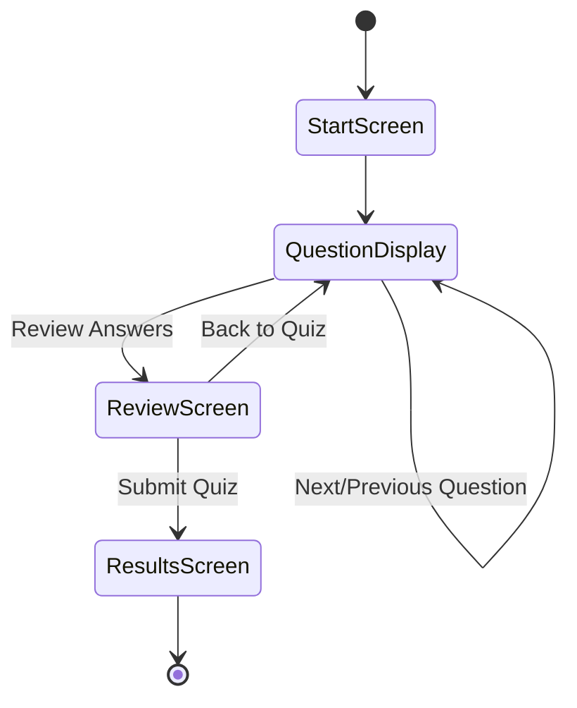

# Quiz Features Implementation

This document details the specific features of the quiz implementation and how they will be implemented. It includes detailed specifications for each feature, implementation approaches, and considerations for future expansion.

## Table of Contents

1. [Shared Section/Category Structure](#shared-sectioncategory-structure)
2. [Quiz Builder](#quiz-builder)
3. [Question Types](#question-types)
4. [Access Code System](#access-code-system)
5. [Quiz Taking Experience](#quiz-taking-experience)
6. [Practice Quiz Mode](#practice-quiz-mode)
7. [Results Management](#results-management)
8. [Future Expansion Considerations](#future-expansion-considerations)

## Shared Section/Category Structure

The quiz section will mirror the study guide section's structure, ensuring that sections and categories created in one area are automatically available in the other.

### Implementation Approach

1. **Reuse Existing Data Structure**: The quiz system will use the same `v2_sections` and `v2_categories` tables that are already used by the study guide system.

2. **Category Selection in Quiz Builder**: When creating or editing a quiz, administrators will be able to select one or more categories from the existing structure.

3. **Practice Quiz Integration**: Practice quizzes will be accessible directly from the study guide interface, providing a seamless learning experience.

### Code Example: Category Selection in Quiz Builder

```jsx
// In QuizMetadataForm.jsx
const [sections, setSections] = useState([]);
const [categories, setCategories] = useState([]);

// Fetch sections and categories
useEffect(() => {
  const fetchData = async () => {
    try {
      // Reuse the same sections and categories from the study guide system
      const sectionsData = await sectionsService.getSectionsWithCategories();
      setSections(sectionsData);
      
      // Flatten categories from all sections for selection
      const allCategories = sectionsData.reduce((acc, section) => {
        return [...acc, ...(section.v2_categories || [])];
      }, []);
      
      setCategories(allCategories);
    } catch (error) {
      console.error('Failed to load sections and categories', error);
    }
  };
  
  fetchData();
}, []);
```

### Integration with Study Guide

The practice quiz feature will be integrated directly into the study guide interface:

```jsx
// In StudyGuideViewer.jsx
const StudyGuideViewer = ({ studyGuide, isLoading }) => {
  // ... existing code ...
  
  return (
    <div className="study-guide-viewer">
      {/* ... existing content ... */}
      
      {/* Practice Quiz Integration */}
      <div className="mt-8 p-6 bg-teal-50 rounded-lg border border-teal-200">
        <h3 className="text-xl font-bold text-teal-800 mb-4">Test Your Knowledge</h3>
        <p className="mb-4">Ready to test what you've learned? Take a practice quiz on this topic.</p>
        <button
          className="bg-teal-700 hover:bg-teal-800 text-white border-none rounded py-3 px-4 text-sm font-bold cursor-pointer transition-colors"
          onClick={() => navigate(`/practice-quiz/${studyGuide.category_id}`)}
        >
          Start Practice Quiz
        </button>
      </div>
    </div>
  );
};
```

## Quiz Builder

The quiz builder will allow administrators to create and edit quizzes, including setting metadata, selecting categories, and managing questions.

### Implementation Approach

1. **Tabbed Interface**: The quiz builder will use a tabbed interface to separate metadata, question management, and preview.

2. **Metadata Form**: Administrators will be able to set quiz title, description, time limit, passing score, and select categories.

3. **Question Management**: Administrators will be able to add, edit, and remove questions from the quiz.

4. **Preview**: Administrators will be able to preview the quiz before publishing.

### Quiz Metadata

The quiz metadata will include:

- **Title**: Name of the quiz
- **Description**: Brief description of the quiz
- **Category IDs**: Array of category IDs that the quiz covers
- **Time Limit**: Optional time limit in seconds
- **Passing Score**: Percentage required to pass the quiz
- **Is Practice**: Boolean indicating if this is a practice quiz

### Question Management

The question management interface will allow administrators to:

1. **Browse Questions**: View questions from selected categories
2. **Add Questions**: Add existing questions to the quiz
3. **Create Questions**: Create new questions for selected categories
4. **Edit Questions**: Edit existing questions
5. **Remove Questions**: Remove questions from the quiz

### Code Example: Quiz Builder Page

```jsx
// QuizBuilderPage.jsx
const QuizBuilderPage = () => {
  const { quizId } = useParams();
  const navigate = useNavigate();
  const [quiz, setQuiz] = useState({
    title: '',
    description: '',
    category_ids: [],
    time_limit: null,
    passing_score: 70,
    is_practice: false,
    questions: []
  });
  const [activeTab, setActiveTab] = useState('metadata');
  
  // Fetch quiz data if editing an existing quiz
  useEffect(() => {
    if (quizId) {
      const fetchQuiz = async () => {
        try {
          const data = await quizzesService.getWithQuestions(quizId);
          setQuiz(data);
        } catch (error) {
          // Handle error
        }
      };
      
      fetchQuiz();
    }
  }, [quizId]);
  
  // Handle saving the quiz
  const handleSave = async () => {
    try {
      if (quizId) {
        await quizzesService.update(quizId, quiz);
      } else {
        const newQuiz = await quizzesService.create(quiz);
        navigate(`/admin/quizzes/edit/${newQuiz.id}`);
      }
    } catch (error) {
      // Handle error
    }
  };
  
  return (
    <div className="quiz-builder">
      <div className="tabs">
        <button
          className={activeTab === 'metadata' ? 'active' : ''}
          onClick={() => setActiveTab('metadata')}
        >
          Quiz Details
        </button>
        <button
          className={activeTab === 'questions' ? 'active' : ''}
          onClick={() => setActiveTab('questions')}
        >
          Questions
        </button>
        <button
          className={activeTab === 'preview' ? 'active' : ''}
          onClick={() => setActiveTab('preview')}
        >
          Preview
        </button>
      </div>
      
      {activeTab === 'metadata' && (
        <QuizMetadataForm
          quiz={quiz}
          onChange={setQuiz}
        />
      )}
      
      {activeTab === 'questions' && (
        <QuestionManager
          quiz={quiz}
          onChange={setQuiz}
        />
      )}
      
      {activeTab === 'preview' && (
        <QuizPreview quiz={quiz} />
      )}
      
      <div className="actions">
        <button onClick={handleSave}>Save Quiz</button>
      </div>
    </div>
  );
};
```

## Question Types

The system will support three question types initially: Multiple Choice (single answer), Multiple Choice (multiple answers / check all that apply), and True/False.

### Implementation Approach

1. **Unified Question Schema**: All question types will use the same database schema, with the `question_type` field determining how the question is displayed and scored.

2. **Type-Specific Forms**: Each question type will have its own form component for creating and editing questions.

3. **Type-Specific Display**: Each question type will have its own display component for rendering the question in the quiz.

### Question Schema

```typescript
interface Question {
  id: string;
  category_id: string;
  question_text: string;
  question_type: 'multiple_choice' | 'check_all_that_apply' | 'true_false';
  options: string[] | null; // Array for multiple choice/check all, null for true/false
  correct_answer: number | number[] | boolean; // Single index for MC, array for Check All, boolean for T/F
  explanation: string | null; // Explanation for incorrect answers
  created_at: string;
  updated_at: string;
}
```

### Type-Specific Components

#### Multiple Choice (Single Answer)

```jsx
// MultipleChoiceForm.jsx
const MultipleChoiceForm = ({ options, correctAnswer, onChange, disabled }) => {
  const handleOptionChange = (index, value) => {
    const newOptions = [...options];
    newOptions[index] = value;
    onChange(newOptions, correctAnswer);
  };
  
  const handleAddOption = () => {
    onChange([...options, ''], correctAnswer);
  };
  
  const handleRemoveOption = (index) => {
    const newOptions = options.filter((_, i) => i !== index);
    const newCorrectAnswer = correctAnswer === index
      ? 0
      : correctAnswer > index
        ? correctAnswer - 1
        : correctAnswer;
    onChange(newOptions, newCorrectAnswer);
  };
  
  const handleCorrectAnswerChange = (index) => {
    onChange(options, index);
  };
  
  return (
    <div className="space-y-4">
      <div className="flex justify-between items-center">
        <h3 className="text-lg font-medium">Answer Options</h3>
        <button
          type="button"
          className="text-teal-700 hover:text-teal-800"
          onClick={handleAddOption}
          disabled={disabled}
        >
          Add Option
        </button>
      </div>
      
      {options.map((option, index) => (
        <div key={index} className="flex items-center space-x-2">
          <input
            type="radio"
            checked={correctAnswer === index}
            onChange={() => handleCorrectAnswerChange(index)}
            disabled={disabled}
          />
          <input
            type="text"
            value={option}
            onChange={(e) => handleOptionChange(index, e.target.value)}
            className="flex-1 p-2 border rounded"
            placeholder={`Option ${index + 1}`}
            disabled={disabled}
          />
          <button
            type="button"
            onClick={() => handleRemoveOption(index)}
            disabled={options.length <= 2 || disabled}
            className="text-red-500 hover:text-red-700"
          >
            Remove
          </button>
        </div>
      ))}
    </div>
  );
};
```

#### Multiple Choice (Check All That Apply)

```jsx
// CheckAllThatApplyForm.jsx
const CheckAllThatApplyForm = ({ options, correctAnswers, onChange, disabled }) => {
  const handleOptionChange = (index, value) => {
    const newOptions = [...options];
    newOptions[index] = value;
    onChange(newOptions, correctAnswers);
  };
  
  const handleAddOption = () => {
    onChange([...options, ''], correctAnswers);
  };
  
  const handleRemoveOption = (index) => {
    const newOptions = options.filter((_, i) => i !== index);
    const newCorrectAnswers = correctAnswers
      .filter(answerIndex => answerIndex !== index)
      .map(answerIndex => answerIndex > index ? answerIndex - 1 : answerIndex);
    onChange(newOptions, newCorrectAnswers);
  };
  
  const handleCorrectAnswerChange = (index, isChecked) => {
    const newCorrectAnswers = isChecked
      ? [...correctAnswers, index]
      : correctAnswers.filter(i => i !== index);
    onChange(options, newCorrectAnswers);
  };
  
  return (
    <div className="space-y-4">
      <div className="flex justify-between items-center">
        <h3 className="text-lg font-medium">Answer Options (Check all correct answers)</h3>
        <button
          type="button"
          className="text-teal-700 hover:text-teal-800"
          onClick={handleAddOption}
          disabled={disabled}
        >
          Add Option
        </button>
      </div>
      
      {options.map((option, index) => (
        <div key={index} className="flex items-center space-x-2">
          <input
            type="checkbox"
            checked={correctAnswers.includes(index)}
            onChange={(e) => handleCorrectAnswerChange(index, e.target.checked)}
            disabled={disabled}
          />
          <input
            type="text"
            value={option}
            onChange={(e) => handleOptionChange(index, e.target.value)}
            className="flex-1 p-2 border rounded"
            placeholder={`Option ${index + 1}`}
            disabled={disabled}
          />
          <button
            type="button"
            onClick={() => handleRemoveOption(index)}
            disabled={options.length <= 2 || disabled}
            className="text-red-500 hover:text-red-700"
          >
            Remove
          </button>
        </div>
      ))}
    </div>
  );
};
```

#### True/False

```jsx
// TrueFalseForm.jsx
const TrueFalseForm = ({ correctAnswer, onChange, disabled }) => {
  return (
    <div className="space-y-4">
      <h3 className="text-lg font-medium">Correct Answer</h3>
      
      <div className="flex space-x-4">
        <label className="flex items-center space-x-2">
          <input
            type="radio"
            checked={correctAnswer === true}
            onChange={() => onChange(true)}
            disabled={disabled}
          />
          <span>True</span>
        </label>
        
        <label className="flex items-center space-x-2">
          <input
            type="radio"
            checked={correctAnswer === false}
            onChange={() => onChange(false)}
            disabled={disabled}
          />
          <span>False</span>
        </label>
      </div>
    </div>
  );
};
```

## Access Code System

The access code system will allow administrators to generate unique codes for quizzes and associate them with test taker information.

### Implementation Approach

1. **Code Generation**: Administrators will be able to generate unique 8-digit alphanumeric codes for quizzes.

2. **Test Taker Information**: Each code will be associated with test taker information (LDAP, Email, Supervisor, Market).

3. **Code Validation**: Users will be able to enter access codes to access restricted quizzes.

4. **Code Usage Tracking**: The system will track which codes have been used.

### Access Code Schema

```typescript
interface AccessCode {
  id: string;
  quiz_id: string;
  code: string; // 8-digit alphanumeric code
  ldap: string;
  email: string;
  supervisor: string;
  market: string;
  is_used: boolean;
  created_at: string;
  expires_at: string | null;
}
```

### Code Example: Access Code Generation

```jsx
// AccessCodeGenerator.jsx
const AccessCodeGenerator = ({ quizId }) => {
  const [testTakerInfo, setTestTakerInfo] = useState({
    ldap: '',
    email: '',
    supervisor: '',
    market: ''
  });
  const [generatedCode, setGeneratedCode] = useState(null);
  const [isGenerating, setIsGenerating] = useState(false);
  const [error, setError] = useState(null);
  
  const handleChange = (field, value) => {
    setTestTakerInfo({
      ...testTakerInfo,
      [field]: value
    });
  };
  
  const handleGenerateCode = async () => {
    setIsGenerating(true);
    setError(null);
    
    try {
      const code = await accessCodesService.generateCode(quizId, testTakerInfo);
      setGeneratedCode(code);
    } catch (error) {
      setError('Failed to generate access code');
    } finally {
      setIsGenerating(false);
    }
  };
  
  return (
    <div className="space-y-6">
      <h3 className="text-xl font-bold">Generate Access Code</h3>
      
      {error && (
        <div className="bg-red-50 text-red-600 p-4 rounded-lg">{error}</div>
      )}
      
      {generatedCode ? (
        <div className="bg-green-50 p-6 rounded-lg border border-green-200">
          <h4 className="text-lg font-bold text-green-800 mb-4">Access Code Generated</h4>
          <div className="text-3xl font-mono font-bold text-center p-4 bg-white rounded border border-green-300 mb-4">
            {generatedCode.code}
          </div>
          <p className="mb-2"><strong>LDAP:</strong> {generatedCode.ldap}</p>
          <p className="mb-2"><strong>Email:</strong> {generatedCode.email}</p>
          <p className="mb-2"><strong>Supervisor:</strong> {generatedCode.supervisor}</p>
          <p className="mb-2"><strong>Market:</strong> {generatedCode.market}</p>
          <p className="mb-2"><strong>Expires:</strong> {new Date(generatedCode.expires_at).toLocaleDateString()}</p>
          
          <div className="mt-6 flex space-x-4">
            <button
              className="bg-teal-700 hover:bg-teal-800 text-white border-none rounded py-3 px-4 text-sm font-bold cursor-pointer transition-colors"
              onClick={() => setGeneratedCode(null)}
            >
              Generate Another Code
            </button>
            <button
              className="bg-slate-500 hover:bg-slate-600 text-white border-none rounded py-3 px-4 text-sm font-bold cursor-pointer transition-colors"
              onClick={() => navigator.clipboard.writeText(generatedCode.code)}
            >
              Copy Code
            </button>
          </div>
        </div>
      ) : (
        <form className="space-y-4" onSubmit={(e) => { e.preventDefault(); handleGenerateCode(); }}>
          <div>
            <label className="block text-sm font-medium text-slate-700 mb-1">
              LDAP Username
            </label>
            <input
              type="text"
              className="w-full py-2 px-3 border border-slate-300 rounded-md"
              value={testTakerInfo.ldap}
              onChange={(e) => handleChange('ldap', e.target.value)}
              required
            />
          </div>
          
          <div>
            <label className="block text-sm font-medium text-slate-700 mb-1">
              Email
            </label>
            <input
              type="email"
              className="w-full py-2 px-3 border border-slate-300 rounded-md"
              value={testTakerInfo.email}
              onChange={(e) => handleChange('email', e.target.value)}
              required
            />
          </div>
          
          <div>
            <label className="block text-sm font-medium text-slate-700 mb-1">
              Supervisor
            </label>
            <input
              type="text"
              className="w-full py-2 px-3 border border-slate-300 rounded-md"
              value={testTakerInfo.supervisor}
              onChange={(e) => handleChange('supervisor', e.target.value)}
              required
            />
          </div>
          
          <div>
            <label className="block text-sm font-medium text-slate-700 mb-1">
              Market
            </label>
            <input
              type="text"
              className="w-full py-2 px-3 border border-slate-300 rounded-md"
              value={testTakerInfo.market}
              onChange={(e) => handleChange('market', e.target.value)}
              required
            />
          </div>
          
          <div className="pt-4">
            <button
              type="submit"
              className="bg-teal-700 hover:bg-teal-800 text-white border-none rounded py-3 px-4 text-sm font-bold cursor-pointer transition-colors w-full"
              disabled={isGenerating}
            >
              {isGenerating ? 'Generating...' : 'Generate Access Code'}
            </button>
          </div>
        </form>
      )}
    </div>
  );
};
```

### Code Example: Access Code Validation

```jsx
// In QuizTaker.jsx
const validateAccessCode = async (code) => {
  try {
    const accessCodeData = await accessCodesService.validateCode(code);
    
    if (!accessCodeData) {
      setError('Invalid access code');
      return null;
    }
    
    if (accessCodeData.is_used) {
      setError('This access code has already been used');
      return null;
    }
    
    return accessCodeData;
  } catch (error) {
    setError('Error validating access code');
    return null;
  }
};
```

## Quiz Taking Experience

The quiz taking experience will include a timer, question navigation, answer tracking, review mode, and results display.

### Implementation Approach

1. **Quiz Flow**: The quiz flow will include start screen, question display, review screen, and results screen.

2. **Timer**: For timed quizzes, a countdown timer will be displayed and the quiz will be auto-submitted when time runs out.

3. **Question Navigation**: Users will be able to navigate between questions and review their answers before submission.

4. **Answer Tracking**: The system will track which answers the user has selected.

5. **Review Mode**: Before final submission, users will be able to review their answers and see which questions they have answered.

6. **Results Display**: After submission, users will see their score and a review of their answers.

### Quiz Flow



### Code Example: Quiz Timer

```jsx
// QuizTimer.jsx
const QuizTimer = ({ timeLeft, formatTime, isWarning }) => {
  return (
    <div className={`flex items-center gap-2 ${isWarning ? 'text-red-500 font-bold' : 'text-slate-500'}`}>
      <span>⏱️</span> {formatTime(timeLeft)}
    </div>
  );
};

// In QuizTaker.jsx
// Timer countdown effect
useEffect(() => {
  let timer;
  if (quizStarted && timeLeft > 0 && !quizCompleted) {
    timer = setInterval(() => {
      setTimeLeft(prevTime => {
        if (prevTime <= 1) {
          clearInterval(timer);
          handleSubmitQuiz(); // Auto-submit when time runs out
          return 0;
        }
        return prevTime - 1;
      });
    }, 1000);
  }
  
  return () => clearInterval(timer);
}, [quizStarted, timeLeft, quizCompleted]);
```

### Code Example: Review Screen

```jsx
// QuizReview.jsx
const QuizReview = ({ quiz, selectedAnswers, onSubmit, onBack }) => {
  // Count answered and unanswered questions
  const answeredCount = Object.keys(selectedAnswers).length;
  const unansweredCount = quiz.questions.length - answeredCount;
  
  return (
    <div>
      <h3 className="text-xl font-bold mb-6">Review Your Answers</h3>
      
      <div className="mb-6 p-4 bg-slate-50 rounded-lg">
        <p>
          You have answered <strong>{answeredCount}</strong> out of <strong>{quiz.questions.length}</strong> questions.
          {unansweredCount > 0 && (
            <span className="text-amber-600"> There are {unansweredCount} unanswered questions.</span>
          )}
        </p>
        
        <p className="mt-2">
          Once you submit, you will not be able to change your answers.
        </p>
      </div>
      
      <div className="mb-8">
        <h4 className="font-bold mb-4">Question Summary</h4>
        
        <div className="grid grid-cols-6 sm:grid-cols-10 gap-2">
          {quiz.questions.map((question, index) => {
            const isAnswered = selectedAnswers[question.id] !== undefined;
            
            return (
              <div
                key={question.id}
                className={`w-full aspect-square flex items-center justify-center rounded-md text-sm font-medium ${isAnswered ? 'bg-teal-100 text-teal-800' : 'bg-amber-100 text-amber-800'}`}
              >
                {index + 1}
              </div>
            );
          })}
        </div>
      </div>
      
      <div className="flex justify-between">
        <button
          className="bg-slate-500 hover:bg-slate-600 text-white border-none rounded py-3 px-4 text-sm font-bold cursor-pointer transition-colors"
          onClick={onBack}
        >
          Back to Quiz
        </button>
        
        <button
          className="bg-teal-700 hover:bg-teal-800 text-white border-none rounded py-3 px-4 text-sm font-bold cursor-pointer transition-colors"
          onClick={onSubmit}
        >
          Submit Quiz
        </button>
      </div>
    </div>
  );
};
```

## Practice Quiz Mode

The practice quiz mode will provide immediate feedback on answers and will not require an access code or save results.

### Implementation Approach

1. **Integration with Study Guide**: Practice quizzes will be accessible directly from the study guide interface.

2. **Immediate Feedback**: Users will receive immediate feedback on their answers, including explanations for incorrect answers.

3. **No Access Code**: Practice quizzes will not require an access code.

4. **No Results Saving**: Practice quiz results will not be saved to the database.

### Code Example: Practice Quiz Question Display

```jsx
// PracticeQuestionDisplay.jsx
const PracticeQuestionDisplay = ({ question, onNext }) => {
  const [selectedAnswer, setSelectedAnswer] = useState(null);
  const [showFeedback, setShowFeedback] = useState(false);
  const [isCorrect, setIsCorrect] = useState(false);
  
  const handleSelectAnswer = (answer) => {
    setSelectedAnswer(answer);
    
    // Check if answer is correct
    let correct = false;
    switch (question.question_type) {
      case 'multiple_choice':
        correct = answer === question.correct_answer;
        break;
      case 'check_all_that_apply':
        if (Array.isArray(answer) && Array.isArray(question.correct_answer)) {
          correct = 
            answer.length === question.correct_answer.length &&
            answer.every(a => question.correct_answer.includes(a));
        }
        break;
      case 'true_false':
        correct = answer === question.correct_answer;
        break;
    }
    
    setIsCorrect(correct);
    setShowFeedback(true);
  };
  
  const handleNext = () => {
    setSelectedAnswer(null);
    setShowFeedback(false);
    onNext();
  };
  
  return (
    <div className="mb-8">
      <p className="text-xl font-bold mb-6 text-slate-900">
        {question.question_text}
      </p>
      
      {/* Question content based on type */}
      {/* ... (similar to QuestionDisplay component) ... */}
      
      {showFeedback && (
        <div className={`mt-6 p-4 rounded-lg ${isCorrect ? 'bg-green-50 border border-green-200' : 'bg-red-50 border border-red-200'}`}>
          <h4 className={`font-bold ${isCorrect ? 'text-green-700' : 'text-red-700'}`}>
            {isCorrect ? 'Correct!' : 'Incorrect'}
          </h4>
          
          {!isCorrect && (
            <div className="mt-2">
              <p className="font-medium">Correct answer:</p>
              {/* Display correct answer based on question type */}
              {/* ... */}
              
              {question.explanation && (
                <div className="mt-3 pt-3 border-t border-red-200">
                  <p className="font-medium">Explanation:</p>
                  <p>{question.explanation}</p>
                </div>
              )}
            </div>
          )}
          
          <div className="mt-4">
            <button
              className="bg-teal-700 hover:bg-teal-800 text-white border-none rounded py-2 px-3 text-sm font-bold cursor-pointer transition-colors"
              onClick={handleNext}
            >
              Next Question
            </button>
          </div>
        </div>
      )}
    </div>
  );
};
```

## Results Management

The results management system will allow administrators to view and analyze quiz results.

### Implementation Approach

1. **Results Dashboard**: Administrators will be able to view a dashboard of quiz results.

2. **Filtering and Sorting**: Administrators will be able to filter and sort results by various criteria.

3. **Export**: Administrators will be able to export results to CSV or PDF.

4. **Analytics**: Administrators will be able to view analytics on quiz results.

### Results Schema

```typescript
interface QuizResult {
  id: string;
  quiz_id: string;
  user_identifier: string; // LDAP username
  supervisor: string;
  market: string;
  score_value: number; // Percentage
  score_text: string; // 'Pass' or 'Fail'
  answers: Record<string, any>; // Question ID -> Answer
  time_taken: number | null; // In seconds
  created_at: string;
}
```

### Code Example: Results Dashboard

```jsx
// QuizResultsDashboard.jsx
const QuizResultsDashboard = () => {
  const [results, setResults] = useState([]);
  const [filters, setFilters] = useState({
    startDate: null,
    endDate: null,
    supervisors: [],
    ldaps: [],
    markets: [],
    minScore: null,
    maxScore: null,
    minTime: null,
    maxTime: null,
    sortField: 'created_at',
    sortOrder: 'desc'
  });
  const [isLoading, setIsLoading] = useState(false);
  const [error, setError] = useState(null);
  
  // Fetch results based on filters
  useEffect(() => {
    const fetchResults = async () => {
      setIsLoading(true);
      setError(null);
      
      try {
        const data = await quizResultsService.getFilteredResults(filters);
        setResults(data);
      } catch (error) {
        setError('Failed to load results');
      } finally {
        setIsLoading(false);
      }
    };
    
    fetchResults();
  }, [filters]);
  
  // Handle filter changes
  const handleFilterChange = (field, value) => {
    setFilters({
      ...filters,
      [field]: value
    });
  };
  
  // Handle export
  const handleExport = (format) => {
    // Export logic
  };
  
  return (
    <div className="space-y-6">
      <h2 className="text-2xl font-bold">Quiz Results</h2>
      
      {error && (
        <div className="bg-red-50 text-red-600 p-4 rounded-lg">{error}</div>
      )}
      
      <div className="bg-white rounded-lg shadow p-6">
        <h3 className="text-xl font-bold mb-4">Filters</h3>
        
        <div className="grid grid-cols-1 md:grid-cols-2 lg:grid-cols-3 gap-4">
          {/* Date filters */}
          <div>
            <label className="block text-sm font-medium text-slate-700 mb-1">
              Start Date
            </label>
            <input
              type="date"
              className="w-full py-2 px-3 border border-slate-300 rounded-md"
              value={filters.startDate || ''}
              onChange={(e) => handleFilterChange('startDate', e.target.value)}
            />
          </div>
          
          <div>
            <label className="block text-sm font-medium text-slate-700 mb-1">
              End Date
            </label>
            <input
              type="date"
              className="w-full py-2 px-3 border border-slate-300 rounded-md"
              value={filters.endDate || ''}
              onChange={(e) => handleFilterChange('endDate', e.target.value)}
            />
          </div>
          
          {/* Other filters */}
          {/* ... */}
        </div>
        
        <div className="mt-4 flex justify-end space-x-2">
          <button
            className="bg-slate-500 hover:bg-slate-600 text-white border-none rounded py-2 px-3 text-sm font-bold cursor-pointer transition-colors"
            onClick={() => setFilters({
              startDate: null,
              endDate: null,
              supervisors: [],
              ldaps: [],
              markets: [],
              minScore: null,
              maxScore: null,
              minTime: null,
              maxTime: null,
              sortField: 'created_at',
              sortOrder: 'desc'
            })}
          >
            Clear Filters
          </button>
          
          <button
            className="bg-teal-700 hover:bg-teal-800 text-white border-none rounded py-2 px-3 text-sm font-bold cursor-pointer transition-colors"
            onClick={() => handleExport('csv')}
          >
            Export CSV
          </button>
          
          <button
            className="bg-teal-700 hover:bg-teal-800 text-white border-none rounded py-2 px-3 text-sm font-bold cursor-pointer transition-colors"
            onClick={() => handleExport('pdf')}
          >
            Export PDF
          </button>
        </div>
      </div>
      
      <div className="bg-white rounded-lg shadow overflow-hidden">
        <table className="w-full">
          <thead className="bg-slate-50">
            <tr>
              <th className="py-3 px-4 text-left text-sm font-medium text-slate-700">Date</th>
              <th className="py-3 px-4 text-left text-sm font-medium text-slate-700">LDAP</th>
              <th className="py-3 px-4 text-left text-sm font-medium text-slate-700">Supervisor</th>
              <th className="py-3 px-4 text-left text-sm font-medium text-slate-700">Market</th>
              <th className="py-3 px-4 text-left text-sm font-medium text-slate-700">Score</th>
              <th className="py-3 px-4 text-left text-sm font-medium text-slate-700">Result</th>
              <th className="py-3 px-4 text-left text-sm font-medium text-slate-700">Time</th>
              <th className="py-3 px-4 text-left text-sm font-medium text-slate-700">Actions</th>
            </tr>
          </thead>
          <tbody className="divide-y divide-slate-200">
            {isLoading ? (
              <tr>
                <td colSpan="8" className="py-4 px-4 text-center">Loading results...</td>
              </tr>
            ) : results.length === 0 ? (
              <tr>
                <td colSpan="8" className="py-4 px-4 text-center">No results found</td>
              </tr>
            ) : (
              results.map(result => (
                <tr key={result.id} className="hover:bg-slate-50">
                  <td className="py-3 px-4">{new Date(result.created_at).toLocaleDateString()}</td>
                  <td className="py-3 px-4">{result.user_identifier}</td>
                  <td className="py-3 px-4">{result.supervisor}</td>
                  <td className="py-3 px-4">{result.market}</td>
                  <td className="py-3 px-4">{result.score_value}%</td>
                  <td className="py-3 px-4">
                    <span className={`px-2 py-1 rounded text-xs font-medium ${
                      result.score_text === 'Pass' ? 'bg-green-100 text-green-800' : 'bg-red-100 text-red-800'
                    }`}>
                      {result.score_text}
                    </span>
                  </td>
                  <td className="py-3 px-4">{result.time_taken ? `${Math.floor(result.time_taken / 60)}:${(result.time_taken % 60).toString().padStart(2, '0')}` : 'N/A'}</td>
                  <td className="py-3 px-4">
                    <button
                      className="text-teal-700 hover:text-teal-800"
                      onClick={() => navigate(`/admin/results/${result.id}`)}
                    >
                      View
                    </button>
                  </td>
                </tr>
              ))
            )}
          </tbody>
        </table>
      </div>
    </div>
  );
};
```

## Future Expansion Considerations

The quiz implementation is designed to be modular and extensible, allowing for future enhancements and additions. Here are some considerations for future expansion:

### Additional Question Types

The system is designed to easily accommodate new question types in the future:

1. **Essay Questions**: Free-form text responses that require manual grading.
2. **Matching Questions**: Matching items from two columns.
3. **Ordering Questions**: Arranging items in the correct order.
4. **Fill-in-the-Blank**: Entering specific text in blank spaces.
5. **Hotspot Questions**: Clicking on the correct area of an image.

To add a new question type:

1. Add the new type to the `question_type` enum in the database schema.
2. Create a new form component for the question type.
3. Create a new display component for the question type.
4. Update the scoring logic to handle the new question type.

### Enhanced Analytics

The results management system can be expanded to include more advanced analytics:

1. **Question Analysis**: Identify which questions are most frequently missed.
2. **Category Analysis**: Identify which categories have the lowest scores.
3. **User Analysis**: Track individual user progress over time.
4. **Comparative Analysis**: Compare results across different markets or supervisors.

### Integration with Learning Management Systems

The quiz system can be integrated with external learning management systems:

1. **SCORM Compliance**: Make quizzes compatible with SCORM standards.
2. **API Integration**: Provide APIs for external systems to access quiz data.
3. **Single Sign-On**: Allow users to authenticate with external systems.

### Mobile Support

The quiz system can be enhanced for better mobile support:

1. **Responsive Design**: Ensure all components work well on mobile devices.
2. **Offline Mode**: Allow users to take quizzes offline and sync results when online.
3. **Mobile Notifications**: Send notifications for quiz assignments and deadlines.

### Accessibility Enhancements

The quiz system can be enhanced for better accessibility:

1. **Screen Reader Support**: Ensure all components work well with screen readers.
2. **Keyboard Navigation**: Ensure all components can be navigated with keyboard only.
3. **High Contrast Mode**: Provide a high contrast mode for visually impaired users.
4. **Text-to-Speech**: Add text-to-speech functionality for questions and answers.

### Gamification

The quiz system can be enhanced with gamification elements:

1. **Badges**: Award badges for completing quizzes or achieving high scores.
2. **Leaderboards**: Show top performers on leaderboards.
3. **Progress Tracking**: Show users their progress through learning paths.
4. **Achievements**: Unlock achievements for completing specific goals.

### Implementation Approach for Future Expansions

When implementing future expansions, the following approach should be followed:

1. **Maintain Backward Compatibility**: Ensure existing quizzes continue to work with new features.
2. **Incremental Development**: Add new features incrementally, testing thoroughly at each step.
3. **User Feedback**: Gather feedback from users to prioritize new features.
4. **Documentation**: Keep documentation up to date with new features.
5. **Performance Testing**: Ensure new features do not negatively impact performance.
