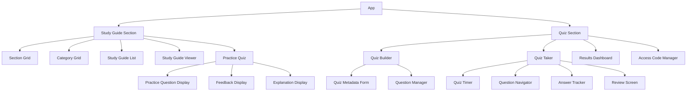

# Quiz Implementation Overview

This document provides a comprehensive overview of the quiz component implementation for the Training Hub application. The quiz section will mirror the study guide section in terms of sections and categories, allowing for a consistent user experience across the platform.

## Table of Contents

1. [Architecture Overview](#architecture-overview)
2. [Implementation Phases](#implementation-phases)
3. [Key Features](#key-features)
4. [Component Relationships](#component-relationships)
5. [User Flows](#user-flows)

## Architecture Overview

The quiz component will be built on the existing architecture of the Training Hub application, utilizing the Supabase backend for data storage and authentication. The implementation will follow the same patterns established in the study guide section, with a focus on reusability and maintainability.

## Implementation Phases

The implementation will be divided into six phases to ensure a structured and manageable development process:

### Phase 1: Core Structure
- Implement shared section/category structure
- Create basic quiz builder UI
- Set up database enhancements
- Establish API services for quiz-related operations

### Phase 2: Quiz Builder
- Complete quiz builder functionality
- Implement question type forms with explanation fields
- Connect to API services
- Add multiple category selection
- Implement question management (add, edit, delete)

### Phase 3: Quiz Taking
- Implement quiz loading and display
- Add timer display
- Create navigation and review mode
- Implement submission and scoring logic
- Build results display

### Phase 4: Access Codes
- Build access code generation (8-digit alphanumeric)
- Implement validation system
- Connect to quiz loading
- Create admin interface for code management

### Phase 5: Practice Quiz
- Create practice quiz interface
- Implement immediate feedback system
- Add explanation display
- Integrate with study guide section
- Build navigation between practice and study materials

### Phase 6: Results & Refinement
- Enhance results display
- Add filtering and export
- Polish UI and fix bugs
- Implement analytics and reporting
- Conduct thorough testing

## Key Features

### 1. Shared Section/Category Structure

The quiz section will mirror the study guide section's structure, ensuring that:
- Sections and categories created in one area are automatically available in the other
- Changes to the structure in one area are reflected in the other
- Users have a consistent navigation experience across the platform

### 2. Quiz Builder

The quiz builder will allow administrators to:
- Create and edit quizzes with metadata (title, description, time limit, passing score)
- Select multiple categories to include in a quiz
- Add, edit, and delete questions of different types
- Set correct answers and explanations for each question
- Preview the quiz before publishing

### 3. Question Types

The system will support three question types initially:
- Multiple Choice (single answer)
- Multiple Choice (multiple answers / check all that apply)
- True/False

Each question type will have:
- Question text
- Answer options
- Correct answer(s)
- Explanation (displayed for incorrect answers in practice mode)

### 4. Access Code System

The access code system will:
- Generate unique 8-digit alphanumeric codes for quizzes
- Associate codes with test taker information (LDAP, Email, Supervisor, Market)
- Validate codes when entered by users
- Track code usage and expiration
- Provide admin interface for code management

### 5. Quiz Taking Experience

The quiz taking experience will include:
- Timer display during the quiz
- Question navigation (next/previous, question list)
- Answer tracking
- Review mode before final submission
- Score calculation and results display
- Saving results to the database (except for practice quizzes)

### 6. Practice Quiz

The practice quiz feature will:
- Be integrated into the study guide section
- Provide immediate feedback on answers
- Display explanations for incorrect answers
- Not require access codes
- Not save results to the database
- Link to related study materials

### 7. Results Management

The results management system will:
- Display quiz results in a dashboard
- Provide filtering and sorting options
- Allow export of results data
- Generate analytics and reports
- Show detailed results for individual quiz attempts

## Component Relationships

## User Flows

### Admin: Creating a Quiz

1. Admin navigates to the Quiz section
2. Selects "Create New Quiz"
3. Enters quiz metadata (title, description, time limit, passing score)
4. Selects categories to include in the quiz
5. Adds questions of different types
6. Sets correct answers and explanations
7. Previews and publishes the quiz

### Admin: Generating Access Codes

1. Admin navigates to the Access Code Manager
2. Selects a quiz
3. Enters test taker information (LDAP, Email, Supervisor, Market)
4. Generates an access code
5. Shares the code with the test taker

### User: Taking a Quiz with Access Code

1. User navigates to the Quiz section
2. Enters the access code
3. Starts the quiz
4. Answers questions
5. Reviews answers before submission
6. Submits the quiz
7. Views results

### User: Taking a Practice Quiz

1. User navigates to the Study Guide section
2. Selects a category or study guide
3. Clicks "Practice Quiz"
4. Answers questions one by one
5. Receives immediate feedback on each answer
6. Views explanations for incorrect answers
7. Navigates between practice questions and study materials

For more detailed information on specific aspects of the implementation, please refer to the following documents:

- [Database Schema](./quiz-database-schema.md)
- [UI Components](./quiz-components.md)
- [API Services](./quiz-services.md)
- [Feature Implementation](./quiz-features.md)
