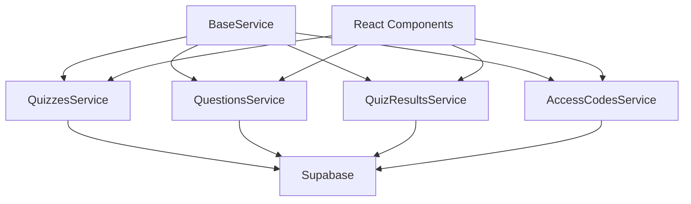
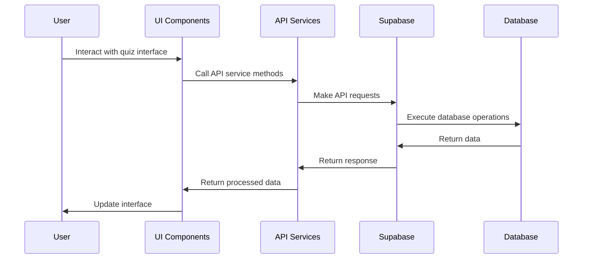
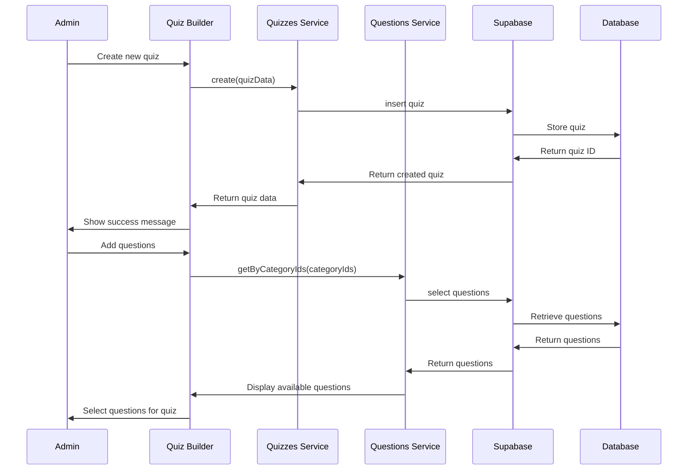
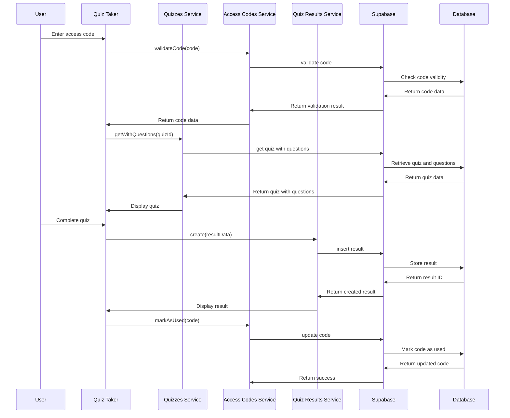

# Quiz API Services

This document details the API services needed for the quiz implementation. It includes service specifications, methods, and data flow.

## Table of Contents

1. [Service Overview](#service-overview)
2. [Quiz Service](#quiz-service)
3. [Question Service](#question-service)
4. [Quiz Results Service](#quiz-results-service)
5. [Access Code Service](#access-code-service)
6. [Data Flow](#data-flow)
7. [Error Handling](#error-handling)

## Service Overview

The quiz implementation requires several API services to interact with the Supabase backend. These services follow the same patterns as the existing services in the application, extending the `BaseService` class.



## Quiz Service

The `QuizzesService` handles operations related to quizzes, including creating, updating, and retrieving quizzes.

### Methods

#### `getAllWithQuestionCount()`

Retrieves all quizzes with the count of questions for each quiz.

**Returns:** Array of quiz objects with question counts

**Example:**

```javascript
// quizzes.js
import { BaseService } from './base';
import { supabase } from '../../config/supabase';

class QuizzesService extends BaseService {
  constructor() {
    super('v2_quizzes');
  }

  /**
   * Get quizzes with questions from selected categories
   * @returns {Promise<Array>} - Quizzes with information about included questions
   */
  async getAllWithQuestionCount() {
    try {
      // First, get all quizzes
      const { data: quizzes, error } = await supabase
        .from(this.tableName)
        .select('*')
        .order('created_at', { ascending: false });

      if (error) {
        throw error;
      }

      // For each quiz, count questions in its categories
      const enhancedQuizzes = await Promise.all(
        quizzes.map(async (quiz) => {
          // Parse category IDs if stored as JSON string
          const categoryIds = typeof quiz.category_ids === 'string' 
            ? JSON.parse(quiz.category_ids) 
            : quiz.category_ids;
            
          // Get categories
          const { data: categories, error: categoriesError } = await supabase
            .from('v2_categories')
            .select('name')
            .in('id', categoryIds);

          if (categoriesError) {
            console.error('Error fetching categories for quiz:', categoriesError.message);
            return {
              ...quiz,
              questionCount: 0,
              categories: []
            };
          }

          // Count questions in these categories
          const { count, error: countError } = await supabase
            .from('v2_questions')
            .select('*', { count: 'exact', head: true })
            .in('category_id', categoryIds);

          if (countError) {
            console.error('Error counting questions:', countError.message);
            return {
              ...quiz,
              questionCount: 0,
              categories: categories || []
            };
          }

          return {
            ...quiz,
            questionCount: count || 0,
            categories: categories || []
          };
        })
      );

      return enhancedQuizzes;
    } catch (error) {
      console.error('Error fetching quizzes with question count:', error.message);
      throw error;
    }
  }

  /**
   * Get a quiz with its full question set
   * @param {string} id - Quiz ID
   * @returns {Promise<Object>} - Quiz with questions
   */
  async getWithQuestions(id) {
    try {
      // Get the quiz
      const { data: quiz, error } = await supabase
        .from(this.tableName)
        .select('*')
        .eq('id', id)
        .single();

      if (error) {
        throw error;
      }

      if (!quiz) {
        throw new Error('Quiz not found');
      }

      // Parse category IDs if stored as JSON string
      const categoryIds = typeof quiz.category_ids === 'string' 
        ? JSON.parse(quiz.category_ids) 
        : quiz.category_ids;

      // Get questions for these categories
      const { data: questions, error: questionsError } = await supabase
        .from('v2_questions')
        .select('*')
        .in('category_id', categoryIds);

      if (questionsError) {
        throw questionsError;
      }

      return {
        ...quiz,
        questions: questions || []
      };
    } catch (error) {
      console.error('Error fetching quiz with questions:', error.message);
      throw error;
    }
  }

  /**
   * Create a new quiz
   * @param {Object} quiz - Quiz data
   * @returns {Promise<Object>} - Created quiz
   */
  async create(quiz) {
    try {
      // Ensure category_ids is stored as an array
      const quizData = {
        ...quiz,
        category_ids: Array.isArray(quiz.category_ids) ? quiz.category_ids : []
      };

      const { data, error } = await supabase
        .from(this.tableName)
        .insert([quizData])
        .select()
        .single();

      if (error) {
        throw error;
      }

      return data;
    } catch (error) {
      console.error('Error creating quiz:', error.message);
      throw error;
    }
  }

  /**
   * Update a quiz
   * @param {string} id - Quiz ID
   * @param {Object} updates - Quiz updates
   * @returns {Promise<Object>} - Updated quiz
   */
  async update(id, updates) {
    try {
      // Ensure category_ids is stored as an array
      const updateData = {
        ...updates,
        category_ids: Array.isArray(updates.category_ids) ? updates.category_ids : []
      };

      const { data, error } = await supabase
        .from(this.tableName)
        .update(updateData)
        .eq('id', id)
        .select()
        .single();

      if (error) {
        throw error;
      }

      return data;
    } catch (error) {
      console.error('Error updating quiz:', error.message);
      throw error;
    }
  }

  /**
   * Get practice quizzes
   * @returns {Promise<Array>} - Practice quizzes
   */
  async getPracticeQuizzes() {
    try {
      const { data, error } = await supabase
        .from(this.tableName)
        .select('*')
        .eq('is_practice', true)
        .order('created_at', { ascending: false });

      if (error) {
        throw error;
      }

      return data;
    } catch (error) {
      console.error('Error fetching practice quizzes:', error.message);
      throw error;
    }
  }

  /**
   * Get quizzes by category
   * @param {string} categoryId - Category ID
   * @returns {Promise<Array>} - Quizzes in the specified category
   */
  async getByCategoryId(categoryId) {
    try {
      const { data, error } = await supabase
        .from(this.tableName)
        .select('*')
        .contains('category_ids', [categoryId])
        .order('created_at', { ascending: false });

      if (error) {
        throw error;
      }

      return data;
    } catch (error) {
      console.error('Error fetching quizzes by category:', error.message);
      throw error;
    }
  }
}

export const quizzesService = new QuizzesService();
```

## Question Service

The `QuestionsService` handles operations related to questions, including creating, updating, and retrieving questions.

### Methods

#### `getByCategory(categoryId)`

Retrieves questions for a specific category.

**Parameters:**
- `categoryId`: ID of the category

**Returns:** Array of question objects

#### `getByCategoryIds(categoryIds, limit)`

Retrieves questions for multiple categories.

**Parameters:**
- `categoryIds`: Array of category IDs
- `limit`: Maximum number of questions to return (default: null for no limit)

**Returns:** Array of question objects

#### `getRandomByCategoryIds(categoryIds, count)`

Retrieves random questions from specified categories.

**Parameters:**
- `categoryIds`: Array of category IDs
- `count`: Number of questions to return (default: 10)

**Returns:** Array of random question objects

**Example:**

```javascript
// questions.js
import { BaseService } from './base';
import { supabase } from '../../config/supabase';

class QuestionsService extends BaseService {
  constructor() {
    super('v2_questions');
  }

  /**
   * Get questions by category
   * @param {string} categoryId - Category ID
   * @returns {Promise<Array>} - Questions in the specified category
   */
  async getByCategory(categoryId) {
    try {
      const { data, error } = await supabase
        .from(this.tableName)
        .select('*')
        .eq('category_id', categoryId)
        .order('created_at');

      if (error) {
        throw error;
      }

      return data;
    } catch (error) {
      console.error('Error fetching questions by category:', error.message);
      throw error;
    }
  }

  /**
   * Get questions by multiple categories
   * @param {Array<string>} categoryIds - Array of category IDs
   * @param {number} limit - Maximum number of questions to return (null for no limit)
   * @returns {Promise<Array>} - Questions from the specified categories
   */
  async getByCategoryIds(categoryIds, limit = null) {
    try {
      let query = supabase
        .from(this.tableName)
        .select('*')
        .in('category_id', categoryIds)
        .order('updated_at', { ascending: false })
        .order('created_at', { ascending: false });

      // Only apply limit if specified
      if (limit !== null && limit > 0) {
        query = query.limit(limit);
      }

      const { data, error } = await query;

      if (error) {
        throw error;
      }

      return data;
    } catch (error) {
      console.error('Error fetching questions by category IDs:', error.message);
      throw error;
    }
  }

  /**
   * Get random questions from specified categories
   * @param {Array<string>} categoryIds - Array of category IDs
   * @param {number} count - Number of questions to return
   * @returns {Promise<Array>} - Random questions from the specified categories
   */
  async getRandomByCategoryIds(categoryIds, count = 10) {
    try {
      // Get all questions from the categories
      const { data: allQuestions, error } = await supabase
        .from(this.tableName)
        .select('*')
        .in('category_id', categoryIds);

      if (error) {
        throw error;
      }

      // Shuffle and limit to count
      const shuffled = allQuestions.sort(() => 0.5 - Math.random());
      return shuffled.slice(0, count);
    } catch (error) {
      console.error('Error fetching random questions:', error.message);
      throw error;
    }
  }

  /**
   * Create a new question
   * @param {Object} question - Question data
   * @returns {Promise<Object>} - Created question
   */
  async create(question) {
    try {
      const { data, error } = await supabase
        .from(this.tableName)
        .insert([question])
        .select()
        .single();

      if (error) {
        throw error;
      }

      return data;
    } catch (error) {
      console.error('Error creating question:', error.message);
      throw error;
    }
  }

  /**
   * Update a question
   * @param {string} id - Question ID
   * @param {Object} updates - Question updates
   * @returns {Promise<Object>} - Updated question
   */
  async update(id, updates) {
    try {
      const { data, error } = await supabase
        .from(this.tableName)
        .update(updates)
        .eq('id', id)
        .select()
        .single();

      if (error) {
        throw error;
      }

      return data;
    } catch (error) {
      console.error('Error updating question:', error.message);
      throw error;
    }
  }
}

export const questionsService = new QuestionsService();
```

## Quiz Results Service

The `QuizResultsService` handles operations related to quiz results, including creating and retrieving results.

### Methods

#### `getFilteredResults(filters)`

Retrieves filtered quiz results based on specified criteria.

**Parameters:**
- `filters`: Object containing filter parameters

**Returns:** Array of filtered quiz results

#### `getDistinctValues(column)`

Retrieves distinct values for a specific column.

**Parameters:**
- `column`: Column name

**Returns:** Array of distinct values

**Example:**

```javascript
// quizResults.js
import { BaseService } from './base';
import { supabase } from '../../config/supabase';

class QuizResultsService extends BaseService {
  constructor() {
    super('v2_quiz_results');
  }

  /**
   * Get filtered quiz results
   * @param {Object} filters - Filter parameters
   * @returns {Promise<Array>} - Filtered quiz results
   */
    async getFilteredResults({
    startDate,
    endDate,
    supervisors,
    ldaps,
    markets,
    minScore,
    maxScore,
    minTime,
    maxTime,
    sortField = 'date_of_test',
    sortOrder = 'desc'
  }) {
    try {
      let query = supabase
        .from(this.tableName)
        .select('*');

      // Apply filters
      if (startDate) {
        query = query.gte('date_of_test', startDate);
      }
      if (endDate) {
        const endDatePlusOne = new Date(endDate);
        endDatePlusOne.setDate(endDatePlusOne.getDate() + 1);
        query = query.lt('date_of_test', endDatePlusOne.toISOString().split('T')[0]);
      }
      if (supervisors?.length) {
        query = query.in('supervisor', supervisors);
      }
      if (ldaps?.length) {
        query = query.in('ldap', ldaps);
      }
      if (markets?.length) {
        query = query.in('market', markets);
      }
      if (minScore !== null && minScore !== undefined) {
        query = query.gte('score_value', minScore);
      }
      if (maxScore !== null && maxScore !== undefined) {
        query = query.lte('score_value', maxScore);
      }
      if (minTime !== null && minTime !== undefined) {
        query = query.gte('time_taken', minTime);
      }
      if (maxTime !== null && maxTime !== undefined) {
        query = query.lte('time_taken', maxTime);
      }

      // Handle sorting - map created_at to date_of_test
      const actualSortField = sortField === 'created_at' ? 'date_of_test' : sortField;
      query = query.order(actualSortField, { ascending: sortOrder === 'asc' });

      const { data, error } = await query;

      if (error) {
        throw error;
      }

      return data;
    } catch (error) {
      console.error('Error fetching filtered results:', error);
      throw error;
    }
  }

  /**
   * Get distinct values for a column
   * @param {string} column - Column name
   * @returns {Promise<Array>} - Distinct values
   */
  async getDistinctValues(column) {
    try {
      const { data, error } = await supabase
        .from(this.tableName)
        .select(column)
        .not(column, 'is', null);

      if (error) {
        throw error;
      }

      // Extract unique values
      const values = [...new Set(data.map(item => item[column]))];
      return values.sort();
    } catch (error) {
      console.error(`Error fetching distinct ${column} values:`, error);
      throw error;
    }
  }

  /**
   * Create a new quiz result
   * @param {Object} result - Quiz result data
   * @returns {Promise<Object>} - Created quiz result
   */
  async create(result) {
    try {
      const { data, error } = await supabase
        .from(this.tableName)
        .insert([result])
        .select()
        .single();

      if (error) {
        throw error;
      }

      return data;
    } catch (error) {
      console.error('Error creating quiz result:', error.message);
      throw error;
    }
  }

  /**
   * Get results for a specific quiz
   * @param {string} quizId - Quiz ID
   * @returns {Promise<Array>} - Quiz results
   */
  async getByQuizId(quizId) {
    try {
      const { data, error } = await supabase
        .from(this.tableName)
        .select('*')
        .eq('quiz_id', quizId)
        .order('date_of_test', { ascending: false });

      if (error) {
        throw error;
      }

      return data;
    } catch (error) {
      console.error('Error fetching results by quiz ID:', error.message);
      throw error;
    }
  }

  /**
   * Get results for a specific user
   * @param {string} userIdentifier - User identifier (LDAP, email, etc.)
   * @returns {Promise<Array>} - Quiz results
   */
  async getByUserIdentifier(ldap) {
    try {
      const { data, error } = await supabase
        .from(this.tableName)
        .select('*')
        .eq('ldap', ldap)
        .order('date_of_test', { ascending: false });

      if (error) {
        throw error;
      }

      return data;
    } catch (error) {
      console.error('Error fetching results by user identifier:', error.message);
      throw error;
    }
  }
}

export const quizResultsService = new QuizResultsService();
```

## Access Code Service

The `AccessCodesService` handles operations related to access codes, including creating, validating, and managing codes.

### Methods

#### `generateCode(quizId, testTakerInfo)`

Generates a unique access code for a quiz.

**Parameters:**
- `quizId`: ID of the quiz
- `testTakerInfo`: Object containing test taker information

**Returns:** Generated access code object

#### `validateCode(code)`

Validates an access code.

**Parameters:**
- `code`: Access code to validate

**Returns:** Access code object if valid, null if invalid

**Example:**

```javascript
// accessCodes.js
import { BaseService } from './base';
import { supabase } from '../../config/supabase';

class AccessCodesService extends BaseService {
  constructor() {
    super('access_codes');
  }

  /**
   * Generate a unique access code for a quiz
   * @param {string} quizId - Quiz ID
   * @param {Object} testTakerInfo - Test taker information
   * @param {string} testTakerInfo.ldap - LDAP username
   * @param {string} testTakerInfo.email - Email address
   * @param {string} testTakerInfo.supervisor - Supervisor name
   * @param {string} testTakerInfo.market - Market
   * @returns {Promise<Object>} - Generated access code
   */
  async generateCode(quizId, { ldap, email, supervisor, market }) {
    try {
      // Generate a random 8-character alphanumeric code
      const code = this.generateRandomCode();
      
      // Set expiration date (30 days from now)
      const expiresAt = new Date();
      expiresAt.setDate(expiresAt.getDate() + 30);
      
      const accessCode = {
        quiz_id: quizId,
        code,
        ldap,
        email,
        supervisor,
        market,
        is_used: false,
        expires_at: expiresAt.toISOString()
      };
      
      const { data, error } = await supabase
        .from(this.tableName)
        .insert([accessCode])
        .select()
        .single();
      
      if (error) {
        throw error;
      }
      
      return data;
    } catch (error) {
      console.error('Error generating access code:', error.message);
      throw error;
    }
  }
  
  /**
   * Generate a random 8-character alphanumeric code
   * @returns {string} - Random code
   */
  generateRandomCode() {
    const chars = 'ABCDEFGHJKLMNPQRSTUVWXYZ23456789'; // Removed similar-looking characters
    let code = '';
    
    for (let i = 0; i < 8; i++) {
      code += chars.charAt(Math.floor(Math.random() * chars.length));
    }
    
    return code;
  }
  
  /**
   * Validate an access code
   * @param {string} code - Access code to validate
   * @returns {Promise<Object|null>} - Access code object if valid, null if invalid
   */
  async validateCode(code) {
    try {
      const { data, error } = await supabase
        .from(this.tableName)
        .select('*')
        .eq('code', code)
        .eq('is_used', false)
        .gte('expires_at', new Date().toISOString())
        .single();
      
      if (error) {
        if (error.code === 'PGRST116') { // No rows returned
          return null;
        }
        throw error;
      }
      
      return data;
    } catch (error) {
      console.error('Error validating access code:', error.message);
      throw error;
    }
  }
  
  /**
   * Mark an access code as used
   * @param {string} code - Access code to mark as used
   * @returns {Promise<Object>} - Updated access code
   */
  async markAsUsed(code) {
    try {
      const { data, error } = await supabase
        .from(this.tableName)
        .update({ is_used: true })
        .eq('code', code)
        .select()
        .single();
      
      if (error) {
        throw error;
      }
      
      return data;
    } catch (error) {
      console.error('Error marking access code as used:', error.message);
      throw error;
    }
  }
  
  /**
   * Get access codes for a quiz
   * @param {string} quizId - Quiz ID
   * @returns {Promise<Array>} - Access codes for the quiz
   */
  async getByQuizId(quizId) {
    try {
      const { data, error } = await supabase
        .from(this.tableName)
        .select('*')
        .eq('quiz_id', quizId)
        .order('created_at', { ascending: false });
      
      if (error) {
        throw error;
      }
      
      return data;
    } catch (error) {
      console.error('Error fetching access codes by quiz ID:', error.message);
      throw error;
    }
  }
  
  /**
   * Delete an access code
   * @param {string} id - Access code ID
   * @returns {Promise<void>}
   */
  async delete(id) {
    try {
      const { error } = await supabase
        .from(this.tableName)
        .delete()
        .eq('id', id);
      
      if (error) {
        throw error;
      }
    } catch (error) {
      console.error('Error deleting access code:', error.message);
      throw error;
    }
  }
}

export const accessCodesService = new AccessCodesService();
```

## Data Flow

The following diagram illustrates the data flow between components and services:



### Quiz Creation Flow



### Quiz Taking Flow



## Error Handling

All services include comprehensive error handling to ensure robust operation. Common error handling patterns include:

1. **Try-Catch Blocks**: All service methods are wrapped in try-catch blocks to catch and handle exceptions.

2. **Error Logging**: Errors are logged to the console with descriptive messages to aid debugging.

3. **Error Propagation**: Errors are propagated to the calling component to allow for appropriate UI feedback.

4. **Specific Error Handling**: Some methods include specific error handling for common scenarios, such as no results found.

**Example Error Handling Pattern:**

```javascript
async someMethod(params) {
  try {
    // API call logic
    const { data, error } = await supabase.from(this.tableName).select('*');
    
    if (error) {
      throw error;
    }
    
    return data;
  } catch (error) {
    console.error('Error in someMethod:', error.message);
    throw error; // Propagate to caller
  }
}
```

Components should handle these errors appropriately, displaying user-friendly error messages and providing options for recovery when possible.
